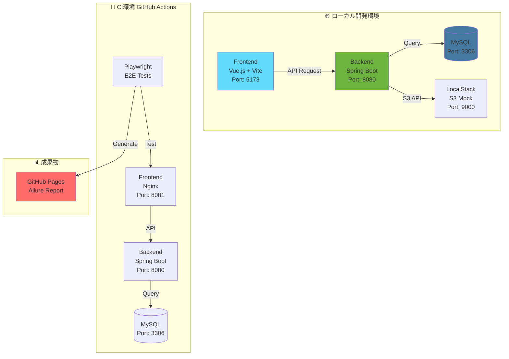
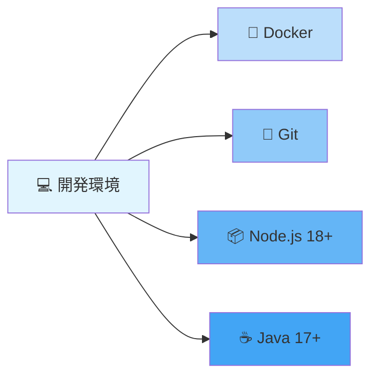
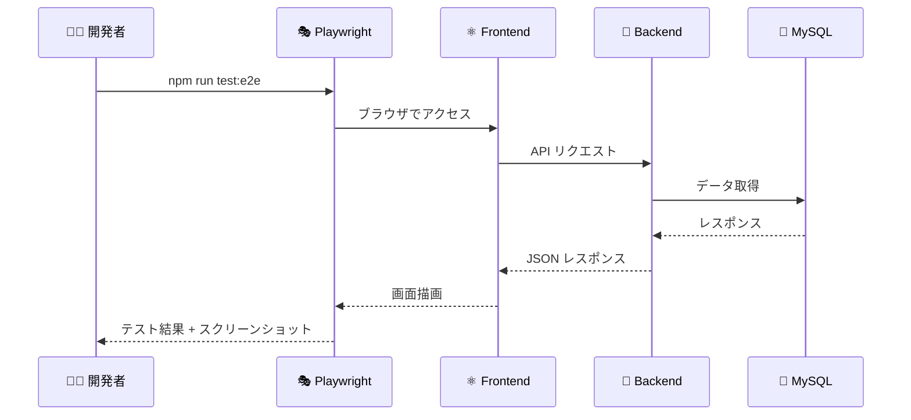
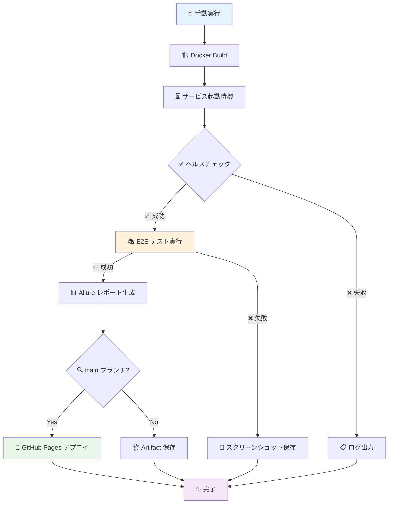
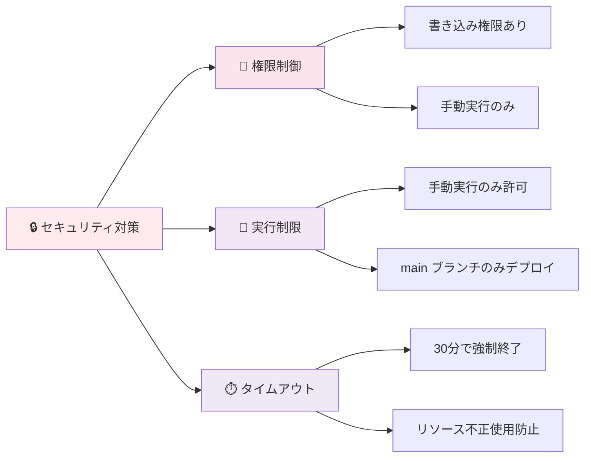

# 📱 Test App

> Spring Boot + Vue.js + Playwright による E2E テスト自動化アプリケーション

[](https://github.com/cocomomojo/test_app/actions/workflows/e2e.yml)
[](https://cocomomojo.github.io/test_app/)

---

## 📋 目次

- [📱 Test App](#-test-app)
  - [📋 目次](#-目次)
  - [🎯 プロジェクト概要](#-プロジェクト概要)
  - [🏗️ システム構成](#️-システム構成)
  - [🛠️ 技術スタック](#️-技術スタック)
  - [📦 環境構築](#-環境構築)
  - [🚀 ローカル実行](#-ローカル実行)
  - [🧪 E2E テスト実行](#-e2e-テスト実行)
  - [🔄 GitHub Actions（CI/CD）](#-github-actionscicd)
  - [📊 GitHub Pages（Allure レポート）](#-github-pagesallure-レポート)
  - [🔒 セキュリティ](#-セキュリティ)
  - [📚 参考資料](#-参考資料)

---

## 🎯 プロジェクト概要

このプロジェクトは、以下の機能を提供するフルスタック Web アプリケーションです：

- ✅ ユーザー認証（ローカル開発用の簡易認証実装）
- ✅ メモ管理（画像アップロード機能付き）
- ✅ ToDo 管理
- ✅ E2E テスト自動化（Playwright + Allure）
- ✅ CI/CD パイプライン（GitHub Actions）
- ✅ テストレポート自動公開（GitHub Pages）

---

## 🏗️ システム構成



### 📂 ディレクトリ構造

```
test_app/
├── 📁 backend/              # Spring Boot バックエンド
│   ├── src/
│   │   └── main/
│   │       ├── java/        # Java ソースコード
│   │       └── resources/   # 設定ファイル
│   ├── build.gradle         # Gradle 設定
│   └── Dockerfile           # Docker イメージ定義
│
├── 📁 frontend/             # Vue.js フロントエンド
│   ├── src/                 # Vue.js コンポーネント
│   ├── tests/e2e/           # E2E テスト（Playwright）
│   ├── package.json         # npm 依存関係
│   ├── playwright.config.ts # Playwright 設定
│   ├── nginx.conf           # Nginx 設定（本番用）
│   └── Dockerfile           # Docker イメージ定義
│
├── 📁 infra/                # インフラ設定
│   ├── docker-compose.local.yml  # ローカル開発用
│   ├── docker-compose.ci.yml     # CI 環境用
│   └── localstack/          # LocalStack 設定
│
└── 📁 .github/
    └── workflows/
        └── e2e.yml          # GitHub Actions ワークフロー
```

---

## 🛠️ 技術スタック

### バックエンド
| 技術 | バージョン | 用途 |
|------|-----------|------|
| ☕ Java | 17 | プログラミング言語 |
| 🍃 Spring Boot | 3.5.9 | Web フレームワーク |
| 🔐 Spring Security | 3.5.9 | 認証・認可 |
| 💾 MySQL | 8.0 | データベース |
| ☁️ AWS SDK | 2.25.60 | S3 連携 |
| 📦 Gradle | - | ビルドツール |

### フロントエンド
| 技術 | バージョン | 用途 |
|------|-----------|------|
| 🖖 Vue.js | 3.3.4+ | UI フレームワーク |
| ⚡ Vite | 5.0+ | ビルドツール |
| 🎨 Vuetify | 3.3.0+ | UI コンポーネント |
| 🎭 Playwright | 1.40.0+ | E2E テスト |
| 📊 Allure | 2.13.9+ | テストレポート |
| 🌐 Nginx | Alpine | Web サーバー（本番） |

### インフラ
| 技術 | 用途 |
|------|------|
| 🐳 Docker | コンテナ化 |
| 🔧 Docker Compose | ローカル環境構築 |
| 🔄 GitHub Actions | CI/CD パイプライン |
| 📄 GitHub Pages | レポート公開 |

---

## 📦 環境構築

### 前提条件

以下のツールがインストールされていることを確認してください：



| ツール | 必須/推奨 | バージョン | 確認コマンド |
|--------|----------|-----------|-------------|
| 🐳 Docker | 必須 | 20.10+ | `docker --version` |
| 🔧 Docker Compose | 必須 | 2.0+ | `docker compose version` |
| 🐙 Git | 必須 | 2.30+ | `git --version` |
| 📦 Node.js | 推奨 | 18+ | `node --version` |
| ☕ Java | 推奨 | 17+ | `java --version` |

### 🔽 リポジトリのクローン

```bash
# リポジトリをクローン
git clone https://github.com/cocomomojo/test_app.git
cd test_app
```

---

## 🚀 ローカル実行

### 🐳 Docker Compose を使用（推奨）

最も簡単な方法です。すべてのサービスが自動的に起動します。

#### 1️⃣ サービスの起動

```bash
cd infra
docker compose -f docker-compose.local.yml up -d --build
```

**起動するサービス：**
- ✅ MySQL（Port: 3306）
- ✅ Spring Boot（Port: 8080）
- ✅ Frontend（Vite dev server、Port: 5173）
- ✅ LocalStack（S3 Mock、Port: 9000）

#### 2️⃣ 動作確認

```bash
# コンテナの状態確認
docker compose -f docker-compose.local.yml ps

# Backend の動作確認
curl http://localhost:8080/actuator/health

# Frontend にアクセス
# ブラウザで http://localhost:5173 を開く
```

#### 3️⃣ ログの確認

```bash
# すべてのサービスのログ
docker compose -f docker-compose.local.yml logs

# Backend のログ（直近 200 行）
docker compose -f docker-compose.local.yml logs backend --tail=200

# リアルタイムログ追跡
docker compose -f docker-compose.local.yml logs -f backend
```

#### 4️⃣ サービスの停止

```bash
cd infra
docker compose -f docker-compose.local.yml down

# ボリュームも削除する場合
docker compose -f docker-compose.local.yml down -v
```

---

### 💻 Docker を使わない実行（開発者向け）

#### Backend

```bash
cd backend

# 開発モードで実行
./gradlew bootRun

# または JAR をビルドして実行
./gradlew bootJar
java -jar build/libs/*.jar --spring.profiles.active=local
```

**アクセス:** http://localhost:8080

#### Frontend

```bash
cd frontend

# 依存関係のインストール
npm install

# 開発サーバー起動
npm run dev
```

**アクセス:** http://localhost:5173

---

### 🔍 コンテナのデバッグ

```bash
# 実行中のコンテナ一覧
docker ps

# コンテナに入る
docker exec -it infra-backend-1 /bin/bash

# コンテナのログ確認
docker logs infra-backend-1

# コンテナの再起動
docker compose -f docker-compose.local.yml restart backend
```

---

## 🧪 E2E テスト実行

### ローカルでのテスト実行



#### 1️⃣ 前提条件

```bash
# サービスが起動していることを確認
cd infra
docker compose -f docker-compose.local.yml up -d
```

#### 2️⃣ Playwright のインストール

```bash
cd frontend

# 依存関係のインストール
npm install

# Playwright ブラウザのインストール
npx playwright install --with-deps
```

#### 3️⃣ テストの実行

```bash
cd frontend

# すべてのテストを実行
npx playwright test --project=chrome

# 特定のテストファイルのみ実行
npx playwright test tests/e2e/login.spec.ts --project=chrome

# UI モードで実行（デバッグに便利）
npx playwright test --ui

# ヘッドフルモードで実行（ブラウザを表示）
npx playwright test --project=chrome --headed
```

#### 4️⃣ テストレポートの確認

```bash
# Allure レポートの生成
cd frontend
npx allure generate allure-results --clean -o allure-report

# レポートを開く
npx allure open allure-report

# HTML レポートを開く（Playwright 標準）
npx playwright show-report
```

### 📝 テストファイル

| ファイル | テスト内容 |
|---------|----------|
| `login.spec.ts` | 🔐 ログイン機能 |
| `memo.spec.ts` | 📝 メモ管理機能 |
| `todo.spec.ts` | ✅ ToDo 管理機能 |
| `navigation.spec.ts` | 🧭 ページナビゲーション |

---

## 🔄 GitHub Actions（CI/CD）

### ⚠️ ワークフロー実行方式

**現在の設定：手動実行のみ**

- ❌ main ブランチへの push では自動実行されません
- ❌ Pull Request 作成時も自動実行されません
- ✅ GitHub Actions から手動実行のみ可能

### ワークフローの概要



### 🎯 ワークフローの実行方法

#### 手動実行（唯一の実行方法）

1. GitHub リポジトリの **Actions** タブを開く
2. 左側から **E2E Tests with Playwright and Allure** を選択
3. 右上の **Run workflow** ボタンをクリック
4. ブランチを選択
   - **main** ブランチ: テスト成功時に GitHub Pages へデプロイ
   - **その他のブランチ**: テストのみ実行（デプロイなし）
5. **Run workflow** をクリック

**実行権限:**
- ✅ リポジトリオーナー
- ✅ Collaborators（書き込み権限あり）
- ❌ 一般の閲覧者は実行不可

**実行結果の確認:**
- Actions タブでワークフローの進行状況を確認
- 各ステップの詳細ログを表示可能
- テスト失敗時はスクリーンショットやビデオを Artifacts からダウンロード可能

### 📊 ワークフローのステップ

| ステップ | 所要時間 | 説明 |
|---------|---------|------|
| 1️⃣ Checkout | ~5秒 | コードの取得 |
| 2️⃣ Docker Build | ~80秒 | コンテナイメージのビルド |
| 3️⃣ Health Check | ~60秒 | サービスの起動確認 |
| 4️⃣ Playwright Install | ~45秒 | ブラウザのインストール |
| 5️⃣ E2E Tests | ~10秒 | テストの実行 |
| 6️⃣ Allure Report | ~5秒 | レポート生成 |
| 7️⃣ Deploy to Pages | ~5秒 | GitHub Pages へデプロイ |

**合計:** 約 2-3 分

---

## 📊 GitHub Pages（Allure レポート）

### 🌐 公開 URL

**Allure レポート:** https://cocomomojo.github.io/test_app/

### ⚙️ 初回セットアップ

#### 1️⃣ GitHub Pages の設定

```
GitHub リポジトリ → Settings → Pages
```

| 設定項目 | 値 |
|---------|---|
| Source | Deploy from a branch |
| Branch | gh-pages |
| Folder | / (root) |

#### 2️⃣ GitHub Actions の権限設定

```
GitHub リポジトリ → Settings → Actions → General
```

| 設定項目 | 値 |
|---------|---|
| Workflow permissions | Read and write permissions |

#### 3️⃣ デプロイのトリガー

```bash
# main ブランチに push
git push origin main

# または GitHub Actions から手動実行
```

#### 4️⃣ 確認

- ✅ Actions タブで「Deploy Allure report to GitHub Pages」が成功
- ✅ Settings → Pages で「Your site is live at」が表示
- ✅ 1-2 分待ってから URL にアクセス

### 🔍 トラブルシューティング

#### 404 エラーが出る場合

1. **Settings → Pages で Source を確認**
   - ❌ GitHub Actions ← 間違い
   - ✅ Deploy from a branch (gh-pages) ← 正しい

2. **gh-pages ブランチの確認**
   ```bash
   git fetch origin
   git checkout gh-pages
   ls -la  # index.html が存在するか確認
   ```

3. **ブラウザキャッシュをクリア**
   - Ctrl + Shift + R（Windows/Linux）
   - Cmd + Shift + R（Mac）

---

## 🔒 セキュリティ

### 🛡️ 実装済みのセキュリティ対策



### セキュリティマトリックス

| リスク | 対策 | 状態 |
|--------|------|:----:|
| 自動実行によるリソース消費 | 手動実行のみ許可 | ✅ |
| 不正なコードの自動実行 | push/PR での自動実行を無効化 | ✅ |
| 不正なデプロイ | main ブランチのみデプロイ | ✅ |
| リソースの不正使用 | タイムアウト設定（30分） | ✅ |
| 権限のない第三者による実行 | 書き込み権限必須 | ✅ |

### 推奨設定（GitHub Settings）

#### Branch Protection Rules（オプション）

```
Settings → Branches → Add rule
Branch name pattern: main
```

- ✅ Require a pull request before merging
- ✅ Require approvals (1)
- ✅ Require branches to be up to date before merging

**注意:** 手動実行のみの設定のため、ステータスチェックは不要

#### Actions 権限設定

```
Settings → Actions → General
```

- ✅ Allow select actions and reusable workflows
- ✅ Allow actions created by GitHub
- ✅ Require approval for first-time contributors

---

## 📚 参考資料

### 📖 公式ドキュメント

| 技術 | URL |
|------|-----|
| Spring Boot | https://spring.io/projects/spring-boot |
| React | https://react.dev/ |
| Playwright | https://playwright.dev/ |
| Allure | https://docs.qameta.io/allure/ |
| GitHub Actions | https://docs.github.com/ja/actions |
| GitHub Pages | https://docs.github.com/ja/pages |
| Docker | https://docs.docker.com/ |

### 🎓 チュートリアル

- [Playwright 入門](https://playwright.dev/docs/intro)
- [Allure レポートの使い方](https://docs.qameta.io/allure/)
- [GitHub Actions ワークフロー構文](https://docs.github.com/ja/actions/using-workflows/workflow-syntax-for-github-actions)
- [Spring Security 認証設定](https://spring.io/guides/gs/securing-web/)

### 💡 トラブルシューティング

| 問題 | 解決方法 |
|------|---------|
| Docker コンテナが起動しない | `docker compose logs` でログ確認 |
| Backend に接続できない | `curl http://localhost:8080/actuator/health` で確認 |
| E2E テストが失敗する | `--headed` オプションでブラウザを表示してデバッグ |
| GitHub Pages が 404 | Settings → Pages で Source 設定を確認 |

---

## 📝 注意事項

### 🔴 LocalStack の制限

Cognito をローカルで完全にエミュレートするには **LocalStack Pro（有料）** が必要です。

**代替案:**
1. LocalStack Pro を使用
2. 実際の AWS Cognito を使用
3. ローカル用の簡易ログイン実装（現在採用）

### テストユーザー

| ユーザー名 | パスワード | 用途 |
|-----------|----------|------|
| `testuser` | `Test1234!` | E2E テスト / ローカル開発 |

---

---

## 📄 ライセンス

このプロジェクトは MIT ライセンスの下で公開されています。

---

**作成日:** 2025-12-30  
**最終更新:** 2025-12-30