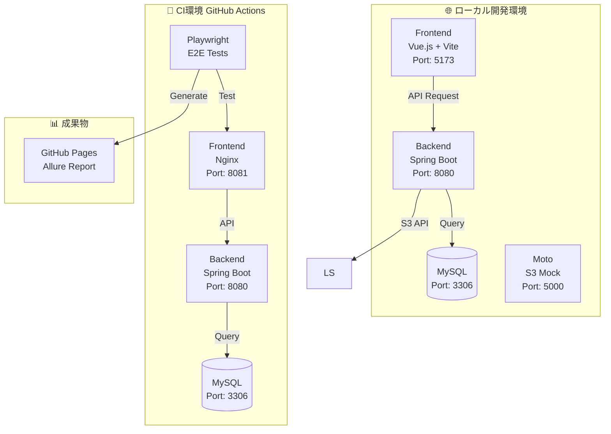
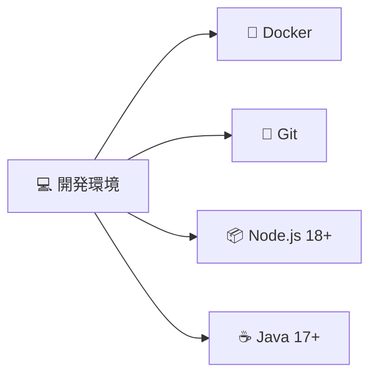
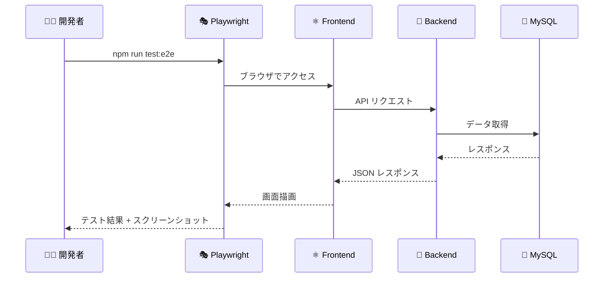
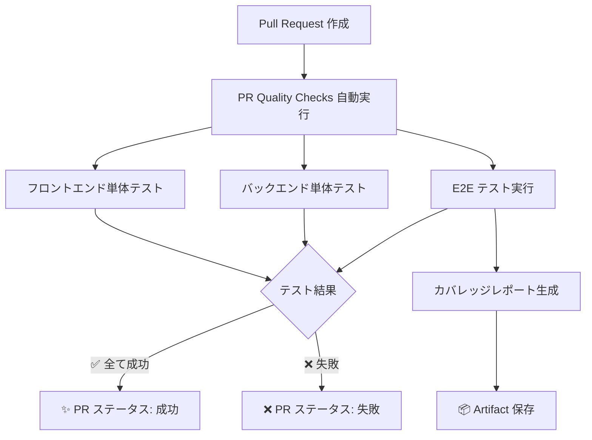
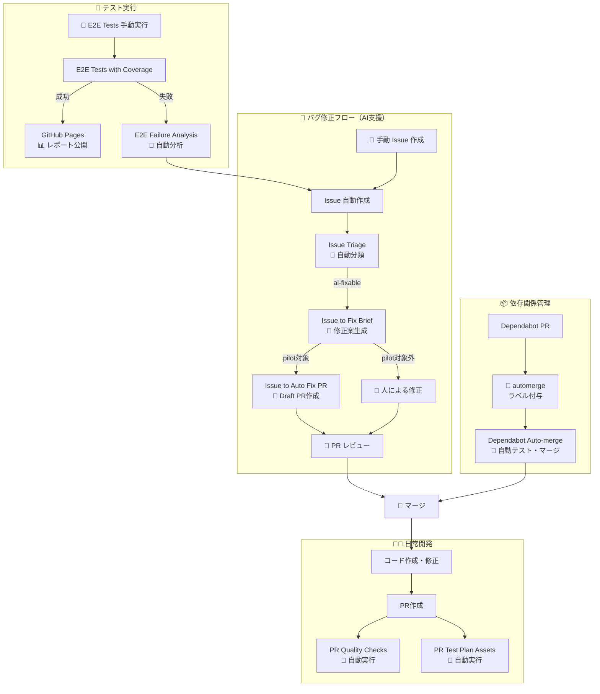
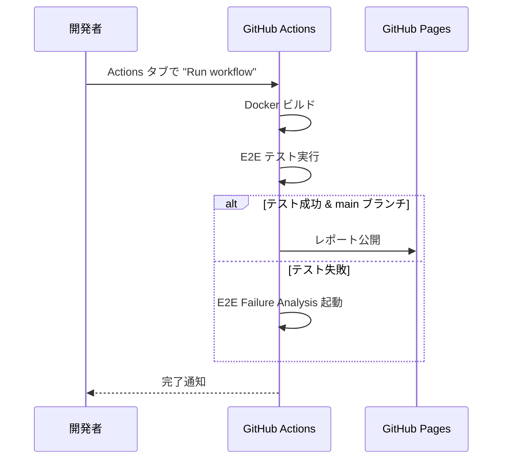
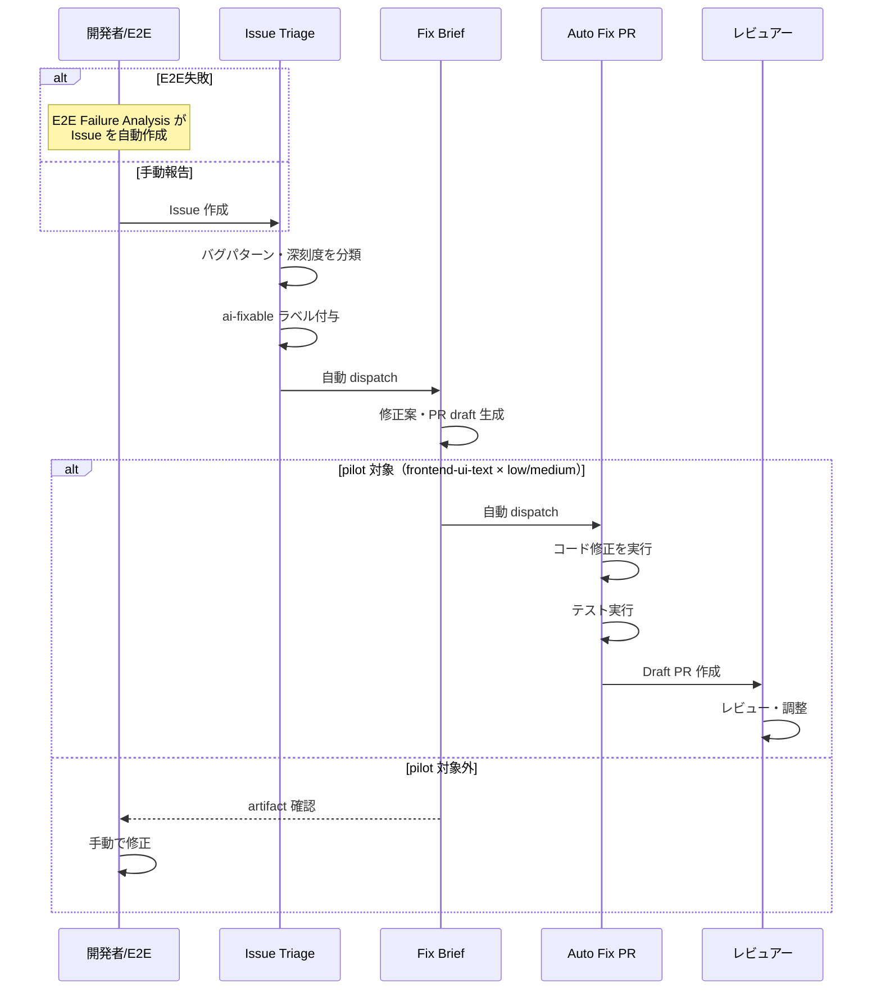
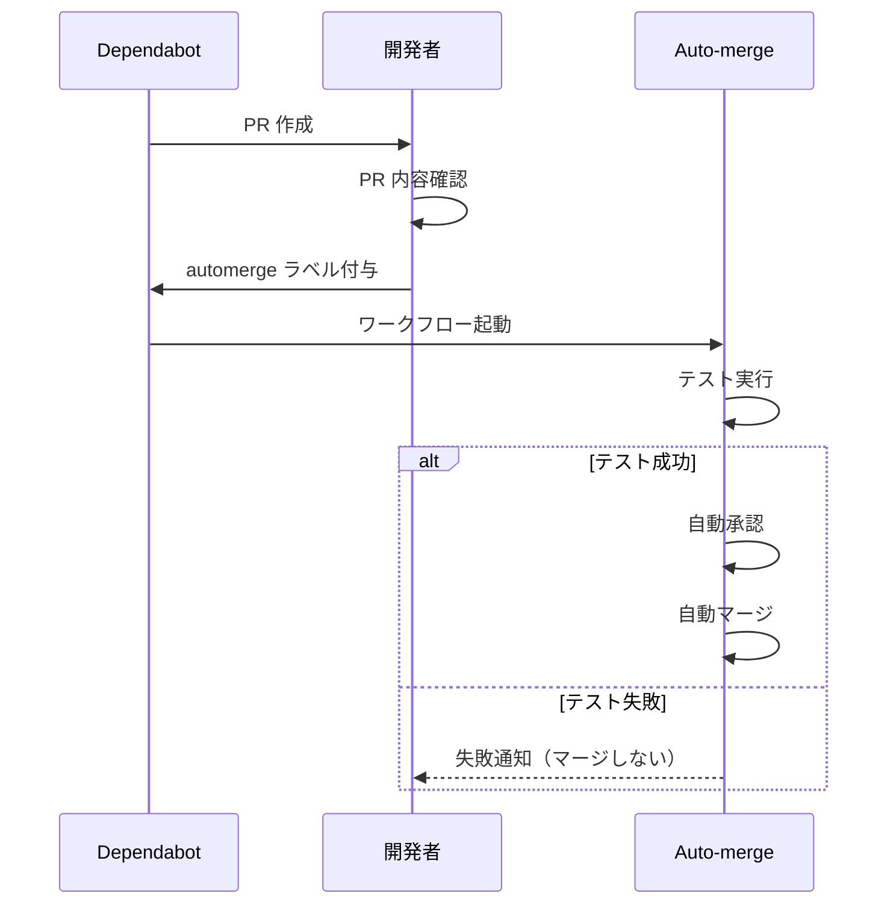
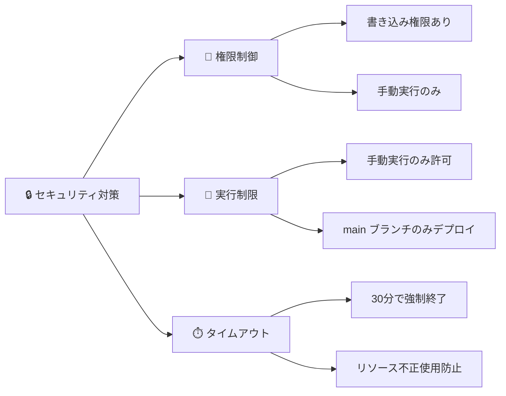
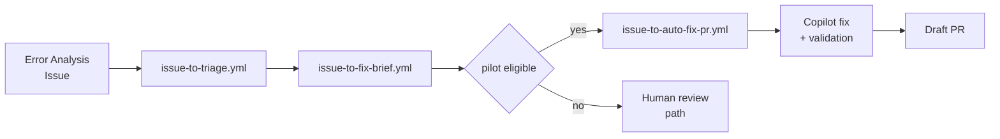

# 📱 Test App

> Spring Boot + Vue.js + Playwright による E2E テスト自動化アプリケーション

[](https://github.com/cocomomojo/test_app/actions/workflows/e2e.yml)
[](https://cocomomojo.github.io/test_app/allure/)
[](https://cocomomojo.github.io/test_app/coverage/)

---
---

## 📋 目次

- [📱 Test App](#-test-app)
  - [📋 目次](#-目次)
  - [🎯 プロジェクト概要](#-プロジェクト概要)
  - [🏗️ システム構成](#️-システム構成)
  - [🛠️ 技術スタック](#️-技術スタック)
  - [📦 環境構築](#-環境構築)
  - [🚀 ローカル実行](#-ローカル実行)
  - [🧪 E2E テスト実行](#-e2e-テスト実行)
  - [🔄 GitHub Actions（CI/CD）](#-github-actionscicd)
  - [📊 GitHub Pages（テストレポート・カバレッジ）](#-github-pagesテストレポート・カバレッジ)
  - [🔒 セキュリティ](#-セキュリティ)
  - [📚 参考資料](#-参考資料)

---

## 🎯 プロジェクト概要

このプロジェクトは、以下の機能を提供するフルスタック Web アプリケーションです：

- ✅ ユーザー認証（ローカル開発用の簡易認証実装）
- ✅ メモ管理（画像アップロード機能付き）
- ✅ ToDo 管理
- ✅ E2E テスト自動化（Playwright + Allure）
- ✅ CI/CD パイプライン（GitHub Actions）
- ✅ テストレポート自動公開（GitHub Pages）

---

## 🏗️ システム構成


```mermaid
graph TB
    subgraph "🌐 ローカル開発環境"
        FE[Frontend<br/>Vue.js + Vite<br/>Port: 5173]
        BE[Backend<br/>Spring Boot<br/>Port: 8080]
        DB[(MySQL<br/>Port: 3306)]
        Moto[Moto<br/>S3 Mock<br/>Port: 5000]
    end

    subgraph "🔄 CI環境 GitHub Actions"
        FE_CI[Frontend<br/>Nginx<br/>Port: 8081]
        BE_CI[Backend<br/>Spring Boot<br/>Port: 8080]
        DB_CI[(MySQL<br/>Port: 3306)]
        PW[Playwright<br/>E2E Tests]
    end

    subgraph "📊 成果物"
        GHP[GitHub Pages<br/>Allure Report]
    end

    FE -->|API Request| BE
    BE -->|Query| DB
    BE -->|S3 API| LS

    PW -->|Test| FE_CI
    FE_CI -->|API| BE_CI
    BE_CI -->|Query| DB_CI
    PW -->|Generate| GHP
```

### 📂 ディレクトリ構造

```
test_app/
├── 📁 backend/              # Spring Boot バックエンド
│   ├── src/
│   │   └── main/
│   │       ├── java/        # Java ソースコード
│   │       └── resources/   # 設定ファイル
│   ├── build.gradle         # Gradle 設定
│   └── Dockerfile           # Docker イメージ定義
│
├── 📁 frontend/             # Vue.js フロントエンド
│   ├── src/                 # Vue.js コンポーネント
│   ├── tests/e2e/           # E2E テスト（Playwright）
│   ├── package.json         # npm 依存関係
│   ├── playwright.config.ts # Playwright 設定
│   ├── nginx.conf           # Nginx 設定（本番用）
│   └── Dockerfile           # Docker イメージ定義
│
├── 📁 infra/                # インフラ設定
│   ├── docker-compose.local.yml  # ローカル開発用
│   ├── docker-compose.ci.yml     # CI 環境用
│
└── 📁 .github/
    └── workflows/
        └── e2e.yml          # GitHub Actions ワークフロー
```

---

## 🛠️ 技術スタック

### バックエンド
| 技術 | バージョン | 用途 |
|------|-----------|------|
| ☕ Java | 17 | プログラミング言語 |
| 🍃 Spring Boot | 3.5.9 | Web フレームワーク |
| 🔐 Spring Security | 3.5.9 | 認証・認可 |
| 💾 MySQL | 8.0 | データベース |
| ☁️ AWS SDK | 2.25.60 | S3 連携 |
| 📦 Gradle | - | ビルドツール |

### フロントエンド
| 技術 | バージョン | 用途 |
|------|-----------|------|
| 🖖 Vue.js | 3.3.4+ | UI フレームワーク |
| ⚡ Vite | 5.0+ | ビルドツール |
| 🎨 Vuetify | 3.3.0+ | UI コンポーネント |
| 🎭 Playwright | 1.40.0+ | E2E テスト |
| 📊 Allure | 2.13.9+ | テストレポート |
| 🌐 Nginx | Alpine | Web サーバー（本番） |

### インフラ
| 技術 | 用途 |
|------|------|
| 🐳 Docker | コンテナ化 |
| 🔧 Docker Compose | ローカル環境構築 |
| 🔄 GitHub Actions | CI/CD パイプライン |
| 📄 GitHub Pages | レポート公開 |

---

## 📦 環境構築

### 前提条件

以下のツールがインストールされていることを確認してください：


```mermaid
graph LR
   A[💻 開発環境] --> B[🐳 Docker]
    A --> C[🐙 Git]
    A --> D[📦 Node.js 18+]
    A --> E[☕ Java 17+]
```

| ツール | 必須/推奨 | バージョン | 確認コマンド |
|--------|----------|-----------|-------------|
| 🐳 Docker | 必須 | 20.10+ | `docker --version` |
| 🔧 Docker Compose | 必須 | 2.0+ | `docker compose version` |
| 🐙 Git | 必須 | 2.30+ | `git --version` |
| 📦 Node.js | 推奨 | 18+ | `node --version` |
| ☕ Java | 推奨 | 17+ | `java --version` |

### 🔽 リポジトリのクローン

```bash
# リポジトリをクローン
git clone https://github.com/cocomomojo/test_app.git
cd test_app
```

---

## 🚀 ローカル実行

### 🐳 Docker Compose を使用（推奨）

最も簡単な方法です。すべてのサービスが自動的に起動します。

#### 1️⃣ サービスの起動

```bash
cd infra
docker compose -f docker-compose.local.yml up -d --build
```

**起動するサービス：**
- ✅ MySQL（Port: 3306）
- ✅ Spring Boot（Port: 8080）
- ✅ Frontend（Vite dev server、Port: 5173）
- ✅ Moto（S3 Mock、Port: 5000）

#### 2️⃣ 動作確認

```bash
# コンテナの状態確認
docker compose -f docker-compose.local.yml ps

# Backend の動作確認
curl http://localhost:8080/actuator/health

# Frontend にアクセス
# ブラウザで http://localhost:5173 を開く
```

#### 3️⃣ ログの確認

```bash
# すべてのサービスのログ
docker compose -f docker-compose.local.yml logs

# Backend のログ（直近 200 行）
docker compose -f docker-compose.local.yml logs backend --tail=200

# リアルタイムログ追跡
docker compose -f docker-compose.local.yml logs -f backend
```

#### 4️⃣ サービスの停止

```bash
cd infra
docker compose -f docker-compose.local.yml down

# ボリュームも削除する場合
docker compose -f docker-compose.local.yml down -v
```

---

### 💻 Docker を使わない実行（開発者向け）

#### Backend

```bash
cd backend

# 開発モードで実行
./gradlew bootRun

# または JAR をビルドして実行
./gradlew bootJar
java -jar build/libs/*.jar --spring.profiles.active=local
```

**アクセス:** http://localhost:8080

#### Frontend

```bash
cd frontend

# 依存関係のインストール
npm install

# 開発サーバー起動
npm run dev
```

**アクセス:** http://localhost:5173

---

### 🔍 コンテナのデバッグ

```bash
# 実行中のコンテナ一覧
docker ps

# コンテナに入る
docker exec -it infra-backend-1 /bin/bash

# コンテナのログ確認
docker logs infra-backend-1

# コンテナの再起動
docker compose -f docker-compose.local.yml restart backend
```

---

## 🧪 E2E テスト実行

### ローカルでのテスト実行


```mermaid
sequenceDiagram
    participant Dev as 👨‍💻 開発者
    participant PW as 🎭 Playwright
    participant FE as ⚛️ Frontend
    participant BE as 🍃 Backend
    participant DB as 💾 MySQL

    Dev->>PW: npm run test:e2e
    PW->>FE: ブラウザでアクセス
    FE->>BE: API リクエスト
    BE->>DB: データ取得
    DB-->>BE: レスポンス
    BE-->>FE: JSON レスポンス
    FE-->>PW: 画面描画
    PW-->>Dev: テスト結果 + スクリーンショット
```

#### 1️⃣ 前提条件

```bash
# サービスが起動していることを確認
cd infra
docker compose -f docker-compose.local.yml up -d
```

#### 2️⃣ Playwright のインストール

```bash
cd frontend

# 依存関係のインストール
npm install

# Playwright ブラウザのインストール
npm run setup:e2e
```

#### 2.5️⃣ 公式 Playwright Test Agents の初期化（初回 1 回）

> planner / generator / healer を使う場合に必要です。

```bash
cd frontend

# 公式 Playwright Test Agents を初期化
npm run setup:agents
```

#### 3️⃣ テストの実行

```bash
cd frontend

# すべてのテストを実行
npx playwright test --project=chrome

# 特定のテストファイルのみ実行
npx playwright test tests/e2e/login.spec.ts --project=chrome

# UI モードで実行（デバッグに便利）
npx playwright test --ui

# ヘッドフルモードで実行（ブラウザを表示）
npx playwright test --project=chrome --headed
```

#### 4️⃣ テストレポートの確認

```bash
# Allure レポートの生成
cd frontend
npx allure generate allure-results --clean -o allure-report

# レポートを開く
npx allure open allure-report

# HTML レポートを開く（Playwright 標準）
npx playwright show-report
```

### 📝 テストファイル

| ファイル | テスト内容 |
|---------|----------|
| `login.spec.ts` | 🔐 ログイン機能 |
| `memo.spec.ts` | 📝 メモ管理機能 |
| `todo.spec.ts` | ✅ ToDo 管理機能 |
| `navigation.spec.ts` | 🧭 ページナビゲーション |

---

## 🔄 GitHub Actions（CI/CD）

### ✅ ワークフロー実行方式

**現在の設定：自動実行と手動実行の併用**

#### PR Quality Checks（自動実行）
- ✅ Pull Request 作成時に自動実行
- ✅ フロントエンド単体テスト実行
- ✅ バックエンド単体テスト実行
- ✅ E2E テスト実行（Docker Compose）
- ✅ カバレッジレポート生成

#### E2E Tests with Coverage（手動実行）
- ✅ GitHub Actions から手動実行可能
- ✅ main ブランチへのデプロイ時に自動デプロイ
- ✅ テストレポートを GitHub Pages に公開

### 🔄 PR Quality Checks ワークフロー


```mermaid
graph TD
    A[Pull Request 作成] --> B[PR Quality Checks 自動実行]
    
    B --> C[フロントエンド単体テスト]
    B --> D[バックエンド単体テスト]
    B --> E[E2E テスト実行]
    
    C --> F{テスト結果}
    D --> F
    E --> F
    
    F -->|✅ 全て成功| G[✨ PR ステータス: 成功]
    F -->|❌ 失敗| H[❌ PR ステータス: 失敗]
    
    E --> I[カバレッジレポート生成]
    I --> J[📦 Artifact 保存]
```

### 🎯 ワークフローの実行方法

#### 自動実行（PR Quality Checks）

1. GitHub リポジトリで新しい Pull Request を作成
2. PR Quality Checks ワークフローが自動実行開始
3. 以下のテストが並行実行：
   - フロントエンド単体テスト
   - バックエンド単体テスト
   - E2E テスト（フルスタックテスト）
4. PR ページにテスト結果がコメント表示
5. 全てのテストが成功すると、PR マージ可能に

**実行時間:** 約 5-6 分

#### 手動実行（E2E Tests with Coverage）

1. GitHub リポジトリの **Actions** タブを開く
2. 左側から **E2E Tests with Coverage** を選択
3. 右上の **Run workflow** ボタンをクリック
4. ブランチを選択
   - **main** ブランチ: テスト成功時に GitHub Pages へデプロイ
   - **その他のブランチ**: テストのみ実行（デプロイなし）
5. **Run workflow** をクリック

**実行権限:**
- ✅ リポジトリオーナー
- ✅ Collaborators（書き込み権限あり）
- ❌ 一般の閲覧者は実行不可

**実行結果の確認:**
- Actions タブでワークフローの進行状況を確認
- 各ステップの詳細ログを表示可能
- テスト失敗時はスクリーンショットやビデオを Artifacts からダウンロード可能

### 📊 ワークフローのステップ

#### PR Quality Checks（自動実行）

| ステップ | 所要時間 | 説明 |
|---------|---------|------|
| 1️⃣ Checkout | ~5秒 | コードの取得 |
| 2️⃣ Frontend Unit Tests | ~30秒 | フロントエンド単体テスト実行 |
| 3️⃣ Backend Unit Tests | ~45秒 | バックエンド単体テスト実行 |
| 4️⃣ Docker Setup | ~80秒 | Docker Compose サービス起動 |
| 5️⃣ Health Check | ~60秒 | サービスの起動確認 |
| 6️⃣ Playwright Install | ~45秒 | ブラウザのインストール |
| 7️⃣ E2E Tests | ~10秒 | E2E テストの実行 |
| 8️⃣ Coverage Report | ~5秒 | カバレッジレポート生成 |
| 9️⃣ PR Comment | ~5秒 | テスト結果を PR にコメント |

**注：** quality-checks と e2e-tests ジョブは並行実行されます。合計所要時間は E2E テスト（Docker起動含む）によって決まります。

**合計:** 約 5-6 分

#### E2E Tests with Coverage（手動実行オプション）

| ステップ | 所要時間 | 説明 |
|---------|---------|------|
| 1️⃣ Checkout | ~5秒 | コードの取得 |
| 2️⃣ Docker Setup | ~80秒 | Docker Compose サービス起動 |
| 3️⃣ Health Check | ~60秒 | サービスの起動確認 |
| 4️⃣ Playwright Install | ~45秒 | ブラウザのインストール |
| 5️⃣ E2E Tests | ~10秒 | E2E テストの実行 |
| 6️⃣ Allure Report | ~5秒 | Allure レポート生成 |
| 7️⃣ Coverage Reports | ~10秒 | フロントエンド・バックエンドカバレッジレポート生成 |
| 8️⃣ Deploy to Pages | ~5秒 | GitHub Pages へデプロイ（main ブランチのみ）|

**合計:** 約 4-5 分

### 🔄 開発サイクルとワークフローの全体像

このセクションでは、開発の各フェーズで使用されるワークフローと、AI/人の役割を視覚的に説明します。

#### 📊 開発サイクル全体図


```mermaid
graph TB
    subgraph "🧑‍💻 日常開発"
        DEV[コード作成・修正] --> PR[PR作成]
        PR --> PR_QUALITY[PR Quality Checks<br/>🤖 自動実行]
        PR --> PR_TEST_PLAN[PR Test Plan Assets<br/>🤖 自動実行]
    end

    subgraph "🧪 テスト実行"
        E2E_MANUAL[👤 E2E Tests 手動実行] --> E2E_RUN[E2E Tests with Coverage]
        E2E_RUN -->|成功| PAGES[GitHub Pages<br/>📊 レポート公開]
        E2E_RUN -->|失敗| E2E_ANALYSIS[E2E Failure Analysis<br/>🤖 自動分析]
    end

    subgraph "🐛 バグ修正フロー（AI支援）"
        E2E_ANALYSIS --> ISSUE_CREATE[Issue 自動作成]
        MANUAL_ISSUE[👤 手動 Issue 作成] --> ISSUE_CREATE
        ISSUE_CREATE --> TRIAGE[Issue Triage<br/>🤖 自動分類]
        TRIAGE -->|ai-fixable| FIX_BRIEF[Issue to Fix Brief<br/>🤖 修正案生成]
        FIX_BRIEF -->|pilot対象| AUTO_FIX[Issue to Auto Fix PR<br/>🤖 Draft PR作成]
        FIX_BRIEF -->|pilot対象外| HUMAN_FIX[👤 人による修正]
        AUTO_FIX --> REVIEW[👤 PR レビュー]
        HUMAN_FIX --> REVIEW
    end

    subgraph "📦 依存関係管理"
        DEPENDABOT[Dependabot PR] --> LABEL[👤 automerge<br/>ラベル付与]
        LABEL --> AUTO_MERGE[Dependabot Auto-merge<br/>🤖 自動テスト・マージ]
    end

    REVIEW --> MERGE[👤 マージ]
    AUTO_MERGE --> MERGE
    MERGE --> DEV
```

**凡例:**
- 🤖 = AI が自動実行
- 👤 = 人が実行・判断

#### 📋 ワークフロー一覧と用途

このリポジトリでは以下の GitHub Actions ワークフローを使用しています：

| ワークフロー | トリガー | 用途 | 実行時間 | 自動/手動 |
|------------|---------|------|---------|----------|
| **E2E Tests with Coverage** | 手動実行のみ | E2E テスト実行とカバレッジレポート生成。main ブランチでは GitHub Pages へデプロイ | ~3分 | 👤 手動 |
| **PR Quality Checks** | PR作成・更新時 | フロントエンド・バックエンドのユニットテスト実行と品質チェック | ~5分 | 🤖 自動 |
| **PR Test Plan Assets** | PR作成・更新時 | PR 用のテスト計画とPlaywright雛形を自動生成 | ~2分 | 🤖 自動 |
| **Issue Triage** | Issue作成・編集時 | Issue を自動分類し、バグパターンと深刻度をラベル付け | ~1分 | 🤖 自動 |
| **Issue to Fix Brief** | `ai-fixable` ラベル付与時 | Issue から修正案を生成し、PR ドラフトを作成 | ~3分 | 🤖 自動 |
| **Issue to Auto Fix PR** | 手動実行（またはFix Brief後の自動dispatch） | 対象Issue（frontend-ui-text、low/medium）の自動修正とDraft PR作成 | ~5分 | 🤖 自動 |
| **E2E Failure Analysis** | E2E テスト失敗時 | 失敗ログを AI で分析し、Issue を自動作成 | ~3分 | 🤖 自動 |
| **Dependabot Auto-merge** | Dependabot PR作成時 | `automerge` ラベル付き Dependabot PR の自動テスト・承認・マージ | ~5分 | 🤖 自動 |

#### 🎯 開発フェーズ別ワークフロー利用マトリックス

| フェーズ | ワークフロー | 実行者 | 実行タイミング |
|---------|------------|--------|---------------|
| **コード開発** | PR Quality Checks | 🤖 | PR作成・更新時に自動 |
| **コード開発** | PR Test Plan Assets | 🤖 | PR作成・更新時に自動 |
| **テスト実行** | E2E Tests with Coverage | 👤 | 手動実行（必要時） |
| **バグ発見** | E2E Failure Analysis | 🤖 | E2Eテスト失敗時に自動 |
| **バグ報告** | Issue Triage | 🤖 | Issue作成時に自動 |
| **修正計画** | Issue to Fix Brief | 🤖 | ai-fixableラベル付与時に自動 |
| **自動修正（Pilot）** | Issue to Auto Fix PR | 🤖 | pilot対象の場合に自動dispatch |
| **依存関係更新** | Dependabot Auto-merge | 🤖 | automergeラベル付与時に自動 |

#### 💡 主要ワークフローの使い方

##### 1. E2E テストの実行（手動）


```mermaid
sequenceDiagram
    participant 👤 as 開発者
    participant 🔄 as GitHub Actions
    participant 📊 as GitHub Pages

    👤->>🔄: Actions タブで "Run workflow"
    🔄->>🔄: Docker ビルド
    🔄->>🔄: E2E テスト実行
    alt テスト成功 & main ブランチ
        🔄->>📊: レポート公開
    else テスト失敗
        🔄->>🔄: E2E Failure Analysis 起動
    end
    🔄-->>👤: 完了通知
```

**実行手順:**
1. GitHub リポジトリの **Actions** タブを開く
2. 左側から **E2E Tests with Coverage** を選択
3. 右上の **Run workflow** ボタンをクリック
4. ブランチを選択して実行

##### 2. Issue から自動修正 PR までのフロー（AI支援）


```mermaid
sequenceDiagram
    participant 👤 as 開発者/E2E
    participant 🤖T as Issue Triage
    participant 🤖F as Fix Brief
    participant 🤖A as Auto Fix PR
    participant 👤R as レビュアー

    alt E2E失敗
        Note over 👤: E2E Failure Analysis が<br/>Issue を自動作成
    else 手動報告
        👤->>🤖T: Issue 作成
    end
    
    🤖T->>🤖T: バグパターン・深刻度を分類
    🤖T->>🤖T: ai-fixable ラベル付与
    🤖T->>🤖F: 自動 dispatch
    🤖F->>🤖F: 修正案・PR draft 生成
    
    alt pilot 対象（frontend-ui-text × low/medium）
        🤖F->>🤖A: 自動 dispatch
        🤖A->>🤖A: コード修正を実行
        🤖A->>🤖A: テスト実行
        🤖A->>👤R: Draft PR 作成
        👤R->>👤R: レビュー・調整
    else pilot 対象外
        🤖F-->>👤: artifact 確認
        👤->>👤: 手動で修正
    end
```

**ステップ詳細:**

1. **Issue 作成**
   - E2E テスト失敗時: `E2E Failure Analysis` が自動作成
   - または手動で Issue を作成

2. **自動トリアージ** (🤖 `Issue Triage`)
   - バグパターンを分類: `frontend-ui-text`, `backend`, `ci-config` など
   - 深刻度を判定: `low`, `medium`, `high`, `critical`
   - AI修正可能かを判定して `ai-fixable` ラベルを付与

3. **修正案生成** (🤖 `Issue to Fix Brief`)
   - `ai-fixable` ラベルが付与されると自動実行
   - 修正案（Fix Brief）と PR ドラフトを生成
   - Artifact としてダウンロード可能

4. **自動修正PR作成（Pilot）** (🤖 `Issue to Auto Fix PR`)
   - 条件: `frontend-ui-text` × `low`/`medium`
   - Copilot がコード修正を実行
   - テストを実行して検証
   - Draft PR を自動作成
   - **必須:** `AUTO_FIX_GITHUB_TOKEN` シークレット

5. **レビューとマージ** (👤 人)
   - Draft PR の内容を確認
   - 必要に応じて調整
   - レビュー・承認してマージ

##### 3. Dependabot PR の自動マージ


```mermaid
sequenceDiagram
    participant 🤖D as Dependabot
    participant 👤 as 開発者
    participant 🤖M as Auto-merge

    🤖D->>👤: PR 作成
    👤->>👤: PR 内容確認
    👤->>🤖D: automerge ラベル付与
    🤖D->>🤖M: ワークフロー起動
    🤖M->>🤖M: テスト実行
    alt テスト成功
        🤖M->>🤖M: 自動承認
        🤖M->>🤖M: 自動マージ
    else テスト失敗
        🤖M-->>👤: 失敗通知（マージしない）
    end
```

**実行手順:**
1. Dependabot が PR を作成
2. PR の内容を確認
3. 問題なければ `automerge` ラベルを手動で付与
4. ワークフローが自動実行されテスト・マージ

---

### 🔑 ワークフロー前提条件

#### 必須シークレット

| シークレット名 | 用途 | 必要なワークフロー |
|--------------|------|-------------------|
| `COPILOT_GITHUB_TOKEN` | GitHub Copilot CLI の認証 | E2E Failure Analysis<br/>Issue to Auto Fix PR |
| `AUTO_FIX_GITHUB_TOKEN` | Auto Fix PR 作成時の認証 | Issue to Auto Fix PR |
| `GITHUB_TOKEN` | 標準の GitHub API アクセス | すべて（自動提供） |

#### シークレットの設定方法

```
GitHub リポジトリ → Settings → Secrets and variables → Actions → New repository secret
```

1. **COPILOT_GITHUB_TOKEN** の作成
   - GitHub Copilot CLI に必要
   - [設定方法のドキュメント](https://github.github.com/gh-aw/reference/engines/#github-copilot-default)

2. **AUTO_FIX_GITHUB_TOKEN** の作成（オプション）
   - 自動修正 PR 作成に必要
   - Personal Access Token (PAT) を作成
   - 必要な権限: `repo` (full control)

**注意:** `AUTO_FIX_GITHUB_TOKEN` が未設定の場合、`Issue to Auto Fix PR` は修正案生成まで実行されますが、PR は作成されません。

---

### 🔄 ワークフロー関連性図

ワークフロー間の依存関係と実行フローを以下に示します。

#### 1️⃣ 週次機能改修フロー

```
┌─────────────────────────┐
│ weekly-feature-issue.yml │  ← 毎週月曜 09:00 UTC
│ (Issue 自動作成)        │
└────────────┬────────────┘
             │
             ↓
┌─────────────────────────┐
│ weekly-feature-fix.yml   │  ← 毎週月曜 10:00 UTC
│ (Copilot 実装、最大3回  │    または weekly-feature-issue 完了後
│  リトライ)              │
└─────────────────────────┘
```

#### 🔄 ループエンジニアリング分析フロー

```
┌──────────────────────────────────┐
│ weekly-loop-engineering-report.yml│  ← 毎週土曜 09:00 UTC
│ (ループ分析レポート自動生成)      │
│                                  │
│ 分析対象:                        │
│ - GitHub Actions 実行ログ        │
│ - Issue トラッキング             │
│ - PR マージ状況                  │
│ - Agent 実行履歴                 │
└────────────┬─────────────────────┘
             │
             ├─→ 成功率・処理量計算
             ├─→ 失敗パターン分析
             ├─→ 改善提案生成
             └─→ レポート Issue 自動作成
                 (ラベル: loop-engineering-report)
```

#### 2️⃣ Dependabot 自動修正フロー

```
┌──────────────────────────┐
│ Dependabot PR 作成        │
└────────────┬─────────────┘
             │
             ↓
┌──────────────────────────┐
│ dependabot-label-setup   │  ← PR作成時
│ (自動ラベル付与)        │
└────────────┬─────────────┘
             │
             ↓
┌──────────────────────────┐
│ PR Quality Checks        │  ← テスト実行
│ (失敗時に次へ)          │
└────────────┬─────────────┘
             │
             ↓
┌──────────────────────────┐
│ dependabot-auto-fix      │  ← PR Quality Checks 失敗時
│ (自動修正試行)          │
└────────────┬─────────────┘
             │
             ↓
┌──────────────────────────┐
│ dependabot-notification  │  ← auto-fix 完了時
│ (失敗時に通知Issue作成)  │
└──────────────────────────┘
             ↓
┌──────────────────────────┐
│ dependabot-auto-merge    │  ← automerge ラベル付与時
│ (テスト成功時に自動マージ)│
└──────────────────────────┘
```

#### 3️⃣ PR テスト・品質チェックフロー

```
┌──────────────────────────┐
│ PR 作成・更新            │
└────────────┬─────────────┘
             │
      ┌──────┴──────┐
      ↓             ↓
┌─────────────┐ ┌──────────────┐
│ pr-quality  │ │ pr-test-plan │
│ .yml        │ │ .yml         │
│ (テスト実行) │ │ (テスト計画  │
│             │ │ 自動生成)    │
└─────────────┘ └──────────────┘
```

#### 4️⃣ E2E テスト失敗フロー

```
┌──────────────────────────┐
│ e2e.yml (テスト実行)     │
│ 失敗
└────────────┬─────────────┘
             │
             ↓
┌──────────────────────────┐
│ e2e-failure-analysis.yml │
│ (Copilot 分析、Issue作成) │
└──────────────────────────┘
             │
             ↓
┌──────────────────────────┐
│ issue-to-triage.yml      │  ← Issue 自動振り分け
│ (自動トリアージ)        │
└──────────────────────────┘
```

#### 5️⃣ Issue 自動修正フロー

```
┌──────────────────────────┐
│ Issue 作成 or 編集       │
│ ai-fixable ラベル付与    │
└────────────┬─────────────┘
             │
             ↓
┌──────────────────────────┐
│ issue-to-fix-brief.yml   │
│ (修正案・PR案生成)      │
└────────────┬─────────────┘
             │
             ↓
┌──────────────────────────┐
│ issue-to-auto-fix-pr.yml │  ← 手動実行 または自動dispatch
│ (Copilot 実装、Draft PR) │
└──────────────────────────┘
```

#### 📋 ワークフロー分類

| 分類 | ワークフロー | 実行タイプ | 用途 |
|------|-----------|---------|------|
| **定期実行** | weekly-feature-issue | スケジュール | 週次タスク Issue 作成 |
| | weekly-feature-fix | スケジュール | 週次タスク実装 |
| | weekly-loop-engineering-report | スケジュール | ループエンジニアリング分析レポート |
| **Dependabot 自動化** | dependabot-label-setup | イベント | ラベル自動付与 |
| | dependabot-auto-fix | イベント | テスト失敗時修正 |
| | dependabot-notification | イベント | 失敗時通知 |
| | dependabot-auto-merge | イベント | テスト成功時自動マージ |
| **PR チェック** | pr-quality | イベント | ユニットテスト実行 |
| | pr-test-plan | イベント | テスト計画生成 |
| | pr-test-plan-simulation | 手動 | ワークフローテスト（開発用） |
| **Issue 処理** | issue-to-triage | イベント | Issue 自動分類 |
| | issue-to-fix-brief | イベント | 修正案生成 |
| | issue-to-auto-fix-pr | 手動/自動 | 自動修正実装 |
| **E2E テスト** | e2e | 手動 | E2E テスト実行 |
| | e2e-failure-analysis | イベント | 失敗分析・Issue作成 |
| **メンテナンス** | close-old-dependabot-prs | 手動 | PR クリーンアップ（ワンタイム） |

---

### 📚 ワークフロー詳細リファレンス

<details>
<summary>📖 各ワークフローの詳細説明（クリックして展開）</summary>

#### E2E Tests with Coverage
- **ファイル:** `.github/workflows/e2e.yml`
- **トリガー:** 手動実行のみ (`workflow_dispatch`)
- **処理内容:**
  1. Docker Compose で環境構築
  2. Playwright で E2E テスト実行
  3. カバレッジデータ収集
  4. Allure レポート生成
  5. main ブランチの場合は GitHub Pages へデプロイ
- **成果物:** Allure レポート、カバレッジレポート

#### PR Quality Checks
- **ファイル:** `.github/workflows/pr-quality.yml`
- **トリガー:** PR 作成・更新時
- **処理内容:**
  1. フロントエンドのユニットテスト実行
  2. バックエンドのユニットテスト実行
  3. カバレッジレポート生成
  4. PR にコメント投稿
- **成果物:** テスト結果、カバレッジレポート

#### PR Test Plan Assets
- **ファイル:** `.github/workflows/pr-test-plan.yml`
- **トリガー:** PR 作成・更新時
- **処理内容:**
  1. PR の変更内容を分析
  2. テスト計画を生成
  3. Playwright テストの雛形を生成
  4. PR にコメント投稿
- **成果物:** テスト計画、テスト雛形

#### Issue Triage for AI Fix Flow
- **ファイル:** `.github/workflows/issue-to-triage.yml`
- **トリガー:** Issue 作成・編集時
- **処理内容:**
  1. Issue の内容を解析
  2. バグパターンを分類（`bug-pattern:*` ラベル）
  3. 深刻度を判定（`severity:*` ラベル）
  4. AI修正可能性を判定（`ai-fixable` ラベル）
  5. `ai-fixable` の場合、`Issue to Fix Brief` を自動 dispatch
- **ラベル例:** `bug-pattern:frontend-ui-text`, `severity:medium`, `ai-fixable`

#### Issue to Fix Brief
- **ファイル:** `.github/workflows/issue-to-fix-brief.yml`
- **トリガー:** `ai-fixable` ラベル付与時
- **処理内容:**
  1. Issue の内容から修正案を生成
  2. PR ドラフトを生成
  3. Artifact としてアップロード
  4. pilot 対象の場合、`Issue to Auto Fix PR` を自動 dispatch
- **成果物:** fix-brief.json, pr-draft.md

#### Issue to Auto Fix PR (Pilot)
- **ファイル:** `.github/workflows/issue-to-auto-fix-pr.yml`
- **トリガー:** 手動実行 または Fix Brief からの自動 dispatch
- **対象範囲（Pilot）:** `frontend-ui-text` × `low`/`medium`
- **処理内容:**
  1. Fix Brief を読み込み
  2. GitHub Copilot CLI でコード修正を実行
  3. フロントエンドのビルド・テスト実行
  4. 検証成功時に Draft PR 作成
- **前提条件:** `COPILOT_GITHUB_TOKEN`, `AUTO_FIX_GITHUB_TOKEN`

#### E2E Failure Analysis with Copilot
- **ファイル:** `.github/workflows/e2e-failure-analysis.yml`
- **トリガー:** E2E テスト失敗時
- **処理内容:**
  1. 失敗した workflow run のログ・artifact をダウンロード
  2. GitHub Copilot CLI で失敗原因を分析
  3. Issue を自動作成（原因・対応案を含む）
- **前提条件:** `COPILOT_GITHUB_TOKEN`

#### Dependabot Auto-merge
- **ファイル:** `.github/workflows/dependabot-auto-merge.yml`
- **トリガー:** `automerge` ラベル付与時
- **処理内容:**
  1. テストを実行
  2. テスト成功時に自動承認
  3. 自動マージ
- **対象:** Dependabot が作成した PR のみ

#### Weekly Feature Improvement Issue
- **ファイル:** `.github/workflows/weekly-feature-issue.yml`
- **トリガー:** 毎週月曜日 09:00 UTC（または手動実行）
- **処理内容:**
  1. 既存のOpen状態の同名Issueをチェック
  2. ラベルが存在しない場合は作成
  3. 定期的なWebアプリ機能改修タスクのIssueを自動作成
- **成果物:** Issue タイトル: `[FEATURE] 週次タスク: Webアプリの機能改修（規模：低）`
- **関連ワークフロー:** `weekly-feature-fix.yml` が次に実行

#### Weekly Feature Fix with Retry
- **ファイル:** `.github/workflows/weekly-feature-fix.yml`
- **トリガー:** 毎週月曜日 10:00 UTC（または手動実行、Issue番号指定可能）
- **処理内容:**
  1. 最新のFEATUREラベル付きIssueを自動検出
  2. GitHub Copilot CLI で実装を実行
  3. テスト失敗時に最大3回までリトライ
  4. 進捗状況をIssueコメントに記録
- **前提条件:** `COPILOT_GITHUB_TOKEN` secret
- **関連ワークフロー:** `weekly-feature-issue.yml` で作成されたIssueを対象

#### Weekly Loop Engineering Report
- **ファイル:** `.github/workflows/weekly-loop-engineering-report.yml`
- **トリガー:** 毎週土曜日 09:00 UTC（または手動実行 `workflow_dispatch`）
- **処理内容:**
  1. 過去7日間の GitHub Actions ワークフロー実行ログを分析（最大500件）
     - 成功/失敗/キャンセル/スキップ/実行中ステータスの集計
     - 成功率、実行数、失敗パターンを計算
  2. Issue の作成・クローズ・進捗を分析（最大500件）
     - ラベル別の進捗状況
     - 作成数、クローズ数、オープン中の件数を集計
  3. Pull Request のマージ状況を分析（最大500件）
     - マージ成功数、未マージ数を集計
     - **Dependabot 自動マージの検出**（author フィールドでの正確な判定）
     - 自動マージ成功率を計算
  4. Markdown 形式の包括的なレポートを生成
     - セクション: 実施内容、成功事例、失敗事例、改善提案、中止事項
     - データドリブンな分析と提案を含む
  5. レポート Issue を自動作成
     - ラベル: `loop-engineering-report`
     - タイトル形式: `[LOOP REPORT] YYYY-MM-DD`
     - 本文: 生成されたレポート（Markdown形式）
- **成果物:** 分析 Issue の自動作成、GITHUB_STEP_SUMMARY への分析結果表示
- **分析項目:**
  - ✅ 実施内容: ワークフロー実行数、Issue 処理件数、PR 処理件数
  - ✅ 成功したこと: 成功率、Dependabot 自動マージ成功件数、正常稼働ワークフロー
  - ❌ 失敗したこと: 失敗数、失敗ワークフロー一覧、失敗パターン
  - 🔧 改善提案: パフォーマンス最適化案、AI エージェント効率化案、自動化拡張提案
  - 🛑 中止提案: 非効率なプロセス、保守負荷の高い処理、実績の低い自動化
- **技術的特徴:**
  - `gh` CLI + JSON パース（jq）での堅牢なデータ取得
  - Python での統計計算と分析
  - stdout/stderr 分離による安全な出力処理
  - 複数フォーマットの Dependabot ログイン名に対応

#### Dependabot Auto-Fix
- **ファイル:** `.github/workflows/dependabot-auto-fix.yml`
- **トリガー:** `PR Quality Checks` ワークフロー失敗時（Dependabot PR のみ）
- **処理内容:**
  1. 失敗したテストログを解析
  2. 依存関係の互換性問題を自動診断
  3. 修正パターンマッチングで自動修正を試行
  4. テスト再実行して成功時はコミット
  5. PR にコメント投稿
- **対象:** Dependabot が作成した PR のみ
- **関連ワークフロー:** `dependabot-label-setup.yml` → `dependabot-auto-fix.yml` → `dependabot-notification.yml`

#### Dependabot Label Setup
- **ファイル:** `.github/workflows/dependabot-label-setup.yml`
- **トリガー:** Dependabot PR 作成時
- **処理内容:**
  1. PR内容からエコシステムを検出（frontend/backend/github-actions等）
  2. 必要なラベルを自動作成（存在しない場合）
  3. PR に自動ラベル付与（`automerge`, `dependencies`, エコシステム別ラベル）
- **成果物:** 自動ラベル付与
- **関連ワークフロー:** `dependabot-auto-merge.yml` のトリガーになる

#### Dependabot Notification
- **ファイル:** `.github/workflows/dependabot-notification.yml`
- **トリガー:** `Dependabot Auto-Fix` ワークフロー完了時
- **処理内容:**
  1. Auto-Fix ワークフローの結果を確認
  2. 自動修正失敗時に通知Issue を自動作成
  3. 対応方法（マニュアルフィックス、クローズ、ダウングレード等）をガイド
- **成果物:** 失敗時に通知Issue 作成
- **関連ワークフロー:** `dependabot-auto-fix.yml` の結果に依存

#### PR Test Plan Simulation
- **ファイル:** `.github/workflows/pr-test-plan-simulation.yml`
- **トリガー:** 手動実行のみ（`workflow_dispatch`）
- **入力パラメータ:**
  - `pr_number`: シミュレーション対象のPR番号
  - `scenario`: テストシナリオ（normal/fork/draft/no-label/no-token）
  - `push_label`: 必須ラベル名
- **処理内容:**
  1. 指定したシナリオで PR Test Plan ワークフローをシミュレーション
  2. 異なる条件下での動作を検証
  3. AI提案の生成（Copilot利用可能な場合）
  4. テスト結果をアーティファクトとしてアップロード
- **成果物:** テスト計画、AI提案、シミュレーションレポート
- **用途:** `pr-test-plan.yml` ワークフローの開発・テスト

#### Close Old Dependabot PRs
- **ファイル:** `.github/workflows/close-old-dependabot-prs.yml`
- **トリガー:** 手動実行のみ（`workflow_dispatch`）
- **処理内容:**
  - ハードコードされた PR 番号（90～81）をクローズ
- **用途:** 一時的なクリーンアップスクリプト（Dependabot グループ化設定更新時のみ使用）
- **ステータス:** ⚠️ 不要に なった場合は削除推奨

</details>

---

## 📊 GitHub Pages（テストレポート・カバレッジ）

### 🌐 公開 URL

| レポート | URL |
|---------|-----|
| **📊 Allure レポート** | https://cocomomojo.github.io/test_app/allure/ |
| **📈 カバレッジレポート** | https://cocomomojo.github.io/test_app/coverage/ |
| **🏠 メインページ** | https://cocomomojo.github.io/test_app/ |

### ⚙️ 初回セットアップ

#### 1️⃣ GitHub Pages の設定

```
GitHub リポジトリ → Settings → Pages
```

| 設定項目 | 値 |
|---------|---|
| Source | Deploy from a branch |
| Branch | gh-pages |
| Folder | / (root) |

#### 2️⃣ GitHub Actions の権限設定

```
GitHub リポジトリ → Settings → Actions → General
```

| 設定項目 | 値 |
|---------|---|
| Workflow permissions | Read and write permissions |

#### 3️⃣ デプロイのトリガー

```bash
# main ブランチに push
git push origin main

# または GitHub Actions から手動実行
```

#### 4️⃣ 確認

- ✅ Actions タブで「E2E Tests with Coverage」が成功
- ✅ Settings → Pages で「Your site is live at」が表示
- ✅ 1-2 分待ってから URL にアクセス

### 🔍 トラブルシューティング

#### 404 エラーが出る場合

1. **Settings → Pages で Source を確認**
   - ❌ GitHub Actions ← 間違い
   - ✅ Deploy from a branch (gh-pages) ← 正しい

2. **gh-pages ブランチの確認**
   ```bash
   git fetch origin
   git checkout gh-pages
   ls -la  # index.html が存在するか確認
   ```

3. **ブラウザキャッシュをクリア**
   - Ctrl + Shift + R（Windows/Linux）
   - Cmd + Shift + R（Mac）

---

## 🔒 セキュリティ

### 🛡️ 実装済みのセキュリティ対策


```mermaid
graph LR
    A[🔒 セキュリティ対策] --> B[🔑 権限制御]
    A --> C[🚫 実行制限]
    A --> D[⏱️ タイムアウト]

    B --> B1[書き込み権限あり]
    B --> B2[手動実行のみ]

    C --> C1[手動実行のみ許可]
    C --> C2[main ブランチのみデプロイ]

    D --> D1[30分で強制終了]
    D --> D2[リソース不正使用防止]
```

### セキュリティマトリックス

| リスク | 対策 | 状態 |
|--------|------|:----:|
| 自動実行によるリソース消費 | 手動実行のみ許可 | ✅ |
| 不正なコードの自動実行 | push/PR での自動実行を無効化 | ✅ |
| 不正なデプロイ | main ブランチのみデプロイ | ✅ |
| リソースの不正使用 | タイムアウト設定（30分） | ✅ |
| 権限のない第三者による実行 | 書き込み権限必須 | ✅ |

### 推奨設定（GitHub Settings）

#### Branch Protection Rules（オプション）

```
Settings → Branches → Add rule
Branch name pattern: main
```

- ✅ Require a pull request before merging
- ✅ Require approvals (1)
- ✅ Require branches to be up to date before merging

**注意:** 手動実行のみの設定のため、ステータスチェックは不要

#### Actions 権限設定

```
Settings → Actions → General
```

- ✅ Allow select actions and reusable workflows
- ✅ Allow actions created by GitHub
- ✅ Require approval for first-time contributors

---


### 🤖 AI修正PR自動化フロー（Pilot）

Issue #35 の検証で、`frontend-ui-text` × `low|medium` を対象に **Issue から Draft PR 作成まで** の自動化が確認できました。


```mermaid
flowchart LR
    A[Error Analysis<br/>Issue] --> B[issue-to-triage.yml]
    B --> C[issue-to-fix-brief.yml]
    C --> D{pilot eligible}
    D -->|yes| E[issue-to-auto-fix-pr.yml]
    E --> F[Copilot fix<br/>+ validation]
    F --> G[Draft PR]
    D -->|no| H[Human review<br/>path]
```

現在の pilot 条件:

- bug pattern: `frontend-ui-text`
- severity: `low`, `medium`
- PR 作成には repository secret `AUTO_FIX_GITHUB_TOKEN` が必要

---

## 📚 参考資料

### 📖 公式ドキュメント

| 技術 | URL |
|------|-----|
| Spring Boot | https://spring.io/projects/spring-boot |
| Vue.js | https://vuejs.org/ |
| Vuetify | https://vuetifyjs.com/ |
| Playwright | https://playwright.dev/ |
| Allure | https://docs.qameta.io/allure/ |
| GitHub Actions | https://docs.github.com/ja/actions |
| GitHub Pages | https://docs.github.com/ja/pages |
| Docker | https://docs.docker.com/ |

### 🎓 チュートリアル

- [Playwright 入門](https://playwright.dev/docs/intro)
- [Allure レポートの使い方](https://docs.qameta.io/allure/)
- [GitHub Actions ワークフロー構文](https://docs.github.com/ja/actions/using-workflows/workflow-syntax-for-github-actions)
- [Spring Security 認証設定](https://spring.io/guides/gs/securing-web/)

### 💡 トラブルシューティング

| 問題 | 解決方法 |
|------|---------|
| Docker コンテナが起動しない | `docker compose logs` でログ確認 |
| Backend に接続できない | `curl http://localhost:8080/actuator/health` で確認 |
| E2E テストが失敗する | `--headed` オプションでブラウザを表示してデバッグ |
| GitHub Pages が 404 | Settings → Pages で Source 設定を確認 |

---

## 📝 注意事項

### ☁️ Moto について

AWS S3 のローカルモックとして **Moto** を使用しています（Port: 5000）。

**利点:**
1. 軽量でシンプル（LocalStack 不要）
2. Python ベースで高い互換性

### テストユーザー

| ユーザー名 | パスワード | 用途 |
|-----------|----------|------|
| `testuser` | `Test1234!` | E2E テスト / ローカル開発 |

---

---

## 📄 ライセンス

このプロジェクトは MIT ライセンスの下で公開されています。

---

**作成日:** 2025-12-30  
**最終更新:** 2026-08-23