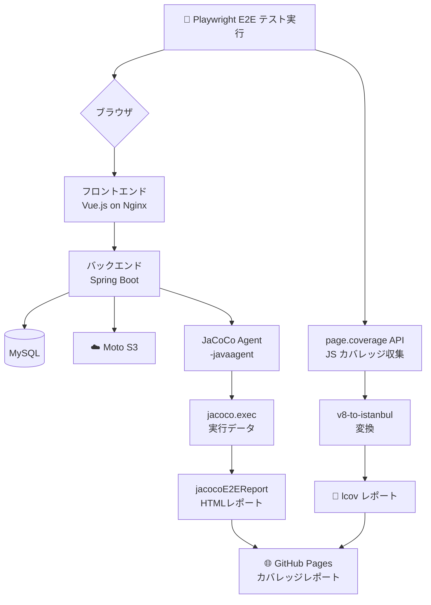
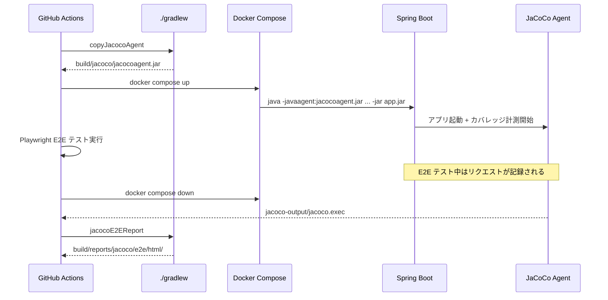
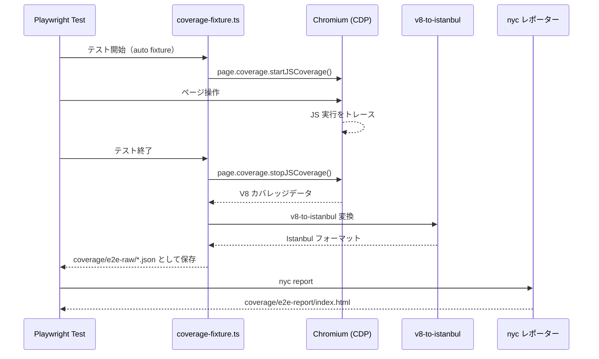
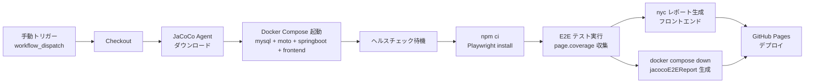

# 📊 E2E テストによるカバレッジ計測ガイド

> このドキュメントでは、Playwright E2E テストを使ったフロントエンド・バックエンドのカバレッジ計測方法と、GitHub Pages への自動レポート公開について解説します。

---

## 🗂 目次

1. [概要とアーキテクチャ](#概要とアーキテクチャ)
2. [E2E カバレッジのメリット・デメリット](#e2e-カバレッジのメリットデメリット)
3. [バックエンド JaCoCo 設定](#バックエンド-jacoco-設定)
4. [フロントエンド Playwright Coverage 設定](#フロントエンド-playwright-coverage-設定)
5. [ローカルでの実行方法](#ローカルでの実行方法)
6. [GitHub Actions による自動化](#github-actions-による自動化)
7. [GitHub Pages へのレポート公開](#github-pages-へのレポート公開)
8. [トラブルシューティング](#トラブルシューティング)

---

## 🏗 概要とアーキテクチャ

本プロジェクトでは、ブラウザを使った E2E テスト（Playwright）の実行に合わせてコードカバレッジを計測します。  
ユニットテストでは計測できない「実際のユーザー操作による経路」のカバレッジを可視化できます。



### 計測対象

| レイヤー | ツール | 出力形式 |
|---|---|---|
| フロントエンド (Vue.js) | Playwright `page.coverage` + v8-to-istanbul | lcov / HTML |
| バックエンド (Spring Boot) | JaCoCo Agent (実行時アタッチ) | HTML / XML |

---

## ⚖️ E2E カバレッジのメリット・デメリット

### ✅ メリット

| メリット | 説明 |
|---|---|
| 🎯 **リアルなカバレッジ** | 実際のブラウザ操作を通じてカバーされるコードが計測される |
| 🔗 **E2E 統合の検証** | フロント→バック→DB の一連の流れが通っているか確認できる |
| 🐛 **デグレ検出** | リリース前に重要フローが壊れていないか確認できる |
| 📈 **ユニットテストとの補完** | ユニットテストが薄い部分も E2E で補える |
| 🚀 **CI/CD 統合** | GitHub Actions で自動化し、Pages でいつでも確認できる |

### ❌ デメリット

| デメリット | 説明 |
|---|---|
| ⏱ **実行時間が長い** | E2E テストはブラウザを起動するためユニットテストより遅い |
| 🔧 **環境構築が複雑** | Docker, JaCoCo Agent, v8-to-istanbul など複数ツールの連携が必要 |
| 📊 **精度の限界** | フロント側は minify されたコードの計測が困難（ソースマップ必須）|
| 🔀 **テスト順依存** | ステートフルな E2E テストは実行順で結果が変わることがある |
| 💔 **フレーキー** | ネットワーク・タイミング問題でテストが不安定になりやすい |

---

## 🔙 バックエンド JaCoCo 設定

### 仕組み

Spring Boot アプリを **JaCoCo Java エージェント**付きで起動し、E2E テスト実行後に `.exec` ファイルからレポートを生成します。



### 設定ファイル

`backend/build.gradle` の主要設定:

```groovy
// JaCoCo エージェント jar を取り出すタスク
configurations { jacocoAgent }
dependencies {
    jacocoAgent "org.jacoco:org.jacoco.agent:${jacoco.toolVersion}:runtime"
}

tasks.register('copyJacocoAgent', Copy) {
    from configurations.jacocoAgent
    into layout.buildDirectory.dir('jacoco')
    rename { 'jacocoagent.jar' }
}

// E2E exec ファイルからレポート生成
tasks.register('jacocoE2EReport', JacocoReport) {
    executionData fileTree(project.rootDir).include('**/jacoco-output/jacoco.exec')
    sourceSets sourceSets.main
    reports {
        xml.required = true
        html.required = true
    }
}
```

`infra/docker-compose.ci.yml` の Spring Boot 設定:

```yaml
springboot:
  environment:
    JAVA_TOOL_OPTIONS: >-
      -javaagent:/jacoco/jacocoagent.jar=destfile=/jacoco-output/jacoco.exec,output=file
  volumes:
    - ./jacoco:/jacoco:ro          # jacocoagent.jar をマウント
    - ./jacoco-output:/jacoco-output  # exec ファイルを出力
```

---

## 🎭 フロントエンド Playwright Coverage 設定

### 仕組み

Chromium の CDP（Chrome DevTools Protocol）を使って JavaScript のカバレッジを計測し、Istanbul 形式に変換してレポートを生成します。



### カバレッジ自動 Fixture

`tests/e2e/fixtures/coverage-fixture.ts` が **auto fixture** として全テストに自動適用されます。
テストコードに変更は不要で、`test` を coverage-fixture からインポートするだけです:

```typescript
// 通常の Playwright test の代わりに coverage-fixture を使う
import { test, expect } from './fixtures/coverage-fixture';

test('ページが表示されること', async ({ page }) => {
  await page.goto('/');
  await expect(page).toHaveTitle('...');
});
```

---

## 💻 ローカルでの実行方法

### 前提条件

```bash
# Node.js 20+ が必要
node --version  # v20.x.x

# フロントエンド依存関係インストール
cd frontend
npm ci
npx playwright install chromium
```

### E2E テストとカバレッジの実行

```bash
# サービス起動（MySQL + Moto + Spring Boot + Frontend）
cd infra
docker compose -f docker-compose.local.yml up -d

# E2E テスト実行 + カバレッジ収集
cd ../frontend
npm run test:e2e:coverage

# レポート確認
open coverage/e2e-report/index.html    # macOS
xdg-open coverage/e2e-report/index.html  # Linux
```

### バックエンド E2E カバレッジのローカル実行

```bash
# JaCoCo エージェント jar を取り出す
cd backend
./gradlew copyJacocoAgent

# infra/jacoco ディレクトリにコピー
mkdir -p ../infra/jacoco
cp build/jacoco/jacocoagent.jar ../infra/jacoco/

# E2E テスト実行後（jacoco.exec が生成された後）
./gradlew jacocoE2EReport

# レポート確認
open build/reports/jacoco/jacocoE2EReport/html/index.html
```

---

## ⚙️ GitHub Actions による自動化

`.github/workflows/e2e.yml` が以下の手順を自動実行します:



### ワークフロー構成

```yaml
on:
  workflow_dispatch:   # 手動実行

jobs:
  e2e:
    steps:
      - name: Download JaCoCo Agent
      - name: Start Docker Compose (with JaCoCo)
      - name: Run Playwright E2E Tests
      - name: Generate Frontend Coverage Report (nyc)
      - name: Generate Backend E2E Coverage (jacocoE2EReport)
      - name: Deploy to GitHub Pages
```

---

## 🌐 GitHub Pages へのレポート公開

E2E ワークフローが `main` ブランチで実行されると、カバレッジレポートが GitHub Pages に公開されます。

### レポート構造

```
gh-pages/
├── index.html                    # レポート一覧
├── frontend/                     # フロントエンドカバレッジ
│   └── index.html
└── backend/                      # バックエンドカバレッジ
    └── index.html
```

### アクセス方法

```
https://<username>.github.io/<repository>/
```

### GitHub Pages の有効化

リポジトリの Settings → Pages → Source を `gh-pages` ブランチに設定してください。

---

## 🔧 トラブルシューティング

### フロント: `page.coverage` が空

| 原因 | 対処 |
|---|---|
| Chromium 以外のブラウザ | `playwright.config.ts` でブラウザが `chromium` になっているか確認 |
| `localhost` URL のフィルタ | `coverage-fixture.ts` の URL フィルタ条件を確認 |
| ソースマップなし | Vite の `build.sourcemap: true` を確認 |

### バックエンド: `jacoco.exec` が生成されない

| 原因 | 対処 |
|---|---|
| エージェントがマウントされていない | `infra/jacoco/jacocoagent.jar` が存在するか確認 |
| ボリュームパス誤り | `docker-compose.ci.yml` の volumes 設定を確認 |
| 出力ディレクトリの権限 | `infra/jacoco-output/` の書き込み権限を確認 |

```bash
# jacoco-output ディレクトリを手動作成
mkdir -p infra/jacoco-output
chmod 777 infra/jacoco-output
```

### GitHub Pages: デプロイが失敗する

```yaml
# workflow の permissions に以下が必要
permissions:
  contents: write
  pages: write
  id-token: write
```

---

## 📚 参考リンク

- [Playwright Coverage API](https://playwright.dev/docs/api/class-coverage)
- [JaCoCo ドキュメント](https://www.jacoco.org/jacoco/trunk/doc/)
- [v8-to-istanbul](https://github.com/istanbuljs/v8-to-istanbul)
- [nyc (Istanbul CLI)](https://github.com/istanbuljs/nyc)
- [GitHub Pages with Actions](https://docs.github.com/en/pages/getting-started-with-github-pages/configuring-a-publishing-source-for-your-github-pages-site)
