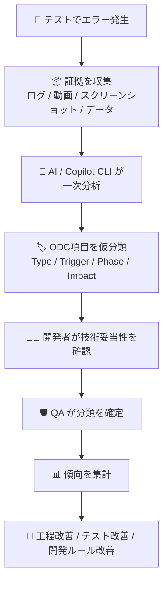
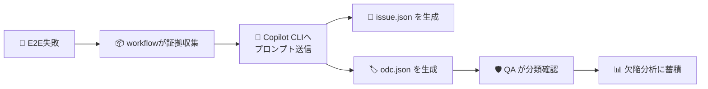
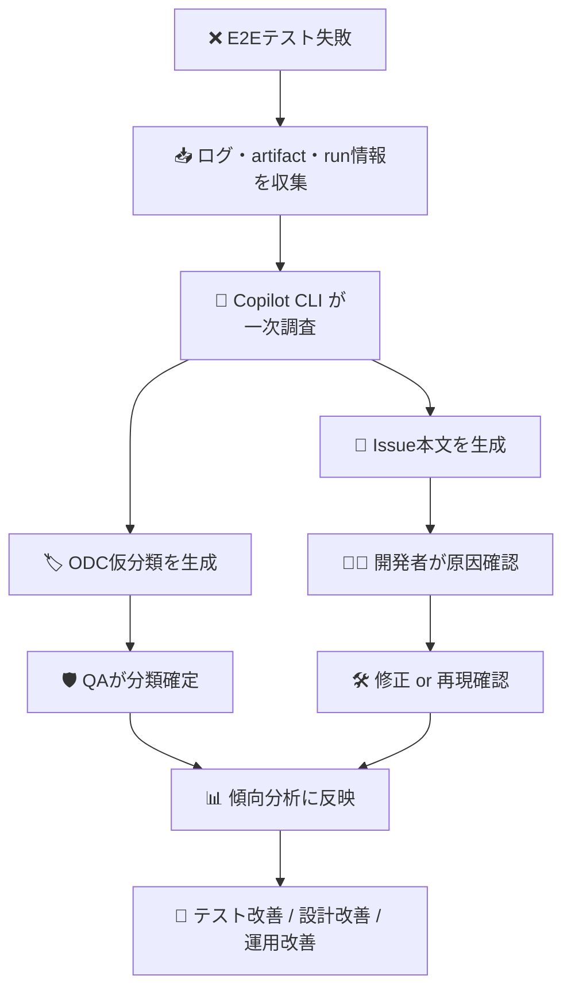

# HRサービス向け 品質検証 × ODT（ODC）分析 活用案 🧭

## はじめに 🎯

このメモは、**HRサービスのソフトウェア品質検証に ODT 分析を取り入れたい**ときの、初心者向けの草案です。

> 📌 本文では、ユーザーが使っている「ODT分析」という言い方を尊重しつつ、
> 一般的なソフトウェア品質の文脈では **ODC（Orthogonal Defect Classification：直交欠陥分類）** を指すものとして整理します。

この文書で扱うテーマは次の4つです。

- 🧑‍💻 **開発者**と 🛡️ **品質保証者（QA）** の両方にメリットがある活用案
- 🧪 **各テスト工程でエラーが出たときに ODC 分析を使うメリット / デメリット**
- 🤖 **現在 Copilot CLI が行っている E2E エラー一次調査に、ODC 分析を追加できるか**
- 🚀 **環境構築・推進者を含めた役割分担、導入工程、業務フロー**

---

## ODT（ODC）分析って何？ 🔍

ODC は、不具合を「なんとなく難しかった」で終わらせず、**決まった切り口で分類して、どの工程に弱さがあるかを見つける手法**です。

### ざっくり言うと

| 項目 | 意味 | 初心者向けの言い換え |
| --- | --- | --- |
| Defect Type | 不具合の種類 | どんな壊れ方か |
| Trigger | 発見のきっかけ | 何をしたら見つかったか |
| Phase | 混入工程 / 検出工程 | いつ作り込み、いつ見つかったか |
| Impact | 影響範囲 | どれくらい困るか |
| Action | 改善アクション | 次に何を変えるべきか |

### ODC を使う目的

- 🧩 不具合を**感想ではなく構造で見る**
- 📈 エラーの傾向をためて、**弱い工程を見つける**
- 🔁 「直す」だけでなく、**再発防止につなげる**

---

## なぜ HRサービスで有効なのか？ 🏢

HRサービスでは、一般的なWebアプリの品質観点に加えて、**人事データ・評価情報・労務情報**のようなセンシティブな情報を扱います。

そのため、単に「バグがあった」で終わらせず、

> **どの工程で、どんな種類の不具合が、どの条件で見つかり、なぜ漏れたのか**

を継続的に見ることが重要です。

### HRサービスで特に見たい観点

| 観点 | 具体例 |
| --- | --- |
| 🔐 セキュリティ | 権限不備、個人情報の露出、監査ログ不足 |
| 🧾 業務整合性 | 人事評価計算ミス、承認フロー不整合 |
| 🌍 利用者影響 | 管理者・従業員・人事担当で画面や権限が異なる |
| 🧪 回帰しやすさ | 年度切替、組織改編、雇用形態差分などで壊れやすい |
| 📉 操作性 | 迷いやすい導線、入力ミスしやすいUI |

---

## 品質保証者と開発者の両方にメリットがある案 🌈

ODC分析を入れる価値は、**QAだけが得すること**でも、**開発者だけが楽になること**でもありません。

両者のメリットを揃えると、運用が定着しやすくなります。

### 両者にとっての価値

| 対象 | メリット | 具体例 |
| --- | --- | --- |
| 🧑‍💻 開発者 | 原因の見え方が揃う | 「E2E失敗」ではなく「テストデータ不備」「待機不足」「権限条件漏れ」まで言語化できる |
| 🧑‍💻 開発者 | 再発防止しやすい | 似たエラーをまとめて対策できる |
| 🛡️ QA | テストで見つけた不具合を工程改善につなげやすい | どの工程に弱点があるか説明しやすい |
| 🛡️ QA | 報告の説得力が上がる | 「件数が多い」ではなく「設計起因の欠陥が結合/E2Eで多発」と示せる |
| 🤝 両者 | 会話が建設的になる | 人責めでなく、工程・ルール・設計の改善に会話を寄せられる |

### 導入メッセージのコツ 💡

- ❌ 「不具合を細かく分類してください」だけだと運用が重く見える
- ✅ 「再発防止のために、最低限の共通ラベルを持ちましょう」と伝える
- ✅ 「一次分類は AI / Copilot CLI が支援、人が最終確認」とすると始めやすい

---

## 3つのロールと役割分担 👥

このテーマは、以下の3ロールで整理すると進めやすいです。

### ロール別の目的

| ロール | 主な目的 | ひとことで言うと |
| --- | --- | --- |
| 🧑‍💻 開発者 | エラーを早く理解し、正しく修正する | 原因を直す人 |
| 🛡️ 品質保証者（QA） | 欠陥傾向を見て、品質改善につなげる | 品質を守る人 |
| 🚀 環境構築・推進者 | 分析の仕組みを整え、継続運用を作る | 回る仕組みを作る人 |

### ロール別の役割・分担

| ロール | 主な役割 | 具体的な分担 | 成果物の例 |
| --- | --- | --- | --- |
| 🧑‍💻 開発者 | 原因確認、修正、再発防止策の提案 | エラーの一次確認、ODC候補の妥当性確認 | 修正PR、原因メモ |
| 🛡️ QA | 分類基準整備、傾向分析、改善提案 | ODC項目定義、レビュー、ダッシュボード化 | 欠陥分類表、分析レポート |
| 🚀 推進者 | 分析入力の整備、自動化、教育 | Copilot CLI連携、テンプレート整備、運用定着 | プロンプト、workflow、運用ガイド |

### 誰が何を決めるか

| テーマ | 主担当 | 関与する人 |
| --- | --- | --- |
| ODC分類項目の定義 | 🛡️ QA | 開発リーダー、推進者 |
| どこまで AI に任せるか | 🚀 推進者 | QA、開発者 |
| 一次調査の出力形式 | 🚀 推進者 | QA |
| 最終的な分類の確定 | 🛡️ QA | 開発者 |
| 再発防止アクションの実施 | 🧑‍💻 開発者 | QA、推進者 |

---

## ODC分析の基本フロー 🔄



---

## 導入テスト工程の考え方 🧪

ODC分析は、**導入そのものも段階的に試す**のが安全です。

### 導入ステップ

| 工程 | 目的 | 主担当 | 確認したいこと |
| --- | --- | --- | --- |
| 1. 分類項目の設計 | 何をどう分類するか決める | 🛡️ QA | 項目が多すぎないか、現場で使えるか |
| 2. サンプル分類 | 過去の不具合で試す | 🧑‍💻 / 🛡️ | 同じ事象を同じように分類できるか |
| 3. AI一次分類テスト | Copilot CLI などに仮分類させる | 🚀 推進者 | 出力の再現性、誤分類の傾向 |
| 4. E2E連携テスト | 既存一次調査に組み込む | 🚀 推進者 | ログ不足時でも最低限動くか |
| 5. レビュー運用テスト | 人が最終確定できるか | 🛡️ QA | 工数が増えすぎないか |
| 6. 傾向分析運用 | 分類結果を改善に使う | 🛡️ QA | 本当に工程改善につながるか |

---

## 各テスト工程で、エラー分析に ODC を使うメリット / デメリット ⚖️

### 工程別の見え方

| テスト工程 | 典型的なエラー | ODC分析のメリット | ODC分析のデメリット / 注意点 |
| --- | --- | --- | --- |
| 単体テスト | ロジックミス、条件分岐漏れ | バグの種類を早く整理できる / 実装修正に直結しやすい | 件数が多いと分類が面倒 / 粒度が細かすぎると疲れる |
| 結合テスト | API連携不整合、データ不整合 | インターフェース設計やデータ受け渡しの弱点が見える | 原因が複数層にまたがり、分類がぶれやすい |
| システムテスト | 業務フロー不整合、権限ミス | 業務シナリオ起点での欠陥傾向を整理しやすい | ビジネス要件の曖昧さが混ざりやすい |
| E2Eテスト | UI操作失敗、待機不足、テストデータ不備 | 実行環境起因と実装起因を切り分けやすい / 一次調査自動化と相性がよい | flakyな失敗を誤分類しやすい / 証拠不足だと精度が落ちる |
| 受入テスト(UAT) | 要件期待値ずれ、操作性課題 | ユーザー視点の欠陥をプロセス改善に結びつけやすい | 技術分類だけでは足りず、業務文脈の補足が必要 |
| 本番障害 / 運用試験 | 性能、権限、データ整合性 | 重大事故の再発防止に効く / 監視や運用設計の弱さも見える | 緊急対応中は分類まで手が回りにくい |

### まとめると

#### メリット ✅

- エラーを**工程改善につなげやすい**
- QAと開発で**共通言語**を持ちやすい
- AIに一次分類をさせることで、**初動を速くできる**
- E2Eや結合試験のような複雑な失敗でも、**見方を揃えやすい**

#### デメリット ⚠️

- 分類項目が多いと、運用がすぐ重くなる
- 証拠が不足していると、AIも人も誤分類しやすい
- flaky test や環境起因の失敗は、断定が危険
- 「分類すること」が目的化すると、本来の改善につながらない

---

## E2Eエラーの一次調査に、Copilot CLI で ODC分析をやらせることは可能か？ 🤖

### 結論

> **可能です。**
> ただし、**最終確定は人が行う前提の「一次分析・仮分類支援」** として使うのが現実的です。

現在このリポジトリでは、E2E失敗時に **Copilot CLI がログ・artifact・run情報を読んで、原因分析用の Issue を自動生成する workflow** がすでにあります。

そのため、次の一歩としては、

> **Issue本文の生成に加えて、ODC項目を structured output として一緒に出させる**

のが最も自然です。

### Copilot CLI に向いている理由

| 理由 | 説明 |
| --- | --- |
| 📚 自然言語ログを読める | failed log, run summary, artifact説明をまとめて扱える |
| 🧩 リポジトリ文脈も見られる | 実装と失敗証拠を合わせて推論できる |
| 🏷️ 仮分類が得意 | Type / Trigger / Phase などの候補出しに向く |
| 📝 JSON出力を強制できる | issue.json と同様に、odc.json 形式で出力しやすい |

### ただし注意点

| 注意点 | 理由 |
| --- | --- |
| 断定しすぎないこと | ログ不足だと「仮説」止まりにすべきケースがある |
| 入力証拠を揃えること | 動画・スクリーンショット・テストデータ情報がないと精度が落ちる |
| 分類辞書を固定すること | 毎回自由分類だと比較できない |
| 個人情報をマスクすること | HRサービスではログに機微情報が混ざりやすい |

---

## Copilot CLI に ODC分析をさせる具体的な方法 🛠️

### 方法の全体像



### 具体ステップ

| ステップ | やること | ポイント |
| --- | --- | --- |
| 1 | ODC分類項目を固定する | 例: `defect_type`, `trigger`, `inject_phase`, `detect_phase`, `severity`, `confidence` |
| 2 | Copilotのプロンプトに分類ルールを書く | 自由記述ではなく候補値を与える |
| 3 | `issue.json` に加えて `odc.json` を出力させる | 後続の集計で使いやすくする |
| 4 | 信頼度 (`confidence`) を出させる | 人がレビュー優先度を決めやすい |
| 5 | QAが確定・修正する | AIの出力をそのまま正解扱いしない |
| 6 | 集計して改善アクションへつなぐ | テスト改善 / 実装ルール改善 / 設計見直し |

### まず定義したい ODC項目の例

| 項目 | 例 |
| --- | --- |
| defect_type | `logic`, `validation`, `permission`, `timing`, `data`, `ui`, `environment`, `test_script` |
| trigger | `manual_input`, `api_response`, `async_wait`, `role_switch`, `year_end_data`, `regression_run` |
| inject_phase | `requirements`, `design`, `implementation`, `test_data_preparation`, `test_script_creation`, `environment_setup` |
| detect_phase | `unit`, `integration`, `system`, `e2e`, `uat`, `production` |
| severity | `low`, `medium`, `high`, `critical` |
| confidence | `high`, `medium`, `low` |

### Copilot CLI に期待する出力イメージ

| ファイル | 用途 |
| --- | --- |
| `issue.json` | 人が読む一次調査Issue |
| `odc.json` | 構造化された欠陥分類データ |
| `summary.md`（任意） | 週次・月次レポートの素材 |

### `odc.json` に持たせたい内容

| キー | 内容 |
| --- | --- |
| `defect_type` | 不具合タイプ |
| `trigger` | 発見トリガー |
| `inject_phase` | 混入工程 |
| `detect_phase` | 検出工程 |
| `symptom` | 観測された事象 |
| `probable_cause` | 有力原因 |
| `evidence` | 根拠ログ / artifact |
| `confidence` | AIの確信度 |
| `next_action` | 次の確認・修正案 |

### 実運用でのポイント

- ✅ **候補値を固定語彙にする**
- ✅ **「断定」と「仮説」を分ける**
- ✅ **証拠不足なら `confidence=low` を許容する**
- ✅ **flaky / 環境起因 / テストスクリプト起因を別カテゴリで持つ**
- ✅ **E2E失敗のたびに蓄積し、月次で傾向を見る**

### Copilot CLI 用の具体プロンプト案 🧾

以下は、**E2E失敗の一次調査 + ODC仮分類** を Copilot CLI に依頼するためのサンプルです。

#### 1. 最小構成のプロンプト案

```text
あなたは、HRサービスの E2E テスト失敗を分析する品質分析アシスタントです。

以下の証拠を読み、
1. 失敗の概要
2. 有力な原因
3. 仮説
4. ODC分類
5. 次のアクション
を整理してください。

入力:
- リポジトリ: ${GITHUB_WORKSPACE}
- run要約: /tmp/e2e-analysis/logs/run-summary.txt
- 失敗ログ: /tmp/e2e-analysis/logs/failed-steps.log
- run情報: /tmp/e2e-analysis/logs/run.json
- artifact: /tmp/e2e-analysis/artifacts

ODC分類は次の候補値から選んでください。
- defect_type: logic / validation / permission / timing / data / ui / environment / test_script
- trigger: manual_input / api_response / async_wait / role_switch / year_end_data / regression_run / unknown
- inject_phase: requirements / design / implementation / test_data_preparation / test_script_creation / environment_setup / unknown
- detect_phase: unit / integration / system / e2e / uat / production
- confidence: high / medium / low

制約:
- 断定できないものは「仮説」と明記すること
- 証拠にない内容は断定しないこと
- HRサービスのため、個人情報や機微情報はそのまま出力しないこと

出力:
- /tmp/e2e-analysis/output/issue.json
- /tmp/e2e-analysis/output/odc.json

issue.json の形式:
{"title":"...","body":"..."}

odc.json の形式:
{
	"defect_type":"...",
	"trigger":"...",
	"inject_phase":"...",
	"detect_phase":"e2e",
	"symptom":"...",
	"probable_cause":"...",
	"evidence":["..."],
	"confidence":"high|medium|low",
	"next_action":["..."]
}

issue.json の本文には以下の見出しを含めてください。
- 概要
- 発生した事象
- 有力な原因
- 仮説
- 根拠ログ
- ODC仮分類
- 対応案
- 参考情報
```

#### 2. 既存 workflow に寄せた実践向けプロンプト案

```text
あなたは GitHub Actions 上で E2E 失敗を調査する GitHub Copilot です。
以下の証拠を読み、原因分析と ODC 仮分類を行ってください。

証拠:
- リポジトリ一式: ${GITHUB_WORKSPACE}
- 失敗run情報: /tmp/e2e-analysis/logs/run.json
- run要約: /tmp/e2e-analysis/logs/run-summary.txt
- 失敗ログ: /tmp/e2e-analysis/logs/failed-steps.log（なければ full.log）
- 失敗artifact群: /tmp/e2e-analysis/artifacts

タスク:
1. 失敗原因を「確度の高い原因」と「仮説」に分けて整理する。
2. GitHub Issue 作成用に /tmp/e2e-analysis/output/issue.json を UTF-8 JSON で作成する。
3. ODC 仮分類結果として /tmp/e2e-analysis/output/odc.json を UTF-8 JSON で作成する。

ODC分類ルール:
- defect_type は次から選ぶ: logic / validation / permission / timing / data / ui / environment / test_script
- trigger は次から選ぶ: manual_input / api_response / async_wait / role_switch / year_end_data / regression_run / unknown
- inject_phase は次から選ぶ: requirements / design / implementation / test_data_preparation / test_script_creation / environment_setup / unknown
- detect_phase は e2e 固定
- confidence は high / medium / low から選ぶ

issue.json の形式:
{"title":"...","body":"..."}

odc.json の形式:
{
	"defect_type":"...",
	"trigger":"...",
	"inject_phase":"...",
	"detect_phase":"e2e",
	"symptom":"...",
	"probable_cause":"...",
	"evidence":["..."],
	"confidence":"...",
	"next_action":["..."]
}

制約:
- title は 120 文字以内
- body は日本語
- 断定できない内容は「仮説」と明記
- ログや artifact に根拠がない内容は断定しない
- 個人情報・機微情報はマスクして記載する
- 本文末尾に必ず次の1行を入れる: Workflow Run: ${TARGET_RUN_URL}
- issue.json / odc.json 以外のファイルは変更しない

issue.json の body には以下の見出しを含める:
- 概要
- 発生した事象
- 有力な原因
- 仮説
- 根拠ログ
- ODC仮分類
- 対応案
- 参考情報
```

#### 3. `odc.json` の出力例

```json
{
	"defect_type": "timing",
	"trigger": "async_wait",
	"inject_phase": "implementation",
	"detect_phase": "e2e",
	"symptom": "ログイン直後のダッシュボード表示を待たずに要素検索し、Playwright が timeout した",
	"probable_cause": "画面遷移完了前に要素取得を行っており、待機条件が不足している可能性が高い",
	"evidence": [
		"failed-steps.log に locator timeout が記録されている",
		"run-summary.txt にログイン後のダッシュボード描画失敗が見られる"
	],
	"confidence": "medium",
	"next_action": [
		"画面遷移完了を待つ待機条件を追加する",
		"対象テストの flaky 再発状況を確認する",
		"同様の待機不足が他のシナリオにないか確認する"
	]
}
```

#### 4. プロンプト設計のコツ

| コツ | 理由 |
| --- | --- |
| 候補値を明示する | 自由分類だと集計しづらい |
| 出力ファイルを固定する | workflow に組み込みやすい |
| 仮説と断定を分ける | 誤った強断定を防げる |
| `confidence` を出させる | QAレビューの優先順位を付けやすい |
| マスキングを明記する | HR系データの漏えいリスクを下げる |

---

## いまの E2E一次調査フローに ODC分析を足す業務フロー 🔄



---

## 品質保証者・開発者・推進者それぞれの業務フロー 🧵

### 🧑‍💻 開発者の流れ

1. Issue やログからエラー内容を確認する
2. Copilot CLI の ODC仮分類を見て、技術的に妥当か判断する
3. 実装修正・テスト修正・データ修正のどれかを見極める
4. 修正後、再発防止策を短く残す

### 🛡️ QA の流れ

1. ODC分類の最終確定を行う
2. 同種エラーが増えていないか確認する
3. テスト観点漏れ・データ準備漏れ・設計観点漏れを分析する
4. 月次 / スプリントごとに改善提案を出す

### 🚀 推進者の流れ

1. workflow で必要な証拠を自動収集する
2. Copilot CLI へのプロンプトを整備する
3. `issue.json` と `odc.json` の保存先・活用先を整える
4. 運用ルール・FAQ・レビュー基準を更新する

---

## 導入時のメリット・デメリットまとめ 📊

| 観点 | メリット | デメリット / リスク | 対策 |
| --- | --- | --- | --- |
| 初動対応 | 一次調査が速くなる | 誤分類の可能性 | 人が最終確定する |
| 継続改善 | 傾向分析しやすい | 項目が多いと定着しにくい | 最初は少数項目に絞る |
| QA報告 | 説明しやすい | 形だけの分類になりやすい | 改善アクションまでセットにする |
| 開発効率 | 似た障害を横断で見られる | 分類作業が負担に見える | AI一次分類で負担を下げる |
| HR領域 | 機微情報を踏まえた分析ができる | ログに個人情報が混ざる | マスキングを前提にする |

---

## 小さく始める導入案 🌱

いきなり完璧を目指さず、次の順で始めるのがおすすめです。

| Step | やること | ゴール |
| --- | --- | --- |
| 1 | E2E失敗Issueに ODC項目を手で追記してみる | 項目設計を固める |
| 2 | Copilot CLI に仮分類させる | 一次分類の実用性を見る |
| 3 | QAがレビューして確定する | 誤分類パターンを把握する |
| 4 | `odc.json` を蓄積する | 分析可能なデータを作る |
| 5 | 月次で傾向を見る | 工程改善に結びつける |

---

## まとめ 📝

ODT（ODC）分析は、HRサービスの品質検証において、**不具合をただ直すだけでなく、工程改善につなげるための共通言語**として有効です。

特に次の形にすると、現場で使いやすくなります。

- 🧑‍💻 **開発者**には「原因理解を早くする支援」として使う
- 🛡️ **QA**には「傾向分析と再発防止の材料」として使う
- 🚀 **推進者**は「Copilot CLI + workflow + 構造化出力」で運用を仕組み化する

また、現在すでにある **Copilot CLI による E2E一次調査フロー** には、ODC分析を追加可能です。

その際のポイントは、

> **AIに一次分類をさせ、人が最終確定し、構造化データとして蓄積すること**

です。

これにより、E2E失敗のたびに「その場しのぎ」で終わらず、
**どの工程に改善余地があるか** をチームで継続的に見える化できるようになります。

---

## 補足メモ 📌

- HR領域では、ログ・artifactに個人情報や評価情報が混ざらないよう配慮が必要
- flaky test は「製品不具合」と「テスト不具合」を分けて扱うと分析しやすい
- ODC項目は最初から増やしすぎず、まずは 5〜7 項目程度から始めるのが安全