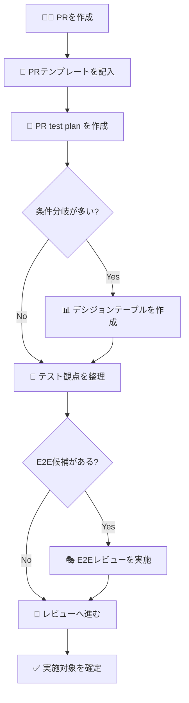

# QA Test Management

このディレクトリは、**Feature PRごとのテスト設計・実行計画**を管理する場所です。

初心者の方でも使いやすいように、以下をまとめて置いています。

- PRごとのテスト計画書
- デシジョンテーブルやケース削減用テンプレート
- E2E設計レビュー用チェックリスト
- 役割別チェックリスト
- 記入済みサンプル

---

## 🎯 このディレクトリでできること

たとえば、次のような場面で使います。

| やりたいこと | 使うもの |
|---|---|
| PRごとに何をテストするか整理したい | `pr/` + `templates/pr-test-plan-template.md` |
| 条件分岐が多く、ケースを減らしたい | `templates/decision-table-template.md` |
| E2Eにするか迷っている | `templates/e2e-design-review-checklist.md` |
| 開発 / QA / レビューアの確認項目をそろえたい | `templates/role-checklists.md` |
| 完成形の例を見たい | `pr/PR-000-sample-test-plan.md` |

---

## 📁 ディレクトリ構成

| パス | 用途 |
|---|---|
| `pr/` | PR単位のテスト計画書を保存 |
| `specs/` | 補助的な設計メモや個別計画 |
| `templates/` | テンプレートやチェックリスト |
| `dashboard.md` | 全体状況をまとめるダッシュボード |

## 生成物

- `pr/PR-<番号>-test-plan.md`: PR単位のテスト計画
- `.meta/pr-<番号>.json`: ダッシュボード集計用メタ情報
- `dashboard.md`: 全PRの集計ダッシュボード
- `ai/prompt-pr-<番号>.txt`: 本番PR workflow が Copilot に渡す prompt
- `ai/pr-<番号>-ai-suggestions.md`: Copilot または fallback による補完提案

---

## 🧩 主要テンプレート一覧

| ファイル | 用途 | 使うタイミング |
|---|---|---|
| `templates/pr-test-plan-template.md` | PRテスト計画書の雛形 | PR作成後 |
| `templates/decision-table-template.md` | 条件整理とケース削減 | 条件分岐が多い機能の設計時 |
| `templates/e2e-design-review-checklist.md` | E2E設計レビュー | E2E採用前 |
| `templates/role-checklists.md` | 役割別の確認項目 | レビュー前後 |
| `templates/planner-prompt-template.md` | Playwright planner への入力雛形 | E2E観点の初稿作成時 |
| `templates/pr-meta-template.json` | dashboard用 meta 情報の雛形 | 自動生成設計 / 手動確認時 |

---

## 🤖 自動生成の設計案

PR test plan を自動生成する設計案は、次のファイルにまとめています。

- `auto-generation-design.md`

この設計書では、以下を整理しています。

- `pr-test-plan.yml` の責務
- 既存スクリプトとの接続方法
- meta 情報の使い方
- dashboard 更新の流れ
- PRコメントへの反映方針
- fork PR 時のフォールバック方針
- branch反映を許可する条件
- 段階導入の進め方

現在は、次の workflow が `main` で利用できます。

- `.github/workflows/pr-test-plan.yml`
- `.github/workflows/pr-test-plan-simulation.yml`

`COPILOT_GITHUB_TOKEN` が設定されている場合、`pr-test-plan.yml` も **AI 提案ファイル** を生成します。

branch へ戻す運用ルールは、次のファイルに分けて整理しています。

- `branch-reflection-policy.md`

### 🎯 Phase 3: E2E vs Manual テスト分類の AI 補助（2026-08-23 実装）

Phase 3 では、AI が変更ファイルを分析し、E2E テスト・手動テスト・総合テストの適切な分類を補助します。

**主な機能:**
- 変更ファイルの種類に基づいたテスト分類の推奨
- E2E 自動化の ROI（投資対効果）を考慮した提案
- 優先度付き（高/中/低）のテスト候補リスト生成

**詳細ガイド:**
- `phase-3-classification-guide.md` - Phase 3 の詳細な使い方と分類基準

**分類基準の例:**
- E2E テスト: UI 変更、API エンドポイント追加、認証フロー変更など
- 手動テスト: ドキュメント変更、UI/UX デザイン改善、アクセシビリティ対応など
- 総合テスト: CI/CD 変更、インフラ設定変更、セキュリティ対応など

---

## ⚙️ GitHub 管理画面での設定手順

`pr-test-plan.yml` の branch 反映を使う場合は、GitHub の管理画面で **Variables / Secrets** を設定します。

画面の場所は次の通りです。

1. GitHub でリポジトリを開く
2. `Settings`
3. 左メニューの `Secrets and variables`
4. `Actions`

### Variables に設定するもの

| 名前 | 例 | 必須 | 用途 |
|---|---|---|---|
| `PR_TEST_PLAN_PUSH_ENABLED` | `false` / `true` | branch反映時のみ必須 | branch 反映の全体ON/OFF |
| `PR_TEST_PLAN_PUSH_LABEL` | `test-plan-sync` | 推奨 | branch 反映を許可するPRラベル |

### Secrets に設定するもの

| 名前 | 必須 | 用途 |
|---|---|---|
| `PR_TEST_PLAN_GITHUB_TOKEN` | branch反映時のみ必須 | PR branch へ push するための token |

### まずおすすめの初期値

| 項目 | 推奨値 |
|---|---|
| `PR_TEST_PLAN_PUSH_ENABLED` | `false` |
| `PR_TEST_PLAN_PUSH_LABEL` | `test-plan-sync` |

最初は **artifact / workflow summary / PRコメントだけ** で運用し、安定してから branch 反映を有効にするのがおすすめです。

### branch反映を有効にする手順

1. `Settings` → `Secrets and variables` → `Actions` を開く
2. Variable `PR_TEST_PLAN_PUSH_ENABLED` を `true` に設定する
3. Variable `PR_TEST_PLAN_PUSH_LABEL` を設定する
	- 例: `test-plan-sync`
4. Secret `PR_TEST_PLAN_GITHUB_TOKEN` を登録する
5. 対象PRに `test-plan-sync` ラベルを付ける
6. draft を解除して通常PRにする
7. workflow 実行後、summary の `Branch sync result` を確認する

### branch反映が走らない代表例

- fork PR である
- draft PR である
- 指定ラベルが付いていない
- `PR_TEST_PLAN_PUSH_ENABLED != true`
- `PR_TEST_PLAN_GITHUB_TOKEN` が未設定

---

## 🧪 ローカルでのシミュレーション手順

今回の対応は、ローカルでも安全にシミュレーションできます。

前提:

- Node.js 20 系
- リポジトリルートの `.nvmrc`

`nvm` を使う場合は、リポジトリルートで Node.js 20 を合わせます。

1. `nvm install`
2. `nvm use`

使うスクリプト:

- `scripts/simulate-pr-test-plan-workflow.js`

### できること

- PR test plan 生成
- meta 生成
- dashboard 更新
- fork / draft / label / token 条件による branch 反映判定
- artifact 名 / summary 内容の確認

### 例: 通常PRとして試す

`node scripts/simulate-pr-test-plan-workflow.js --pr-number 91001 --output-root .tmp/pr-test-plan-sim/normal`

### 例: fork PR として試す

`node scripts/simulate-pr-test-plan-workflow.js --pr-number 91002 --fork true --output-root .tmp/pr-test-plan-sim/fork`

### 例: draft PR として試す

`node scripts/simulate-pr-test-plan-workflow.js --pr-number 91003 --draft true --output-root .tmp/pr-test-plan-sim/draft`

### 例: label 不足を試す

`node scripts/simulate-pr-test-plan-workflow.js --pr-number 91004 --labels needs-review --output-root .tmp/pr-test-plan-sim/no-label`

実行後は、指定した `output-root` 配下に次が出力されます。

- `qa/test-management/pr/PR-<番号>-test-plan.md`
- `qa/test-management/.meta/pr-<番号>.json`
- `qa/test-management/dashboard.md`
- `qa/test-management/simulation-summary.md`
- `frontend/tests/e2e/generated/pr-<番号>-*.spec.ts`

本番の PR workflow では、追加で次も出力対象になります。

- `qa/test-management/ai/prompt-pr-<番号>.txt`
- `qa/test-management/ai/pr-<番号>-ai-suggestions.md`

### ローカルに Node.js がない場合

この環境のように `node` が未導入でも、GitHub Actions からシミュレーションできます。

使う workflow:

- `.github/workflows/pr-test-plan-simulation.yml`

この workflow は、`COPILOT_GITHUB_TOKEN` が設定されていれば **GitHub Copilot CLI を実行して AI 提案ファイルも生成** します。

手順:

1. GitHub の `Actions` タブを開く
2. `PR Test Plan Simulation` を選ぶ
3. `Run workflow` を押す
4. `scenario` を選ぶ
	- `normal`
	- `fork`
	- `draft`
	- `no-label`
	- `no-token`
5. 実行後、artifact `pr-test-plan-simulation-<scenario>-<pr_number>` を確認する

artifact には次も含まれます。

- `qa/test-management/ai/prompt.txt`
- `qa/test-management/ai/pr-<番号>-ai-suggestions.md`

`COPILOT_GITHUB_TOKEN` が未設定でも workflow 自体は動き、AI 提案ファイルには fallback 内容が出力されます。

---

## ✅ まずはこれを見る

初めて使う場合は、次の順番がおすすめです。

1. `.github/pull_request_template.md` を見る
2. `pr/PR-000-sample-test-plan.md` を見る
3. `templates/pr-test-plan-template.md` をコピーして使う
4. 条件分岐が多ければ `templates/decision-table-template.md` を使う
5. E2Eにするか迷ったら `templates/e2e-design-review-checklist.md` を使う

---

## 🚦 標準的な使い方

### この流れで見るポイント

- PR単位で何を確認するかを明確にする
- 不要なケースは理由つきで減らす
- E2Eは必要なものだけに絞る
- AIは下書きや候補提示に使い、人が採否を決める

---

## 📘 サンプルの見方

`pr/PR-000-sample-test-plan.md` は、完成形の例です。

見るときは、次の観点に注目すると分かりやすいです。

- 変更概要をどう書くか
- リスクをどう分けるか
- 観点をどの工程に振り分けるか
- 実施しない観点の理由をどう残すか
- AI利用記録をどう残すか

---

## 現在の扱い

- 現在は、PR単位のテスト設計生成物・補助ファイル・AI提案ファイルの保管場所です。
- 現行のCI運用では、`.github/workflows/pr-test-plan.yml` が本番PR向け、`.github/workflows/pr-test-plan-simulation.yml` がシミュレーション向けに利用されます。
- `.github/workflows/e2e.yml` / `.github/workflows/e2e-failure-analysis.yml` / `.github/workflows/pr-quality.yml` も引き続き並行して利用されます。

## 補足

- E2E/総合項目は `frontend/tests/e2e/generated/` 配下の Playwright 雛形に反映されます。
- テンプレート群は、`testplan.md` の標準プロセス図と対応しています。
- 今後 PR自動生成フローを追加する場合も、このディレクトリを正本として拡張します。
- fork PR では、PRコメントや branch 反映の代わりに artifact / workflow summary を確認する運用を基本にします。
- branch 反映時に push 対象となるのは、`qa/test-management/pr/`、`qa/test-management/.meta/`、`qa/test-management/dashboard.md`、`qa/test-management/ai/`、`frontend/tests/e2e/generated/` の生成物だけです。
