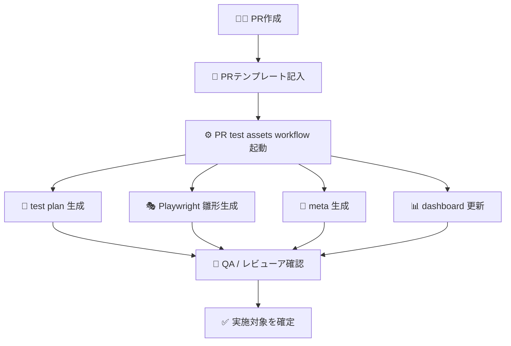
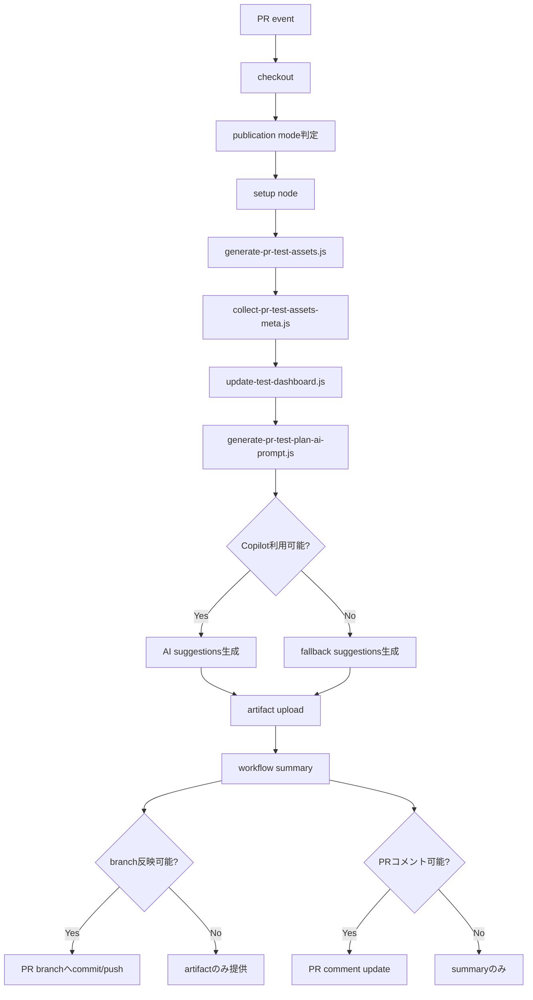

# PR Test Plan 自動生成設計案

## 🎯 目的

この設計書は、PR作成時に **PR test plan / Playwright雛形 / dashboard用meta情報** を自動生成し、必要に応じて **PR branch へ安全に反映する** ための設計案です。

この仕組みを入れることで、次を目指します。

- PRごとに最低限のテスト設計を残す
- QA / 開発 / レビューアが同じ情報を見られるようにする
- Playwright / 手動 / 総合テストの入口を自動でそろえる
- 後からダッシュボード集計できるようにする

---

## 🧭 何を自動生成するか

| 生成物 | 出力先 | 目的 |
|---|---|---|
| PR test plan | `qa/test-management/pr/PR-<番号>-test-plan.md` | PR単位のテスト計画 |
| Playwright 雛形 | `frontend/tests/e2e/generated/pr-<番号>-*.spec.ts` | E2Eのたたき台 |
| meta情報 | `qa/test-management/.meta/pr-<番号>.json` | ダッシュボード集計 |
| dashboard | `qa/test-management/dashboard.md` | PR横断の一覧表示 |
| AI suggestions | `qa/test-management/ai/pr-<番号>-ai-suggestions.md` | Copilot による補完提案 |
| PRコメント | PRコメント欄 | レビュー時の要約 |

---

## 🔐 fork PR / branch反映の基本方針

この自動生成は、PRの種類によって公開方法を分けます。

| PR種別 | PRコメント | artifact | branch反映 |
|---|---|---|---|
| 同一リポジトリPR | 実施する | 保存する | 条件付きで許可 |
| draft PR | 実施する | 保存する | 実施しない |
| fork PR | 実施しない | 保存する | 実施しない |

### 理由

- fork PR は token / write 権限の扱いが難しい
- 無理に branch へ戻そうとすると、権限事故や運用の複雑化を招きやすい
- まずは **artifact + workflow summary** を必ず残す方が安全

### branch反映を許可する条件

- 同一リポジトリPRである
- draft PR ではない
- `PR_TEST_PLAN_PUSH_LABEL` で指定した label が付いている
- `PR_TEST_PLAN_PUSH_ENABLED=true` が設定されている
- `PR_TEST_PLAN_GITHUB_TOKEN` が設定されている

この条件を満たしたときだけ、生成した test plan / meta / dashboard / Playwright 雛形を PR branch へ commit & push します。

### push 対象パス

branch 反映で push してよいファイルは、次の生成物だけに限定します。

- `qa/test-management/pr/PR-<番号>-test-plan.md`
- `qa/test-management/.meta/pr-<番号>.json`
- `qa/test-management/dashboard.md`
- `frontend/tests/e2e/generated/pr-<番号>-*.spec.ts`

workflow では、この許可リスト以外の差分を検知した場合は branch 反映を中止します。

---

## 🏗️ 既存資産との対応

このリポジトリには、すでに次の資産があります。

| 既存資産 | 役割 |
|---|---|
| `.github/workflows/pr-quality.yml` | PR時の品質ゲート |
| `scripts/generate-pr-test-assets.js` | PR本文から test plan / Playwright 雛形を生成 |
| `scripts/collect-pr-test-assets-meta.js` | 生成物を検証し meta を作成 |
| `scripts/update-test-dashboard.js` | meta を集計して dashboard を更新 |
| `scripts/generate-pr-test-plan-ai-prompt.js` | Copilot へ渡す prompt を生成 |
| `scripts/ensure-pr-test-plan-ai-output.js` | AI提案ファイルの fallback を作成 |
| `qa/test-management/templates/pr-test-plan-template.md` | 人が書く test plan の雛形 |
| `.github/pull_request_template.md` | PR作成時の入力をそろえる |

つまり、**完全新規ではなく、既存資産をつないで運用化する設計**がもっとも現実的です。

---

## 🔄 標準フロー



---

## 🚦 推奨トリガー

### 第一候補

- `pull_request`
  - `opened`
  - `synchronize`
  - `reopened`
  - `ready_for_review`

### 理由

- PR本文や変更差分が更新されたタイミングで再生成できる
- 既存の `pr-quality.yml` とタイミングを合わせやすい
- 人がレビューする前に test plan を用意しやすい

---

## 🧩 workflow の責務分割案

### 案A: `pr-quality.yml` に統合しない

**おすすめです。**

理由:

- 品質ゲートと生成処理を分けられる
- 失敗時の原因切り分けがしやすい
- 将来 `workflow_dispatch` で再実行しやすい

### 推奨構成

| Workflow | 役割 |
|---|---|
| `pr-quality.yml` | unit test / SonarQube |
| `pr-test-plan.yml` | test plan / spec / meta / PRコメント生成 |

---

## 🛠️ `pr-test-plan.yml` の処理案

### ステップ構成

1. Checkout
2. Node.js セットアップ
3. PR本文の取得
4. `scripts/generate-pr-test-assets.js` 実行
5. `scripts/collect-pr-test-assets-meta.js` 実行
6. `scripts/update-test-dashboard.js` 実行
7. `generate-pr-test-plan-ai-prompt.js` 実行
8. 条件を満たす場合は Copilot で AI提案を生成
9. 生成物を artifact に保存
10. workflow summary に結果を要約
11. 条件を満たす場合のみ PR branch へ反映
12. コメント可能なPRでは PRコメントに結果を要約

### フロー図



---

## 📝 PRコメントの想定内容

```markdown
### 🧪 PR Test Plan Generated

- Test Plan: `qa/test-management/pr/PR-123-test-plan.md`
- Playwright Draft: `frontend/tests/e2e/generated/pr-123-xxxx.spec.ts`
- Meta: `qa/test-management/.meta/pr-123.json`
- Dashboard: `qa/test-management/dashboard.md`

#### Summary
- E2E items: 2
- Manual items: 3
- Integration items: 1

#### Next actions
- [ ] QA が観点を確認
- [ ] 必要なら test plan を追記
- [ ] E2E の採否を決定
```

### fork PR の場合

- PRコメントは付けず、workflow summary に結果を残します
- artifact から test plan / meta / dashboard / Playwright 雛形を取得します
- branch への push は行いません

### AI提案の扱い

- `COPILOT_GITHUB_TOKEN` がある場合は Copilot が `qa/test-management/ai/pr-<番号>-ai-suggestions.md` を生成します
- token がない場合でも fallback ファイルを作るため、artifact の形は崩れません
- AI提案は **正本ではなく補完提案** として扱い、人レビューで採否を決めます

### workflow summary で見えるようにする内容

- artifact 名
- 生成されたファイルパス
- branch 反映の可否
- required label 名
- artifact の取得手順

---

## 📦 `.meta` の役割

`.meta/pr-<番号>.json` は、後続のダッシュボード集計や将来の自動分析に使います。

### 入れておきたい情報

| キー | 内容 |
|---|---|
| `pr` | PR番号 |
| `title` | PRタイトル |
| `url` | PR URL |
| `e2eCount` | E2E項目数 |
| `manualCount` | 手動項目数 |
| `integrationCount` | 総合項目数 |
| `generatedSpec` | 生成されたPlaywrightファイル |
| `generatedPlan` | 生成されたtest plan |
| `updatedAt` | 更新日時 |

---

## 🤖 AIをどこに入れるか

### まずはルールベース中心

現時点では、既存スクリプトが **PR本文のチェックリストから生成**する方式です。
これは非常に良い出発点です。

### 次段階でAIを加える場所

| フェーズ | AIの役割 |
|---|---|
| Phase 1 | PR本文から観点要約を作る |
| Phase 2 | 変更ファイルから不足観点候補を提案する |
| Phase 3 | E2E候補 / manual候補の分類を補助する |
| Phase 4 | 既存 test plan との差分更新案を出す |

### 方針

- **正本はPR本文 + 人レビュー**
- **AIは候補提示と補足説明**

---

## ⚠️ リスクと対策

| リスク | 内容 | 対策 |
|---|---|---|
| PR本文未記入 | 生成物が空になる | PR template で必須入力を誘導 |
| E2Eが増えすぎる | Playwright 雛形だけ大量生成される | E2E review checklist と併用 |
| AIが観点を広げすぎる | 過剰テストになる | 人レビューで採否を決める |
| workflow肥大化 | PR処理が重くなる | `pr-quality.yml` と分離 |
| fork PR制約 | write/comment が制限される | 生成のみ or artifact保存へフォールバック |
| branch自動更新の誤爆 | 想定外のcommitが積まれる | 明示的な opt-in 変数 + 専用token + 同一repo限定 |
| label付け忘れ | branch反映されない | required label 名を summary / README に明記 |
| draft のまま更新 | 自動commitしたくない段階で反映される | draft PR は常に branch 反映しない |

---

## 🚀 段階導入案

### Step 1

- 既存スクリプトを使い、`pr-test-plan.yml` を追加
- PRコメントに生成物リンクを出す

### Step 2

- dashboard へ反映
- `qa/test-management/README.md` に自動生成運用を追記

### Step 3

- fork PR / branch反映のポリシーを明文化
- 同一repo PRだけ branch 反映を opt-in で許可

### Step 4

- AIで観点候補を補足
- PR本文が薄い場合に不足観点を提案

### Step 5

- 変更ファイルと SonarQube 情報を使って候補を強化

---

## ✅ まず実装すべき最小構成

最初に作るなら、以下が最小でおすすめです。

1. `.github/workflows/pr-test-plan.yml` を新設
2. `generate-pr-test-assets.js` を実行
3. `collect-pr-test-assets-meta.js` を実行
4. PRコメントに生成物サマリを出す
5. `update-test-dashboard.js` を実行する
6. 生成物を artifact に保存する
7. fork PR は summary-only にフォールバックする

これで、いきなり高度なAI分類を入れなくても、**PR test plan の自動生成基盤** は十分に成立します。

---

## 📎 関連ドキュメント

- `branch-reflection-policy.md`
- `.github/workflows/pr-test-plan.yml`
- `.github/workflows/pr-test-plan-simulation.yml`
- `scripts/pr-test-plan-publication-mode.js`
- `scripts/simulate-pr-test-plan-workflow.js`

---

## 🧪 シミュレーション

ローカルで今回の分岐を確認したい場合は、`scripts/simulate-pr-test-plan-workflow.js` を使います。

前提の Node.js バージョンは **20系** です。リポジトリルートの `.nvmrc` を使うと合わせやすくなります。

このスクリプトは、次をまとめて再現します。

- PR本文からの test plan 生成
- meta 生成
- dashboard 更新
- publication mode 判定
- workflow summary 相当の出力

特に、次のケースを個別に試せます。

- 通常PR
- fork PR
- draft PR
- required label 不足
- token 未設定相当

### AI simulation の位置づけ

`pr-test-plan-simulation.yml` では、`COPILOT_GITHUB_TOKEN` が設定されている場合に **GitHub Copilot CLI** を実行し、simulation で生成された test plan / meta / dashboard を読ませた上で、次のファイルを出力します。

- `qa/test-management/ai/prompt.txt`
- `qa/test-management/ai/pr-<番号>-ai-suggestions.md`

これにより、rule-based 生成結果に対して **AI の補完提案** を別 artifact として比較できます。

secret 未設定時は fallback の AI 提案ファイルを生成し、workflow 自体は継続します。
