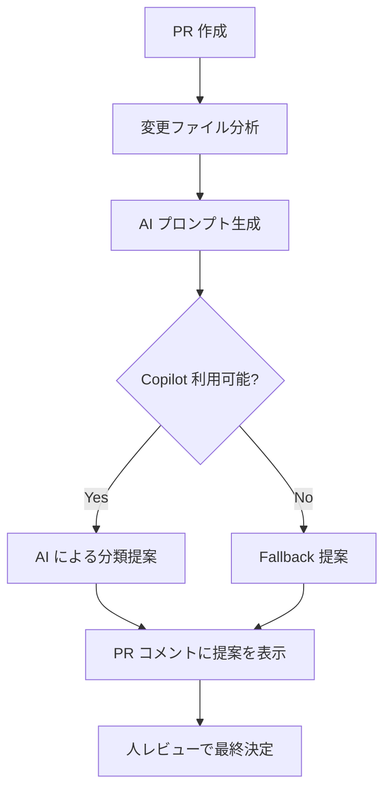

# Phase 3: E2E vs Manual テスト分類ガイド

## 📋 概要

Phase 3 では、GitHub Copilot を活用して、PR の変更内容を分析し、E2E テスト・手動テスト・総合テストの適切な分類を AI が補助します。

## 🎯 目的

- PR の変更ファイルを分析し、テスト種別の適切な分類を提案
- E2E 自動化の ROI（投資対効果）を考慮した推奨を提供
- 人レビューの負担を軽減し、テスト計画の品質を向上

## 🔄 フロー



## 📊 分類基準

### E2E テスト候補の判定基準

以下の変更がある場合、E2E テストを推奨します:

#### 優先度: 高
- ✅ ユーザー認証・認可フローの変更
- ✅ クリティカルなビジネスロジックの変更
- ✅ データの作成・更新・削除（CRUD）操作の変更

#### 優先度: 中
- ✅ ユーザーインターフェース（Vue.js コンポーネント、画面遷移）の変更
- ✅ API エンドポイントの追加・変更（フロントエンドから呼び出されるもの）
- ✅ フォーム入力・バリデーションロジックの変更

#### 優先度: 低
- ✅ 画像アップロード、ファイル操作機能の変更（既存機能の軽微な修正）

### 手動テスト候補の判定基準

以下の変更がある場合、手動テストを推奨します:

#### 優先度: 高
- ✅ UI/UX の視覚的な改善（デザイン・レイアウト・スタイル）
- ✅ アクセシビリティ対応（スクリーンリーダー対応など）
- ✅ 複雑な権限チェック（複数ロールの組み合わせ）

#### 優先度: 中
- ✅ ドキュメント・README の変更（内容の正確性確認が必要）
- ✅ エラーメッセージ、ラベル、テキストの変更
- ✅ パフォーマンス改善（体感速度の確認が必要）

#### 優先度: 低
- ✅ ブラウザ互換性が重要な変更（メジャーブラウザでの動作確認）
- ✅ E2E 自動化が困難または ROI が低いもの

### 総合テスト候補の判定基準

以下の変更がある場合、総合テストを推奨します:

#### 優先度: 高
- ✅ セキュリティ関連の変更（脆弱性対応、認証強化）
- ✅ データベーススキーマの変更（マイグレーション、整合性）
- ✅ CI/CD パイプラインの変更（ワークフロー全体の動作確認）

#### 優先度: 中
- ✅ インフラストラクチャ・Docker 設定の変更
- ✅ 依存関係の更新（互換性、デグレード確認）
- ✅ バックエンドのユニットテストの変更（テストと実装の整合性）

## 🤖 AI プロンプトの構成

Phase 3 では、以下の情報を AI に提供します:

1. **変更ファイル分析の指示**
   - 変更されたファイルの種類を判定
   - 影響範囲を推定

2. **分類基準の提示**
   - E2E/手動/総合テストの判定基準を詳細に記載
   - 優先度付けの方針を明示

3. **ROI 考慮の指示**
   - E2E 自動化のコストと効果を考慮
   - 過剰なテストを避ける方針

4. **出力形式の指定**
   - Markdown 形式で構造化された提案
   - 各候補に優先度（高/中/低）を付与

## 📝 AI 提案の出力例

```markdown
# AI Test Plan Suggestions

## 概要
- PR番号: #123
- 変更内容: ログイン画面のバリデーション強化

## テスト分類の推奨（Phase 3）

### E2E テスト候補
- **優先度: 高** - ログイン機能の E2E シナリオ再実行
  - 理由: 認証フローの変更のため、エンドツーエンドでの動作確認が必須
- **優先度: 中** - バリデーションエラーメッセージの表示確認
  - 理由: ユーザー体験に直結するため、画面上での動作確認が重要

### 手動テスト候補
- **優先度: 中** - エラーメッセージの文言確認
  - 理由: 自然な日本語表現かどうかの確認が必要
- **優先度: 低** - ブラウザ互換性確認
  - 理由: 標準的な HTML/CSS の変更のため、主要ブラウザでの確認で十分

### 総合テスト候補
- **優先度: 高** - セキュリティスキャン実行
  - 理由: 認証ロジックの変更のため、脆弱性の確認が必須
```

## ✅ 運用フロー

1. **PR 作成時**
   - PR test plan workflow が自動実行
   - AI が変更内容を分析し、分類を提案

2. **AI 提案の確認**
   - `qa/test-management/ai/pr-<番号>-ai-suggestions.md` を確認
   - 提案内容を PR コメントで確認

3. **人レビューでの最終決定**
   - AI 提案を参考に、テスト計画を調整
   - 必要に応じて test plan を追記・修正

4. **テスト実行**
   - E2E テストは Playwright で自動実行
   - 手動テストは PR レビュー時に実施
   - 総合テストは CI/CD パイプラインで実行

## 🎓 ベストプラクティス

### DO ✅
- AI 提案を参考にしつつ、プロジェクトの文脈を考慮して最終決定する
- E2E 自動化の ROI を常に意識する（作成コスト vs 長期的効果）
- 優先度の高い項目から順に対応する
- 手動テストは必要最小限に抑える（自動化可能なものは E2E へ）

### DON'T ❌
- AI 提案を無批判に全て採用しない
- E2E テストを過剰に追加しない（メンテナンスコストを考慮）
- 手動テストを軽視しない（視覚的確認が必要な場合は手動で）
- 総合テストをスキップしない（セキュリティやインフラ変更時は必須）

## 🔧 トラブルシューティング

### AI 提案が生成されない場合

1. **Copilot token が設定されているか確認**
   ```bash
   # GitHub Actions の Secrets を確認
   # COPILOT_GITHUB_TOKEN が設定されているか
   ```

2. **Fallback 提案を確認**
   - Copilot が利用できない場合、fallback ファイルが生成される
   - 基本的な分類基準が記載されているので、参考にする

3. **手動で分類を決定**
   - 本ガイドの分類基準を参照し、人レビューで決定

### AI 提案が不適切な場合

- AI の提案はあくまで参考情報
- プロジェクトの文脈や過去の経験を踏まえて、人が最終判断する
- 不適切な提案は無視し、適切な分類を test plan に反映する

## 📚 関連ドキュメント

- [PR Test Plan 自動生成設計案](./auto-generation-design.md)
- [Branch 反映ポリシー](./branch-reflection-policy.md)
- [PR Test Plan テンプレート](./templates/pr-test-plan-template.md)

## 🔄 更新履歴

- 2026-08-23: Phase 3 実装・ドキュメント作成
