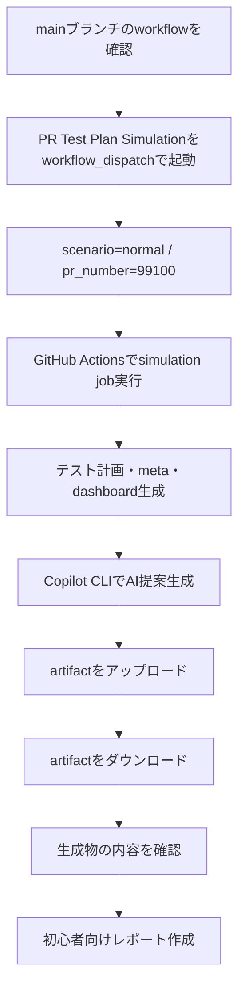
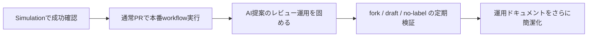

# PR Test Plan CIシミュレーション実行レポート 🚀

## ひとことで言うと

`main` ブランチ上で **GitHub Actions の実運用CIとして** `PR Test Plan Simulation` を実行し、
**テスト計画生成・AI提案生成・artifact出力まで成功** したことを確認しました。  
今回は人手操作の代わりに、workflow の起動・完了確認・artifact 回収・中身確認までこちらで実施しています。

## 今回の確認対象 🧪

| 項目 | 内容 |
|---|---|
| 実行日 | 2026-03-15 |
| 実行場所 | GitHub Actions（`main` ブランチ） |
| Workflow | `PR Test Plan Simulation` |
| Run ID | `23107179312` |
| Run URL | https://github.com/cocomomojo/test_app/actions/runs/23107179312 |
| シナリオ | `normal` |
| シミュレーション用 PR 番号 | `99100` |
| 必須ラベル | `test-plan-sync` |
| 結果 | ✅ Success |

## 何を代替実行したか 🤖

通常は人が GitHub の画面から確認することが多いですが、今回は以下を代替実行しました。

| 人がやりがちな操作 | 今回の対応 |
|---|---|
| workflow を手動起動する | CLI から `main` に対して起動 |
| 実行完了を待つ | 完了までポーリングして成功確認 |
| Actions 画面で step を目視確認する | step ごとの成功状態を取得 |
| artifact をダウンロードする | 実際に回収して中身を確認 |
| 生成された md/json/spec を確認する | ローカルに展開して内容確認 |

## 実行フロー（やったこと）🗺️

## Step結果のサマリー ✅

CI上で確認できた主要 step はすべて成功しました。

| Step | 結果 | メモ |
|---|---|---|
| Setup Scripts | ✅ | 共通スクリプト準備OK |
| Checkout repository | ✅ | リポジトリ取得OK |
| Detect Copilot availability | ✅ | Copilot 利用可能を検知 |
| Validate COPILOT_GITHUB_TOKEN secret | ✅ | Secret 検証OK |
| Install GitHub Copilot CLI | ✅ | Copilot CLI 導入OK |
| Setup Node.js | ✅ | Node 20 系セットアップOK |
| Resolve scenario parameters | ✅ | `normal` 条件を解決 |
| Run simulation | ✅ | simulation 本体成功 |
| Generate AI prompt | ✅ | AI向け prompt 生成成功 |
| Execute GitHub Copilot CLI for AI suggestions | ✅ | AI提案生成成功 |
| Ensure AI suggestion output | ✅ | 出力ファイル保証OK |
| Write AI simulation summary | ✅ | Summary 出力成功 |
| Upload simulation artifacts | ✅ | artifact 保存成功 |

## 実行結果の読み方 📘

### 1. CI は成功したか？

- **はい、成功です** ✅
- Run conclusion: `success`
- Job conclusion: `success`

### 2. AI は本当に使われたか？

- **はい、使われています** ✅
- `Execute GitHub Copilot CLI for AI suggestions` step が `success`
- 生成 artifact 内に `qa/test-management/ai/pr-99100-ai-suggestions.md` が存在

### 3. 何が生成されたか？

artifact から以下のファイルを実際に確認しました。

| ファイル | 役割 | 確認結果 |
|---|---|---|
| `qa/test-management/pr/PR-99100-test-plan.md` | テスト計画本体 | ✅ 存在 |
| `qa/test-management/.meta/pr-99100.json` | 件数・生成先などのメタ情報 | ✅ 存在 |
| `qa/test-management/dashboard.md` | ダッシュボード更新結果 | ✅ 存在 |
| `qa/test-management/ai/prompt.txt` | Copilot に渡した prompt | ✅ 存在 |
| `qa/test-management/ai/pr-99100-ai-suggestions.md` | AIの改善提案 | ✅ 存在 |
| `frontend/tests/e2e/generated/pr-99100-simulation-pr-for-test-plan-workflow.spec.ts` | Playwright 雛形 | ✅ 存在 |
| `qa/test-management/simulation-summary.md` | simulation の要約 | ✅ 存在 |

## 生成物から確認できたこと 🔍

### simulation summary で確認できた内容

| 項目 | 値 |
|---|---|
| comment mode | `comment-and-summary` |
| branch sync enabled | `true` |
| branch sync reason | 同一リポジトリPRかつ push 条件を満たしたため branch 反映を実施 |
| required label | `test-plan-sync` |
| labels | `test-plan-sync` |

> 補足: これは **simulation 上の判定結果** です。`PR Test Plan Simulation` 自体は本番PR branchへ push する workflow ではなく、
> 「本番運用条件だとどう判定されるか」を CI 上で再現・確認するための workflow です。

### meta JSON で確認できた内容

| 項目 | 値 |
|---|---|
| E2E件数 | `2` |
| 手動テスト件数 | `1` |
| 総合テスト件数 | `1` |
| 生成 spec | `frontend/tests/e2e/generated/pr-99100-simulation-pr-for-test-plan-workflow.spec.ts` |
| 生成 plan | `qa/test-management/pr/PR-99100-test-plan.md` |

### AI提案ファイルで確認できた内容

AI は、既存の最低限のテスト計画に対して次のような改善候補を提案していました。

| 分類 | 例 | ねらい |
|---|---|---|
| E2E追加候補 | 未認証アクセス時のログイン画面リダイレクト | 認証の境界条件確認 |
| E2E追加候補 | 必須項目空送信時のバリデーション表示 | 異常系の補強 |
| 手動テスト候補 | APIタイムアウト時のエラー表示 | UX/障害時の見え方確認 |
| 総合テスト候補 | API 5xx 時の保存失敗ハンドリング | フロントとAPIの異常系確認 |

つまり、今回の AI 活用は「ファイルを作っただけ」ではなく、
**人がレビュー時に足りない観点を補う提案を実際に生成できている** 状態です。✨

## artifact 名の見方 📦

少しだけ紛らわしいので、ここを整理します。

| 名前 | どこで使われるか | 今回の値 |
|---|---|---|
| simulation workflow の upload artifact 名 | GitHub Actions の artifact 一覧 | `pr-test-plan-simulation-normal-99100` |
| simulation summary 内の擬似的な本番 artifact 名 | 本番 workflow 相当の表示再現 | `pr-test-assets-99100` |

どちらも正しく、**役割が違うだけ**です。  
前者は「今回ダウンロードした artifact の箱の名前」、後者は「本番 workflow が使う名前の再現」です。

## 成果まとめ 🎉

| 成果 | 判定 |
|---|---|
| `main` 上で CI simulation を実行できた | ✅ |
| workflow が完走した | ✅ |
| Copilot CLI が CI 上で実行された | ✅ |
| AI提案ファイルが生成された | ✅ |
| artifact を回収して内容確認できた | ✅ |
| 初心者向けの結果整理ができた | ✅ |

## 今の運用で言えること 🧭

このリポジトリでは、少なくとも次が確認できています。

1. **GitHub Actions 上で simulation workflow は実用レベルで動作する**
2. **Copilot を使った AI 提案生成も CI 上で成功する**
3. **生成物は test plan / meta / dashboard / spec / AI提案 のセットで残る**
4. **本番 workflow (`PR Test Plan Assets`) にも AI 生成ロジックが反映済み**

## 次のアクション候補 📌

### すぐやると良いもの

| 優先度 | アクション | 理由 |
|---|---|---|
| 高 | 実際のPRで `PR Test Plan Assets` を1件流して確認 | simulation ではなく本番イベント確認のため |
| 高 | `qa/test-management/ai/` のAI提案レビュー運用を決める | 提案を誰が採否判断するか明確化するため |
| 中 | `no-label` / `draft` / `fork` シナリオも CI で定期確認 | ポリシーの退行検知に役立つため |
| 中 | README に「artifact 名の違い」を一文追加 | 初見で混乱しやすいため |
| 低 | simulation 実行結果を定期レポート化 | 継続運用の見える化のため |

### おすすめの検証順

## 最終結論 🏁

今回の依頼に対して、**CI上で実際の運用形式に近い simulation を実行し、成功を確認し、artifact の中身まで検証したうえでレポート化** しました。  
特に重要なのは、**Copilot を使った AI 提案生成が CI 上で成功している** ことです。

次の一手としては、**実際のPRイベントで `PR Test Plan Assets` を1回流して、本番ルートでも同様に確認すること** をおすすめします。
