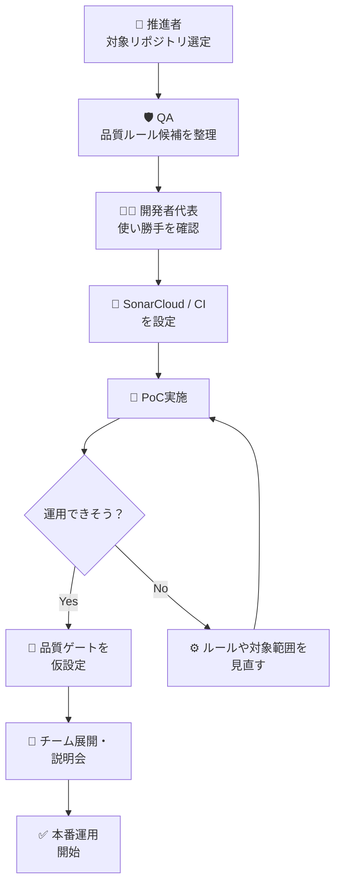
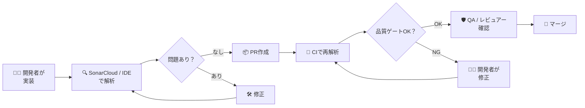

# SonarCloud 活用案（初心者向けリファクタリング版）

## はじめに 🎯

このメモは、**SonarCloud をこれから導入・活用したいチーム向け**に、初心者にもわかりやすく整理した草案です。

特に次の3つを目的にしています。

- 🧑‍💻 **開発者**が「ダメ出しされるツール」ではなく「修正を助けてくれるツール」と感じられること
- 🛡️ **品質保証者（QA）**が、品質確認を仕組み化し、レビューの抜け漏れを減らせること
- 🚀 **SonarCloud環境構築・推進者**が、導入・定着・改善を進めやすくなること

---

## SonarCloud って何？ ☁️

SonarCloud は、ソースコードを自動で解析して、**バグ・脆弱性・保守しづらい書き方**を見つけてくれるクラウド型の品質管理サービスです。

ひとことで言うと、

> **「コードの健康診断を、継続的に自動でやってくれる仕組み」**

です。

### SonarCloud でできること一覧

| 項目 | できること | 初心者向けの言い換え |
| --- | --- | --- |
| 🐞 バグ検出 | 実行時に問題になりそうなコードを見つける | 「あとで事故りそう」な箇所を早めに発見 |
| 🔐 セキュリティ確認 | 脆弱性になりやすい書き方を検出 | 危ないコードを事前に止める |
| 🧹 Code Smell 検出 | 読みにくい・複雑すぎるコードを検出 | 将来つらくなるコードを減らす |
| 📊 カバレッジ可視化 | テストの網羅率を把握できる | 「どこが未テストか」が見える |
| 🔄 PR連携 | Pull Request 上で解析結果を確認できる | レビュー前に機械チェックできる |
| 🚦 品質ゲート | 条件を満たさない変更を止められる | 最低限の品質を守る関所になる |

---

## なぜ導入するのか？ 🤔

SonarCloud の価値は、単に「指摘が増えること」ではありません。

価値はむしろ、次のような**チームの困りごとを減らせること**にあります。

| よくある困りごと | SonarCloud が助けられること |
| --- | --- |
| レビューが人によってブレる | 同じ基準で自動チェックできる |
| バグが後工程で見つかる | 早い段階で検出しやすくなる |
| 開発者がレビュー待ちで止まる | 自分で先に直せる材料が増える |
| QAの確認項目が多い | 機械に任せられる部分を増やせる |
| 品質改善が属人化する | ダッシュボードで状況を共有できる |

---

## AIを組み合わせると何が変わる？ 🤖✨

AIを組み合わせることで、SonarCloud は「問題を見つけるだけの仕組み」から、**問題解決を支援する仕組み**に近づきます。

### 期待できる変化

| 観点 | AIなし | AIあり |
| --- | --- | --- |
| 開発者の体験 | 指摘内容を読んで自力で調査する | 修正の方向性や候補を早く理解できる |
| QAの体験 | 指摘が妥当かを細かく確認する | 指摘の再現性・説明性が上がり判断しやすい |
| 推進者の体験 | 導入説明が「品質のため」だけになる | 「工数削減」「教育」「標準化」まで話せる |

### 開発者・QAがともにメリットを感じやすい案 🌈

| 対象 | メリット | 具体例 |
| --- | --- | --- |
| 🧑‍💻 開発者 | 修正方法を調べる時間を減らせる | IDEやPR上で修正方針のヒントを得る |
| 🧑‍💻 開発者 | 学習コストを下げられる | 「なぜ悪いのか」を理解しやすくなる |
| 🛡️ QA | 単純な指摘を自動化できる | 命名・ヌルチェック・危険な書き方を仕組みで検出 |
| 🛡️ QA | レビューの標準化が進む | 担当者ごとの差を減らせる |
| 🤝 両者 | 議論の質が上がる | 細かい書き方ではなく、仕様や設計に集中できる |

### チーム内での伝え方のコツ 💡

- ❌ 「品質のために守ってください」だけだと、負担感が先に立ちやすい
- ✅ 「調べる時間を減らせる」「レビューの往復を減らせる」と伝えると受け入れられやすい
- ✅ 「人のレビューを減らす」のではなく、**人が見るべきポイントを高度化する**と説明すると納得感が出やすい

---

## 3つのロールと役割分担 🧭

このテーマでは、以下の3ロールで整理すると進めやすいです。

### ロール別の目的

| ロール | 主な目的 | ひとことで言うと |
| --- | --- | --- |
| 🧑‍💻 開発者 | 問題を早く見つけて、早く直す | 手戻りを減らす人 |
| 🛡️ 品質保証者（QA） | 品質基準を整え、確認の抜け漏れを防ぐ | 品質を守る人 |
| 🚀 SonarCloud環境構築・推進者 | 仕組みを整え、定着させる | 使える状態を作る人 |

### ロール別の役割・分担

| ロール | 主な役割 | 分担ポイント | 成果物の例 |
| --- | --- | --- | --- |
| 🧑‍💻 開発者 | 解析結果の確認、修正、再コミット | 日々の開発フローに組み込む | 修正済みコード、PR対応 |
| 🛡️ QA | 品質ルール定義、ゲート条件整理、監視 | 人が見るべき観点を絞る | 品質基準、レビュー観点 |
| 🚀 推進者 | SonarCloud設定、CI連携、教育・展開 | ルールと運用を仕組み化する | 環境設定、導入手順、運用ルール |

### 誰が何を決めるか

| テーマ | 主担当 | 関与する人 |
| --- | --- | --- |
| どのリポジトリに導入するか | 🚀 推進者 | QA、開発リーダー |
| どのルールを厳しく見るか | 🛡️ QA | 推進者、開発者 |
| 日々の指摘対応 | 🧑‍💻 開発者 | 必要に応じてQA |
| 品質ゲートの閾値 | 🛡️ QA / 🚀 推進者 | 開発責任者 |
| 定着施策・教育 | 🚀 推進者 | QA、開発リーダー |

---

## 導入テスト工程の考え方 🧪

SonarCloud は「入れたら終わり」ではなく、**導入してからチームに合う設定へ育てる**のが大事です。

### 導入時に確認したいテスト工程

| 工程 | 目的 | 主担当 | 確認したいこと |
| --- | --- | --- | --- |
| 1. PoC（試行導入） | 小さく試して有効性を確認 | 🚀 推進者 | 対応言語、誤検知の多さ、使いやすさ |
| 2. 開発者テスト | 日常開発で使えるか確認 | 🧑‍💻 開発者 | IDEやPRでの見え方、修正しやすさ |
| 3. QA観点確認 | 品質ルールが妥当か確認 | 🛡️ QA | 重大度、優先度、レビュー観点との整合 |
| 4. CI連携テスト | 自動解析が安定するか確認 | 🚀 推進者 | PR時の実行、失敗時の通知、速度 |
| 5. 品質ゲート試験 | ブロック条件が適切か確認 | 🛡️ QA / 🚀 推進者 | 厳しすぎないか、緩すぎないか |
| 6. 本番運用レビュー | 実運用に耐えるか確認 | 全員 | 手戻り減少、レビュー時間、定着度 |

### 導入テストで特に見たいポイント

- ✅ **誤検知が多すぎないか**
- ✅ **開発者が自分で直せる粒度になっているか**
- ✅ **PRの処理時間が重すぎないか**
- ✅ **品質ゲートが厳しすぎて開発を止めないか**
- ✅ **QAが本当に見るべき観点に集中できるか**

---

## 業務フロー（導入〜運用） 🔄

### 1. 導入フロー

### 2. 日常運用フロー

---

## 各ロールの業務フロー 👥

### 🧑‍💻 開発者の流れ

1. 実装する
2. IDEやPRで指摘を確認する
3. 自分で直せるものはその場で修正する
4. 判断に迷うものだけQAやレビュアーに相談する
5. 品質ゲートを通してPRを出す

### 🛡️ QAの流れ

1. 品質ルール・レビュー観点を定義する
2. 重大な指摘が適切に拾えているか確認する
3. 人が見るべきポイントを設計・仕様に寄せる
4. ダッシュボードで傾向を見て改善提案をする

### 🚀 推進者の流れ

1. SonarCloud と CI/CD を設定する
2. 対象プロジェクト・ルール・ゲートを整える
3. 誤検知や運用負荷を観測する
4. チーム向けに説明資料やFAQを整える
5. 定着状況を見ながら改善を回す

---

## AI活用の導入案（初心者向け） 🪄

### まずは小さく始める

いきなり全社展開するより、まずは**1チーム / 1リポジトリ / 1〜2週間**で試すのがおすすめです。

| ステップ | やること | ねらい |
| --- | --- | --- |
| Step 1 | IDE連携を試す | 開発者が「その場で直せる」体験を作る |
| Step 2 | PR解析を入れる | レビュー前に機械チェックを回す |
| Step 3 | 品質ゲートを緩めに設定 | まずは止めすぎない運用にする |
| Step 4 | QAと振り返る | 本当に見たい指摘だけ残す |
| Step 5 | 対象チームを広げる | 成功パターンを横展開する |

### AI活用で特に伝えたい価値

| 相手 | 刺さりやすいメッセージ |
| --- | --- |
| 🧑‍💻 開発者 | 「レビュー差し戻しを減らせる」「調査時間を減らせる」 |
| 🛡️ QA | 「確認の抜け漏れを減らせる」「レビューを標準化できる」 |
| 🚀 推進者 | 「品質活動を仕組み化できる」「導入効果を説明しやすい」 |

---

## 運用ルールのたたき台 📘

### AI・SonarCloud活用時の基本方針

| 方針 | 内容 |
| --- | --- |
| 機械で見られるものは機械で見る | 命名、単純な危険コード、重複、基本的な保守性は自動化 |
| 人は仕様・設計・ユーザー影響を見る | ビジネスロジックや妥当性に集中 |
| 最初から厳しくしすぎない | 導入初期は、重大度が高いものから運用 |
| 指摘を教育機会に変える | 「なぜ悪いか」を共有し、再発防止につなげる |

### 避けたい進め方 ⚠️

- いきなり全ルールを厳格適用する
- 誤検知を放置したまま「とにかく直して」と言う
- 開発者メリットを説明せず、管理目的だけで導入する
- QAが機械チェックと人のレビューを二重で全部やる

---

## 導入後に測りたい指標 📈

導入効果を見える化するため、次のような指標を持つとよいです。

| 指標 | 見たいこと |
| --- | --- |
| PRでの指摘件数 | 事前検知が進んでいるか |
| レビュー差し戻し回数 | 手戻りが減っているか |
| 修正までの時間 | 開発者の負担が軽くなっているか |
| 重大な品質問題の件数 | 本当にリスクを減らせているか |
| 開発者アンケート | 「使ってよかった」が出ているか |

---

## まとめ 📝

SonarCloud は、単なる静的解析ツールではなく、**品質をチームで継続的に守るための共通基盤**として活用できます。

特に AI と組み合わせると、次のような形で各ロールにメリットを出しやすくなります。

- 🧑‍💻 **開発者**: 修正方針がわかりやすくなり、手戻りを減らせる
- 🛡️ **品質保証者**: 確認を標準化し、重要な観点に集中できる
- 🚀 **推進者**: 導入効果を示しやすく、組織に展開しやすい

おすすめの進め方は、

> **「1チームで小さく始めて、役割分担と品質ゲートを調整しながら広げる」**

です。最初から完璧を目指すより、**使って学び、運用を育てる**方がうまくいきやすいです。

---

## 補足メモ 📌

- SonarCloud のAI支援機能や提供プランは時期・契約によって変わるため、正式導入前に最新情報の確認が必要
- 「AIに全部任せる」のではなく、**自動化する領域と人が判断する領域を分ける**のが成功のポイント
- 初期導入では、**開発者の成功体験づくり**が定着のカギ