# 品質・テスト・生成AI活用計画（test_app向け）

## 🎯 この資料で伝えたいこと

この資料は、**このリポジトリの現状をふまえて、これから品質をどう良くしていくか**を、初心者にもわかりやすく説明するための計画です。

特に、次の流れで読めるようにしています。

1. **いま何ができていて、何が足りないのか**
2. **これから何を追加・整理するのか**
3. **そうすると、どんなメリットがあるのか**

---

## 🧭 まずは全体像

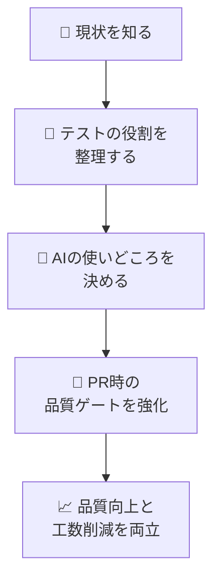

---

## 🏗️ このリポジトリの現状

### いま使っている主な技術

| 項目 | 現状 | 補足 |
|---|---|---|
| Backend | Java 17 + Spring Boot | API / 業務ロジック |
| Frontend | Vue 3 + Vite | 画面表示 / UI |
| Backendテスト | JUnit + JaCoCo | 単体テスト / カバレッジ |
| Frontendテスト | Vitest | 単体テスト |
| E2E | Playwright | UIを通した動作確認 |
| 静的解析 | SonarQube | PR品質ゲートで実行可能 |
| AI活用 | 失敗解析 / 修正PRの一部自動化 | pilot 運用あり |

### いま、できていること ✅

- `pr-quality.yml` で frontend / backend の unit test を実行できる
- SonarQube を PR で動かせる土台がある
- E2E 失敗時に Issue 化し、AI修正につなげる流れが一部ある
- `qa/test-management/` があり、QA成果物の置き場がある

### いま、困っていること ⚠️

| 困りごと | 何が起きるか |
|---|---|
| テスト観点の整理が弱い | どのテストをやるべきか毎回悩む |
| 工程ごとの役割が曖昧 | 同じ確認を何度もやってしまう |
| E2E が Playwright 中心で運用されている | 業務シナリオとして読みやすい形になりにくい |
| AI活用が部分最適 | 全体の品質活動にどう組み込むかが未整理 |
| ドキュメントの表現ゆれ | 初見の人が混乱しやすい |

---

## 😵 現状のままだと何がつらいか

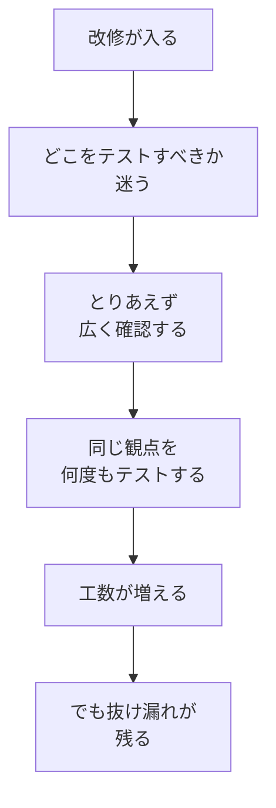

### つまり…

- **時間をかけても安心しきれない**
- **テストの重複が増える**
- **AIを使っても、どこに効いているのか見えにくい**

---

## 🌱 これから目指す姿

### 目指すゴール

> **「人が全部手で考えて実行する」から、**
> **「AIが下書きし、人が判断・承認する」へ少しずつ移す**

### ゴールのイメージ図

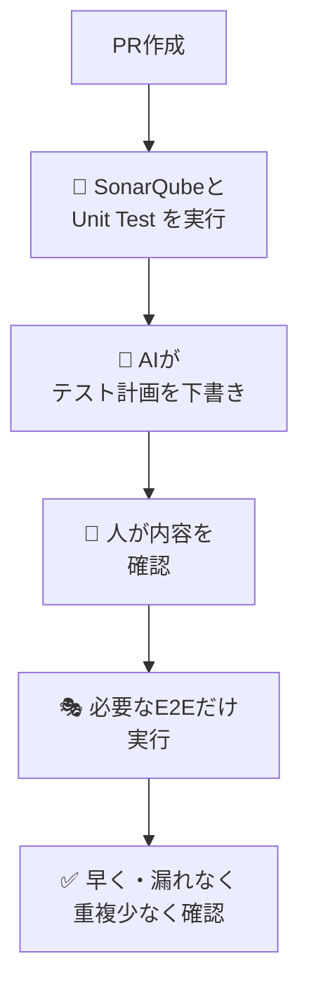

---

## 🪜 どう変えていくか（順を追って説明）

## 1️⃣ まず、PR時の基本チェックを強くする

### 現状

- frontend / backend の unit test は走る
- SonarQube も使える
- ただし「これで何を担保しているか」が初見でわかりにくい

### 今後こうする

- PRの基本ゲートを次の3本柱として明確化する

| チェック | 目的 |
|---|---|
| 🧪 Frontend Unit Test | UI部品や画面ロジックの確認 |
| ☕ Backend Unit / Integration Test | APIや業務ロジックの確認 |
| 🔍 SonarQube | バグの芽、重複、複雑さ、カバレッジの確認 |

### メリット 🎁

- PRレビュー前に、基本的な問題を早く見つけられる
- 「まず何を通せばよいか」がわかりやすくなる
- AIが作った変更も最低限の品質チェックにかけられる

---

## 2️⃣ 次に、テスト工程ごとの役割をはっきり分ける

### 現状

- 単体テスト・E2E・手動テストの境界がやや曖昧
- 同じことを複数工程で繰り返し確認しやすい

### 今後こうする

「どの工程が、何を主に確認するか」を決めます。

| 工程 | 何を主に確認するか | 例 |
|---|---|---|
| 🔍 SonarQube | コード品質の問題を早期発見 | 重複、複雑度、危険な書き方 |
| ☕ Backend Unit | 業務ロジックや計算 | バリデーション、例外、境界値 |
| 🖥️ Frontend Unit | UI部品や画面の状態変化 | 入力、表示切替、エラー表示 |
| 🔗 Integration | 層をまたいだ接続確認 | Controller → Service → Repository |
| 🎭 E2E | ユーザーの主要導線 | ログイン、登録、更新、完了 |
| 👤 Manual/UAT | 人でしか判断しにくい観点 | 文言、体感、業務妥当性 |

### メリット 🎁

- 「この観点はどこで見るのか」が明確になる
- 同じ観点の重複テストを減らせる
- 不足しているテストも見つけやすくなる

### わかりやすい整理図

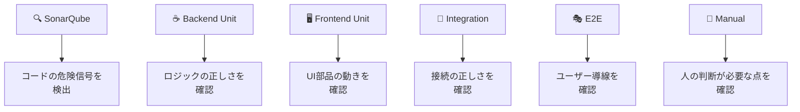

---

## 3️⃣ E2Eを「読みやすく、育てやすく」する

### 現状

- E2E は Playwright が中心
- 実行基盤としては優秀だが、業務シナリオを初心者やQAが読みやすい形で揃える余地がある

### 今後こうする

- **CodeceptJS を主記法**にする
- **Playwright は実行基盤として使う**

### 役割分担

| ツール | 役割 | 初心者へのわかりやすさ |
|---|---|---|
| CodeceptJS | シナリオを読みやすく書く | 高い |
| Playwright | ブラウザ操作・実行・証跡取得 | 高機能 |

### E2Eの構成イメージ

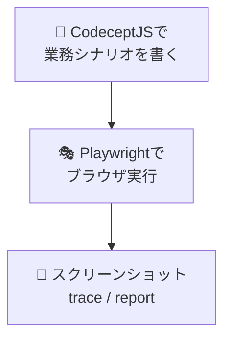

### さらに、E2Eを3種類に分ける

| 種類 | 目的 | 例 |
|---|---|---|
| 🚬 Smoke | 最低限動くかを早く確認 | ログイン、一覧表示 |
| 🛣️ Critical Path | 重要な主導線を確認 | 作成 → 更新 → 完了 |
| 🔁 Regression | 主要な回帰リスクを確認 | 負パス、権限差、保存失敗 |

### メリット 🎁

- シナリオが読みやすくなる
- QA と開発で会話しやすくなる
- E2E をむやみに増やさず、優先順位をつけられる

---

## 4️⃣ PRごとに、AIでテスト計画を下書きする

### 現状

- PR時に「今回は何をテストすべきか」を人が毎回考えている
- 経験者ほど早いが、初心者には難しい

### 今後こうする

- PR作成時に、AIが次の内容を下書きする

| AIが作るもの | 出力先 |
|---|---|
| テスト計画ドラフト | `qa/test-management/pr/PR-<番号>-test-plan.md` |
| メタ情報 | `.meta/pr-<番号>.json` |
| 要約コメント | PRコメント |

### AIがまとめる内容

- 変更概要
- 影響範囲（frontend / backend / infra / docs）
- 想定リスク
- 必要なテスト観点
- 不要と判断した観点
- 手動確認ポイント

### イメージ図

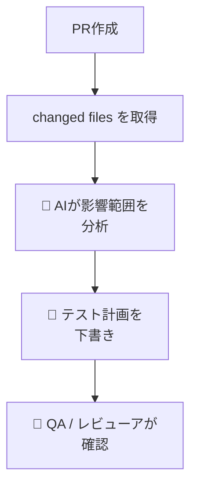

### メリット 🎁

- 初心者でも「何を見ればいいか」がわかる
- QAがゼロから考え始めなくてよい
- テスト漏れと過剰テストの両方を減らしやすい

---

## 5️⃣ 生成AIは、いきなり全部任せない

### 現状

- AIは一部で使われているが、全体のルールはまだ弱い

### 今後こうする

- AIに任せる範囲を、**危険度の低いものから段階的に広げる**

### AIに任せやすいこと ✅

| 領域 | 任せやすさ | 理由 |
|---|---|---|
| PR差分の要約 | 高い | 間違ってもレビューで直しやすい |
| テスト観点の洗い出し | 高い | 下書き用途に向いている |
| テストケースのドラフト | 高い | 人が最終確認しやすい |
| 失敗ログの要約 | 高い | 初動調査を早められる |

### 条件付きで任せること 🟡

| 領域 | 条件 |
|---|---|
| Frontend unit test 雛形作成 | 人が期待値を確認する |
| Backend unit test 雛形作成 | ロジックの正しさを人が確認する |
| E2E修正候補 | 変更範囲を制限する |

### まだ人が主導すべきこと 🔴

| 領域 | 理由 |
|---|---|
| 認証・認可の重要変更 | 事故コストが高い |
| 重要計算ロジック | 期待値の誤りが致命的 |
| 個人情報・監査判断 | 技術だけでは判断しにくい |
| リリース可否判断 | 最終責任は人が持つべき |

### メリット 🎁

- AIを安全に使い始められる
- 事故を抑えながら効果を測れる
- 「どこまで任せてよいか」がチームで共有できる

---

## 6️⃣ そのために必要な準備をする

### 今後、整えておきたいもの

| 項目 | なぜ必要か |
|---|---|
| 📘 ドキュメントの正本整理 | 初見の人が混乱しないため |
| 🏷️ テスト資産の分類 | どのテストが何を担保するか明確にするため |
| 🧾 PRテンプレート改善 | AIと人の両方が判断しやすくするため |
| 🛡️ ガードレール | AIの暴走を防ぐため |
| 📊 ダッシュボード蓄積 | 改善効果を見える化するため |

### PRテンプレートに入れたい項目

- 変更概要
- 影響範囲
- 影響する画面 / API
- 追加・更新したテスト
- 手動確認ポイント
- AI支援を使ったかどうか

### メリット 🎁

- AIがより良い下書きを作れる
- レビューが標準化される
- チームで品質の会話をしやすくなる

---

## 🧪 各テスト工程のテスト戦略はどうするか

ここはとても大事です。

「テストを増やす」ことよりも、**各工程で何を担保するかを分けること**が、いまのプロジェクトでは重要です。

### テスト工程ごとの基本戦略

| 工程 | 戦略 | 重点ポイント | ベストプラクティスの考え方 |
|---|---|---|---|
| 🔍 静的解析 | PRの入口で自動実行 | 新規コードの品質、重複、複雑度、脆弱性の兆候 | **Shift Left**、新規コード重視、Quality Gate を段階導入 |
| ☕ Backend Unit | ロジックの正しさを最優先 | 計算、境界値、例外、認可、バリデーション | **テストピラミッド**の土台、速く・安定・細かく検証 |
| 🖥️ Frontend Unit / Component | UI部品の責務を小さく確認 | 入力、表示切替、エラー表示、状態管理 | **ユーザーに近い操作で検証**、実装詳細への依存を減らす |
| 🔗 Integration | 層のつながりを確認 | Controller〜Service〜Repository の接続 | 単体で拾えない接続不備を補完 |
| 🎭 E2E Smoke | 主要導線の死活確認 | ログイン、画面遷移、基本CRUD | **少数精鋭**、短時間、毎回回しやすい構成 |
| 🛣️ E2E Business Regression | 重要業務シナリオの回帰確認 | 正常系、主要異常系、権限差異 | **クリティカルパス優先**、全組み合わせをE2Eで持たない |
| 👤 Manual / UAT | 人の判断が必要な観点を確認 | 文言、UX、運用妥当性、監査観点 | 自動化困難な観点に集中する |

### いまの計画はベストプラクティスを考慮しているか？

**はい、考慮しています。** ただし、「流行のツールを全部入れる」ではなく、実務で定着しやすいものを選ぶ方針です。

#### 取り入れている考え方

- **Shift Left**
    - できるだけ早い段階、つまり PR 時点で問題を見つける
- **テストピラミッド**
    - unit を厚く、E2E を絞る
- **Risk-Based Testing**
    - すべてを同じ強さでテストせず、重要度で優先順位を変える
- **Maintainable Test Automation**
    - 読みやすく、壊れにくく、運用しやすいテストを目指す
- **Human-in-the-Loop AI**
    - AIに丸投げせず、人が最終判断する

### 逆に、避けたいアンチパターン ⚠️

- E2E に期待しすぎて、なんでもE2Eで確認する
- 単体テストが薄く、E2E だけで品質を守ろうとする
- AIが出したテストケースをそのまま採用する
- テスト数を増やすこと自体が目的になる

---

## 🤖 E2Eのテスト設計は Playwright Test Agents の Planning がよいか？

### 結論

**「最初のたたき台を作る用途」としては、とても相性がよいです。**

ただし、**最終的なテスト設計の正本を Playwright Test Agents の Planning だけに置くのは非推奨**です。

### このリポジトリでのおすすめの使い方

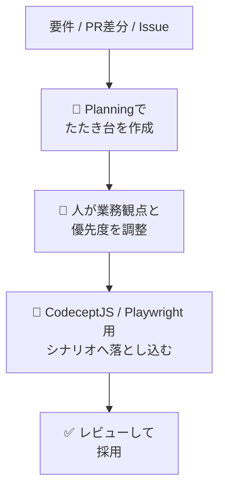

### 向いていること ✅

- 主要シナリオの洗い出し
- 正常系 / 異常系の初稿作成
- 既存画面からの導線候補の抽出
- PR差分をもとにした追加テスト観点の提案

### 向いていないこと ⚠️

- 業務上の優先度判断を完全に任せること
- 法令・監査・個人情報観点の最終判断
- 複雑な条件組み合わせの最終削減判断
- テストスコープの最終承認

### つまり、どう使うべきか

| 使い方 | 評価 |
|---|---|
| Planning を**下書き作成**に使う | ◎ |
| Planning を**設計レビュー補助**に使う | ◎ |
| Planning を**唯一の設計根拠**にする | △ |
| Planning に**全判断を任せる** | ✕ |

### この repo での位置づけ

すでに `frontend/package.json` に `setup:agents` があり、Playwright Test Agents を使う土台があります。

そのため、計画上は以下の位置づけが自然です。

- **Planning**: テスト観点の初稿作成
- **Generator**: 実装のたたき台作成
- **Healer**: 軽微な追従修正の候補提示

> つまり、**Planning は良い選択肢**ですが、
> **「人の設計レビューを前提にした補助役」として使う**のが最適です。

---

## 🧰 他にもAIライブラリやAI手段はあるか？

### 結論

**あります。かなりあります。**

ただし、すべてを同時に導入する必要はありません。今回のプロジェクトでは、**目的ごとに使い分ける**のが大切です。

### 1. まず使いやすい候補（この repo と相性がよい）

| 種類 | 候補 | 向いている用途 |
|---|---|---|
| 公式E2E支援 | Playwright Test Agents | E2E設計、生成、修復 |
| GitHub Copilot カスタムコマンド | `e2e-test-generator` | Playwright テストの雛形生成 |
| GitHub Copilot カスタムエージェント | `e2e-test-specialist` | E2Eテストの自動実装、Issue起点作業 |
| 既存AI修正フロー | triage / fix brief / auto-fix | 失敗解析、低リスク修正 |

### 2. 計画・知識整理に向くAI系ライブラリ / フレームワーク

| 種類 | 候補 | 向いている用途 |
|---|---|---|
| LLMオーケストレーション | LangChain | PR情報、仕様、ログをつないだ分析 |
| RAG / 知識検索 | LlamaIndex | 過去Issueやテスト資産を参照した提案 |
| マルチエージェント | AutoGen / CrewAI | planner / reviewer / fixer の役割分担 |
| 制約条件付き生成 | JSON Schema / structured output | テスト観点を決まった形式で出力 |

### 3. 公式 Agents / Skills のような考え方も有効か？

**有効です。** むしろ、初心者に優しいのはこの方向です。

理由は、自由入力よりも、

- 何を入力すべきかがわかりやすい
- 出力形式がそろう
- チームでルール化しやすい

からです。

### おすすめの役割分担

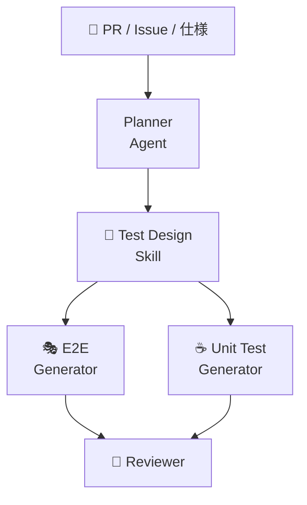

### 実務的なおすすめ

- **最初は Playwright Test Agents + 既存 Copilot 資産で十分**
- その後、必要なら LangChain などで PR要約 / テスト観点抽出 / 過去事例参照を強化
- いきなり重いマルチエージェント基盤を作らない

---

## 🧮 テストパターンやデシジョンテーブルから、不要ケースをAIで削減できるか？

### 結論

**可能です。** ただし、

> **「AIだけで勝手に最適化する」より、**
> **組み合わせ削減のルール + AIの説明補助** の組み合わせが安全です。

### AIが得意なこと ✅

- 条件の整理
- 条件の重複発見
- 明らかに同値なケースの候補抽出
- decision table の読みやすい言語化
- 「このケースは他で担保済みでは？」という提案

### AIだけに任せると危ないこと ⚠️

- 見た目は似ていても、業務上は重要な差があるケースの削除
- 法令・監査・契約条件に関わる例外ケースの削除
- 条件制約を見落とした誤削減

### おすすめの進め方

#### Step 1. まず人またはルールで構造化する

- テストパターン表を作る
- decision table を作る
- 条件、結果、制約を明示する

#### Step 2. 組み合わせ削減ロジックを使う

- 同値分割
- 境界値分析
- pairwise / all-pairs
- リスクベース絞り込み
- 既存工程で担保済み観点の除外

#### Step 3. その上でAIに補助させる

- 不要そうなケース候補を出す
- 削減理由を文章化する
- 削除してはいけないケース候補も逆に出す

### イメージ図

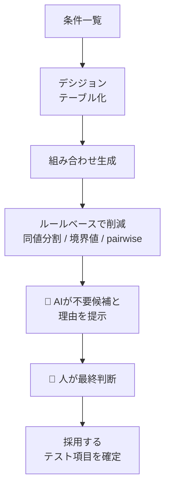

### どこまで現実的にできるか

| レベル | できること | 実現性 |
|---|---|---|
| Level 1 | AIが条件表を整理する | 高い |
| Level 2 | AIが重複・類似ケース候補を出す | 高い |
| Level 3 | pairwise 候補と説明を出す | 高い |
| Level 4 | 削減後の妥当性レビューを支援する | 中〜高 |
| Level 5 | 完全自律でケース削減を確定する | 低い（非推奨） |

### このプロジェクトでのおすすめ方針

- **削減ロジックの正本はルールベース**にする
- **AIは削減候補と説明を出す補助役**にする
- **削ってはいけない高リスクケース**は別タグで保護する

> つまり、AIはかなり使えます。ですが、
> **「削る判断」ほど人の責任を残す**のが安全です。

---

## 🗺️ この計画に基づく具体的な標準プロセス図

ここからは、実際に運用するときに使えるように、**標準プロセスを図解中心**でまとめます。

初心者の方は、まずこの章の図を見るだけでも、

- 誰が
- 何を見て
- どこでAIを使って
- どこで人が判断するのか

がつかみやすくなります。

---

## 1️⃣ テスト設計フロー

### このフローでやること

- PR や Issue を起点にする
- AI で観点の下書きを作る
- 人がレビューして設計を確定する
- unit / integration / E2E / manual に振り分ける

### 標準フロー図

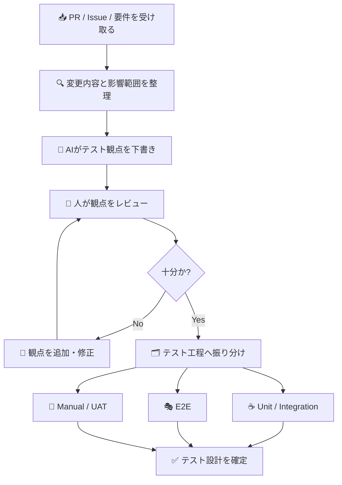

### 役割分担表

| ステップ | 主担当 | AIの役割 | 人の役割 |
|---|---|---|---|
| 変更把握 | 開発 | 差分要約、影響範囲候補の抽出 | 背景や意図の補足 |
| 観点抽出 | AI + QA | テスト観点の初稿作成 | 抜け漏れ確認 |
| 工程振り分け | QA / 開発 | 候補提案 | unit / E2E / manual の最終判断 |
| 設計確定 | QA / レビューア | 整理補助 | 承認 |

### このフローのメリット 🎁

- いきなりテストケースを書くのではなく、**先に観点を整理できる**
- AI が下書きを出すため、初心者でも考え始めやすい
- 最終判断を人が持つため、業務上の重要観点を落としにくい

---

## 2️⃣ PR時のテスト設計標準フロー

### 想定シーン

- 機能追加 PR
- バグ修正 PR
- 既存画面の改修 PR

### 標準フロー図

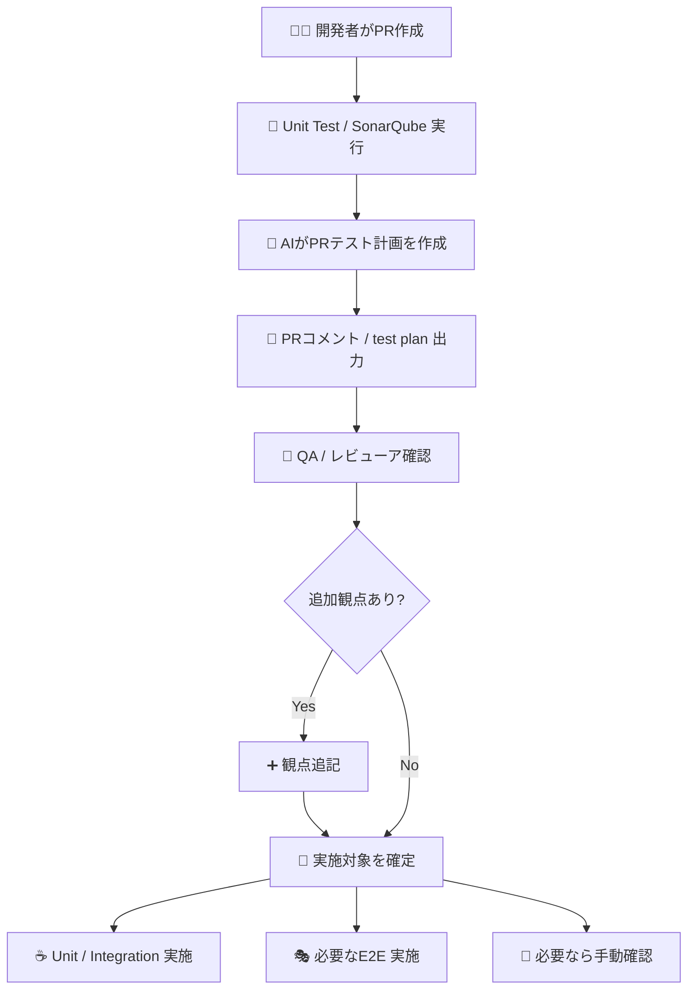

### 出力イメージ

| 出力物 | 使い道 |
|---|---|
| `PR-<番号>-test-plan.md` | PR単位のテスト設計書 |
| PRコメント | レビュー時の要約 |
| `.meta/pr-<番号>.json` | ダッシュボード集計 |

### このフローのメリット 🎁

- PRのたびにゼロから考えなくてよい
- レビューアが「このPRで何を確認すべきか」を把握しやすい
- 実施対象の合意が取りやすい

---

## 3️⃣ E2Eテスト設計フロー

### このフローで大事にすること

- E2E は少数精鋭にする
- 主要導線に絞る
- いきなりコード化せず、先にシナリオを整える

### 標準フロー図

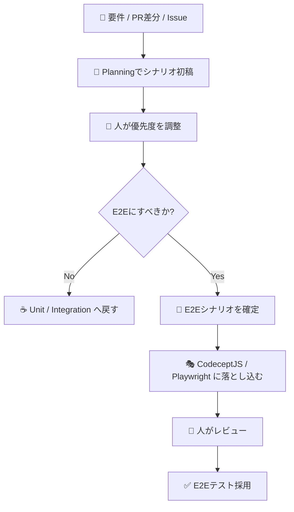

### 判断のポイント

| 質問 | Yes なら E2E 候補 |
|---|---|
| ユーザー導線全体を確認したいか？ | E2E向き |
| 複数画面・複数APIをまたぐか？ | E2E向き |
| UI部品単体の確認か？ | unit / component 向き |
| 計算や条件分岐単体の確認か？ | backend / frontend unit 向き |

### このフローのメリット 🎁

- E2Eの肥大化を防げる
- 「何でもE2E」にしなくて済む
- Playwright Agents を補助役として使いやすい

---

## 4️⃣ デシジョンテーブル削減フロー

### このフローでやること

- 条件を洗い出す
- 全組み合わせを把握する
- ルールで減らす
- AIで削減候補と理由を出す
- 人が最終決定する

### 標準フロー図

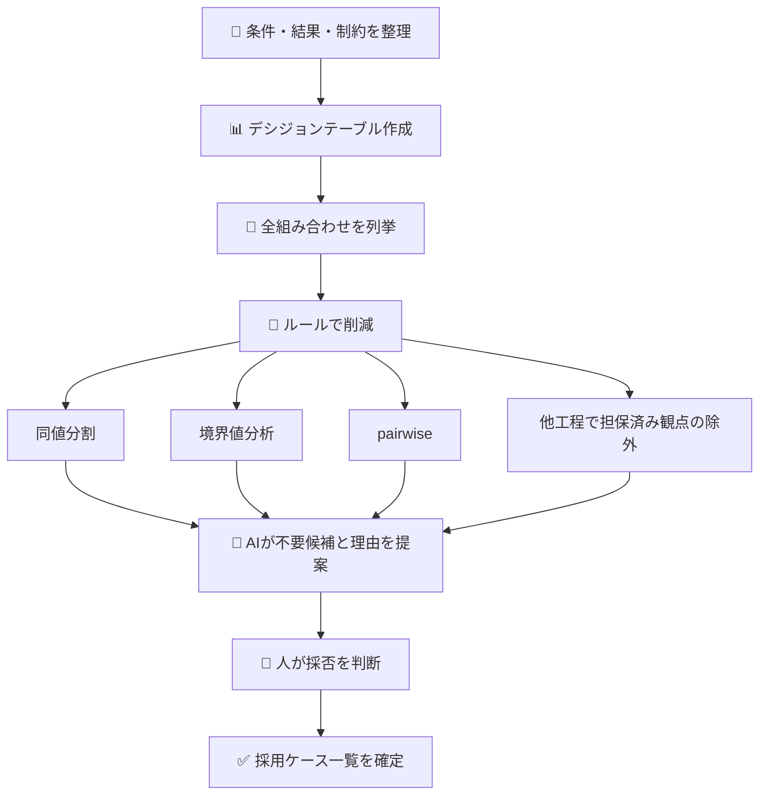

### 判断ルールの考え方

| 削減方法 | 何を減らすか | 人の確認が特に必要な点 |
|---|---|---|
| 同値分割 | 同じ意味のケース | 本当に同値か |
| 境界値分析 | 中間ケースの重複 | 境界条件の漏れ |
| pairwise | 全組み合わせの爆発 | 3条件以上の重要相互作用 |
| 他工程除外 | 別工程で担保済みの観点 | E2Eで見るべき重要導線を消していないか |

### このフローのメリット 🎁

- 無駄なケースを減らしやすい
- 削減理由が説明できる
- AIを使っても、削りすぎ事故を防ぎやすい

---

## 5️⃣ Playwright Agents / CodeceptJS / 人レビューの分担図

### まず結論

- **Playwright Agents** は「考える補助・作る補助」
- **CodeceptJS / Playwright** は「テストを形にする実装レイヤー」
- **人レビュー** は「優先度と採否を決める責任者」

### 分担図

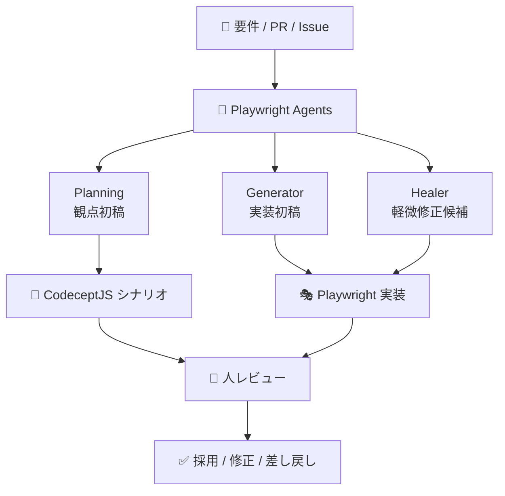

### 分担表

| 役割 | 何をするか | 何を決めないか |
|---|---|---|
| Playwright Agents | 観点案、シナリオ案、修正案の作成 | 最終採否、業務優先度 |
| CodeceptJS | 読みやすい業務シナリオの記述 | テスト採用判断 |
| Playwright | 実行基盤、UI操作、証跡取得 | テストスコープ判断 |
| 人レビュー | 優先度、妥当性、採否の判断 | 単純作業のすべて |

### この分担のメリット 🎁

- AIに得意なところだけ任せられる
- 実装と判断の責任分界が明確になる
- 初心者でも「誰に何を頼るか」がわかる

---

## 6️⃣ テスト失敗時の標準対応フロー

### 目的

- 失敗したときに場当たり対応しない
- 原因分析から修正までの流れを標準化する

### 標準フロー図

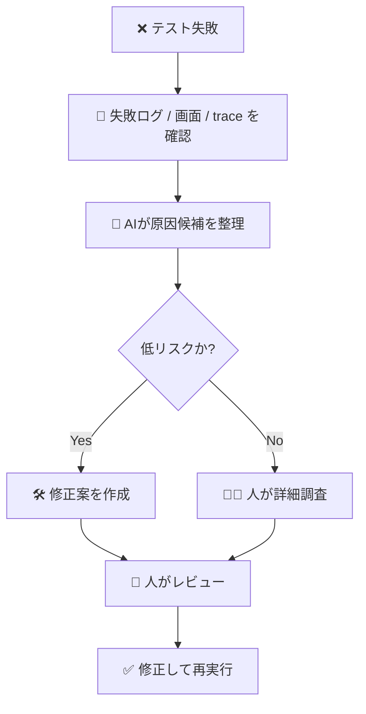

### このフローのメリット 🎁

- 失敗時の初動が早くなる
- 軽微な問題はAIで前処理しやすい
- 高リスク案件は人が丁寧に見る流れを守れる

---

## 🧩 すぐ使えるテンプレート集

上の標準プロセス図を、実際の運用に落とし込むためのテンプレートです。

### テンプレート一覧

| ファイル | 用途 | 使うタイミング |
|---|---|---|
| `qa/test-management/templates/pr-test-plan-template.md` | PRごとのテスト設計書 | PR作成後 |
| `qa/test-management/templates/decision-table-template.md` | 条件整理・ケース削減 | 条件分岐が多い機能の設計時 |
| `qa/test-management/templates/e2e-design-review-checklist.md` | E2E設計レビュー | E2E採用前 |
| `qa/test-management/templates/role-checklists.md` | 開発 / QA / レビューアの確認項目 | PRレビュー前後 |

### 完成イメージのサンプル

| ファイル | 目的 |
|---|---|
| `qa/test-management/pr/PR-000-sample-test-plan.md` | 完成したPRテスト計画書の記入例 |
| `.github/pull_request_template.md` | 実際のPR作成時に使うテンプレート |

### 標準プロセスとの対応

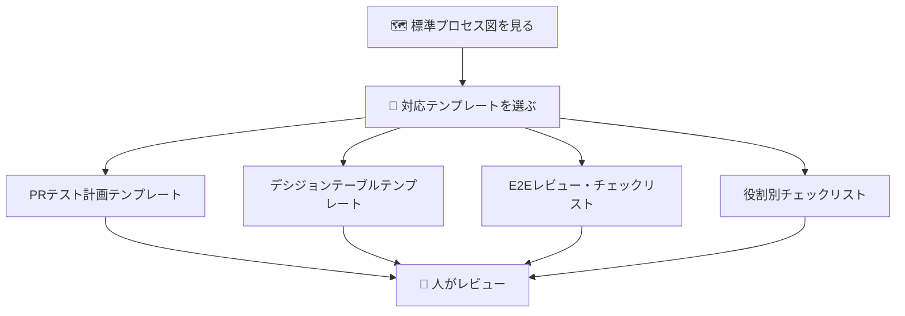

### 使い分けの目安

| 状況 | 使うテンプレート |
|---|---|
| PR単位で何をテストするか整理したい | PRテスト計画テンプレート |
| 条件が多く、組み合わせを減らしたい | デシジョンテーブルテンプレート |
| E2Eにするか迷う / E2E設計をレビューしたい | E2E設計レビュー・チェックリスト |
| 開発・QA・レビューアの確認項目をそろえたい | 役割別チェックリスト |

### 初めて使うときのおすすめ順

1. `.github/pull_request_template.md` を見て PR に必要な情報を書く
2. `qa/test-management/pr/PR-000-sample-test-plan.md` を見て完成形をイメージする
3. `qa/test-management/templates/pr-test-plan-template.md` をコピーして実案件用に作成する
4. 条件分岐が多い場合は `decision-table-template.md` を使う
5. E2Eにするか迷ったら `e2e-design-review-checklist.md` で確認する

---

## 🚦 最終的な運用イメージ

### PR起点の流れ

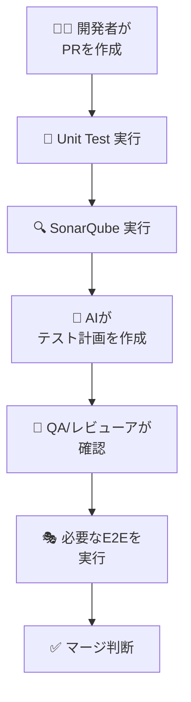

### E2E失敗時の流れ

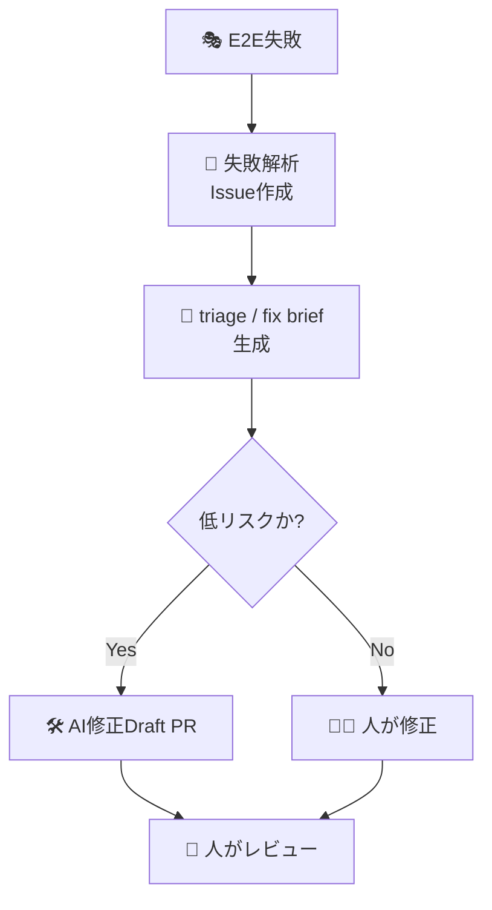

---

## 📅 順を追った導入ステップ

### Step 1: すぐ始めること（Week 1-2）

| やること | 目的 |
|---|---|
| ドキュメント表現の統一 | 初見の人にもわかりやすくする |
| テスト工程の役割表を固める | 重複テストを減らす |
| SonarQube の基準整理 | PRゲートを明確にする |

### Step 2: 次にやること（Week 3-4）

| やること | 目的 |
|---|---|
| PRごとのテスト計画自動生成PoC | QA観点整理を楽にする |
| 出力形式を決める | 継続運用しやすくする |
| レビュー観点テンプレート作成 | AI出力を確認しやすくする |

### Step 3: さらに進めること（Week 5-8）

| やること | 目的 |
|---|---|
| Backend / Frontend 単体テスト強化 | E2Eに頼りすぎないようにする |
| CodeceptJS + Playwright PoC | 読みやすいE2Eへ移行する |
| Smoke / Regression 分離 | 実行時間と保守性を改善する |

### Step 4: AI活用を広げること（Week 9-12）

| やること | 目的 |
|---|---|
| AI修正対象の拡大検討 | 工数削減の幅を広げる |
| 変更パス制御の強化 | 安全性を高める |
| テスト結果サマリの自動コメント | 状況把握を早くする |

---

## 📈 こうすると、どんなメリットがあるか

| 施策 | 期待できるメリット |
|---|---|
| SonarQube を明確なPRゲートにする | 早い段階で品質問題を見つけやすい |
| テスト工程の役割を分ける | 重複テストが減り、漏れも見つけやすい |
| CodeceptJS + Playwright にする | E2Eが読みやすく、育てやすくなる |
| PRごとにAIでテスト計画を作る | 初心者でも必要な確認を追いやすい |
| AIを段階導入する | 効果を出しつつ事故を防ぎやすい |

### 一言でいうと 💡

> **品質を上げながら、考える負担と重複作業を減らす** のが、この計画の目的です。

---

## ⚠️ 気をつけること

| リスク | 気をつけること |
|---|---|
| AIを信じすぎる | 必ず人が最終確認する |
| E2Eが増えすぎる | Smoke / Critical / Regression に分ける |
| ルールだけ作って使われない | PRテンプレートやコメントに落とし込む |
| ドキュメントがまたずれる | README / wiki / 本資料を定期的にそろえる |

---

## ✅ まず最初にやるおすすめ順

1. **SonarQube の基準を明確にする**
2. **テスト工程ごとの役割表をチームで合意する**
3. **PRごとのテスト計画をAIで下書きする仕組みを作る**
4. **E2Eを Smoke / Regression に分ける**
5. **CodeceptJS 導入PoCを小さく試す**

---

## 🏁 まとめ

この計画で大事なのは、いきなり全部を自動化することではありません。

大切なのは次の3つです。

- **いまの仕組みを活かす**
- **工程ごとの役割を分けて、重複を減らす**
- **AIは下書き・分析から始めて、安全に広げる**

これにより、

- 初心者でも流れを追いやすくなり
- QA / 開発 / レビューアの会話がそろい
- 品質向上と工数削減を両立しやすくなります

必要であれば次に、**この計画をそのまま実装タスク一覧に分解した版**も作れます。
