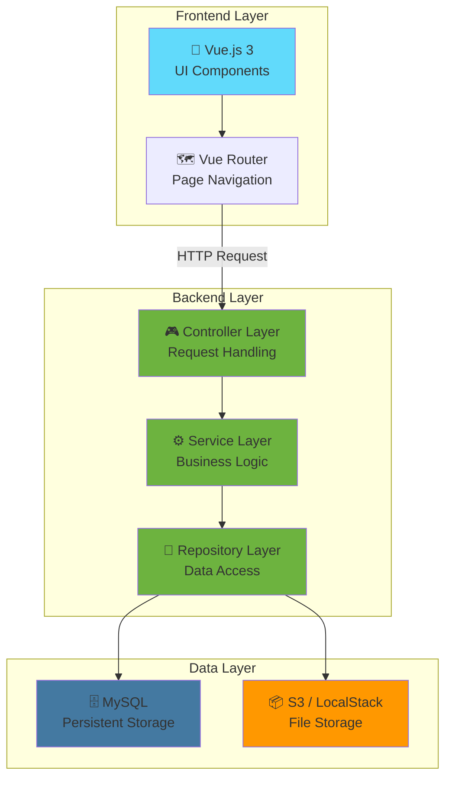
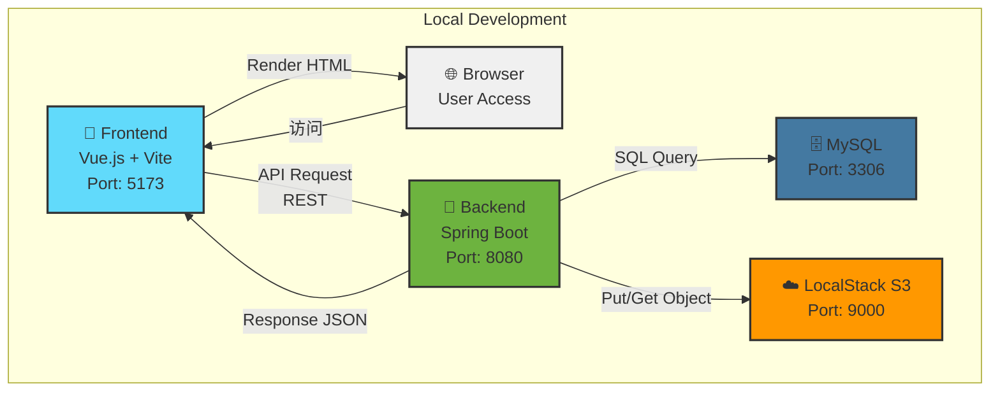
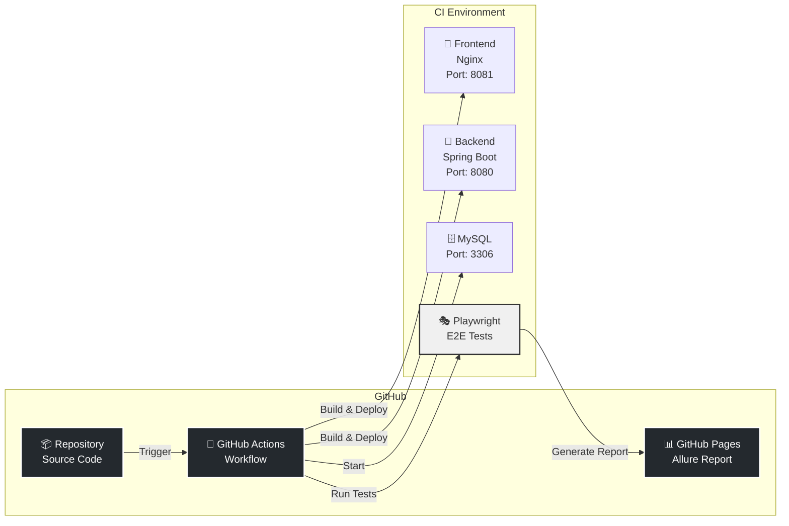

# 🎯 1. 概要

## プロジェクト紹介

**Test App** は Spring Boot + Vue.js + Playwright を組み合わせた、フルスタック E2E テスト自動化アプリケーションです。

### 📌 プロジェクトの目的

このプロジェクトは以下の目的で構築されました：

- **Web アプリケーション開発**: Spring Boot と Vue.js を用いたモダンな Web アプリケーション実装
- **E2E テスト自動化**: Playwright による自動テストの実装と実行
- **CI/CD パイプラインの構築**: GitHub Actions による自動テスト・デプロイ
- **テストレポートの可視化**: Allure による見やすいテストレポート生成・公開

---

## ✨ 主要機能

このアプリケーションが提供する機能：

| 機能 | 説明 |
|------|------|
| **ユーザー認証** | ローカル開発用の簡易認証実装（username/password ベース） |
| **ToDo 管理** | 任務（ToDo）の作成・編集・削除・完了管理機能 |
| **メモ管理** | テキストメモの管理と画像アップロード機能 |
| **E2E テスト自動化** | Playwright による自動テスト実装と Allure レポート生成 |
| **GitHub Pages 連携** | テストレポートの自動公開と可視化 |

---

## 🏗️ アーキテクチャの特徴

このプロジェクトは **レイヤードアーキテクチャ** を採用しており、以下のレイヤーで構成されています：

---

## 🛠️ 使用技術スタック

### 🖥️ バックエンド

| カテゴリ | 技術 | バージョン | 役割 |
|---------|------|----------|------|
| **言語** | Java | 21 | 言語ランタイム |
| **フレームワーク** | Spring Boot | 3.5.9 | Web フレームワーク |
| **セキュリティ** | Spring Security | 3.5.9 | 認証・認可 |
| **ORM** | Spring Data JPA | - | データ永続化 |
| **DB** | MySQL | 8.0 | リレーショナルDB |
| **ストレージ** | AWS SDK / LocalStack | 2.25.60 | オブジェクトストレージ |
| **ビルド** | Gradle | - | ビルドツール |
| **Webサーバー** | Tomcat | - | リクエスト処理 |

### 🎨 フロントエンド

| カテゴリ | 技術 | バージョン | 役割 |
|---------|------|----------|------|
| **フレームワーク** | Vue.js | 3.3.4+ | UI フレームワーク |
| **ビルドツール** | Vite | 5.0+ | 高速ビルド・開発サーバー |
| **UI コンポーネント** | Vuetify | 3.3.0+ | プリセット UI コンポーネント |
| **HTTP クライアント** | axios | - | API 通信 |
| **ルーティング** | Vue Router | - | ページネーション |
| **パッケージ管理** | npm | - | 依存関係管理 |

### 🧪 テスト・レポート

| カテゴリ | 技術 | バージョン | 役割 |
|---------|------|----------|------|
| **E2E テスト** | Playwright | 1.40.0+ | ブラウザ自動操作テスト |
| **テストレポート** | Allure | 2.13.9+ | テスト結果レポート |
| **ブラウザ** | Chromium, Firefox, WebKit | - | テスト実行環境 |

### 🚀 インフラ・CI/CD

| カテゴリ | 技術 | 用途 |
|---------|------|------|
| **コンテナ化** | Docker | アプリケーションの環境統一 |
| **オーケストレーション** | Docker Compose | ローカル環境・CI 環境の構築 |
| **CI/CD** | GitHub Actions | 自動テスト・デプロイ |
| **ホスティング** | GitHub Pages | テストレポート公開 |
| **S3 Mock** | LocalStack | ローカル環境での S3 シミュレーション |
| **Webサーバー** | Nginx | 本番環境での Web サーバー |

---

## 🌐 システム構成図

### ローカル開発環境

### CI/CD パイプライン

---

## 📊 プロジェクト統計

### ソースコード構成

| カテゴリ | 説明 |
|---------|------|
| **バックエンド** | Java + Spring Boot（MVC アーキテクチャ） |
| **フロントエンド** | Vue.js 3（SPA） |
| **テスト** | Playwright + Allure（E2E テスト） |
| **インフラ** | Docker + Docker Compose |

---

## 🎯 次のステップ

このドキュメントから詳細情報を確認できます：

1. **[クイックスタート](./02-クイックスタート.md)** - 環境構築と起動方法
2. **[アーキテクチャ](./03-アーキテクチャ.md)** - 詳細なシステム設計
3. **[データモデル](./05-データモデル.md)** - エンティティ設計
4. **[コアコンポーネント](./06-コアコンポーネント.md)** - 実装詳細
5. **[デプロイメント](./09-デプロイメント.md)** - 本番環境への展開

---

**詳細は [目次](./00-目次.md) から各セクションを参照してください。**
