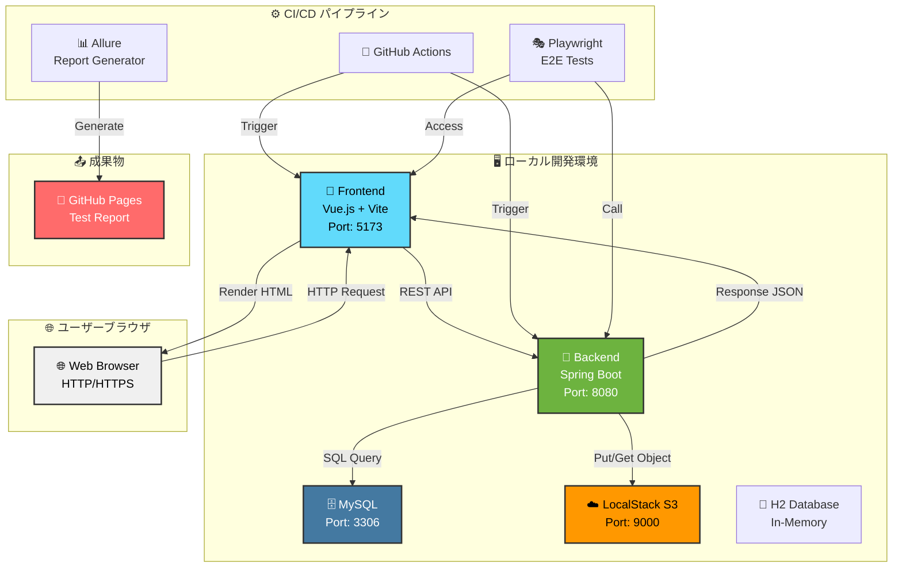
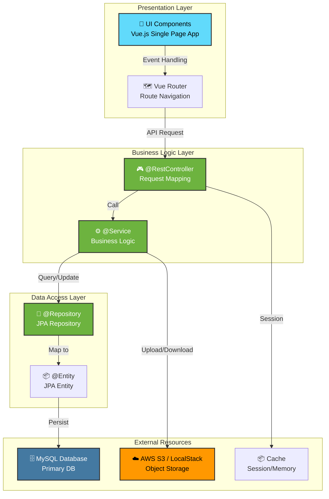
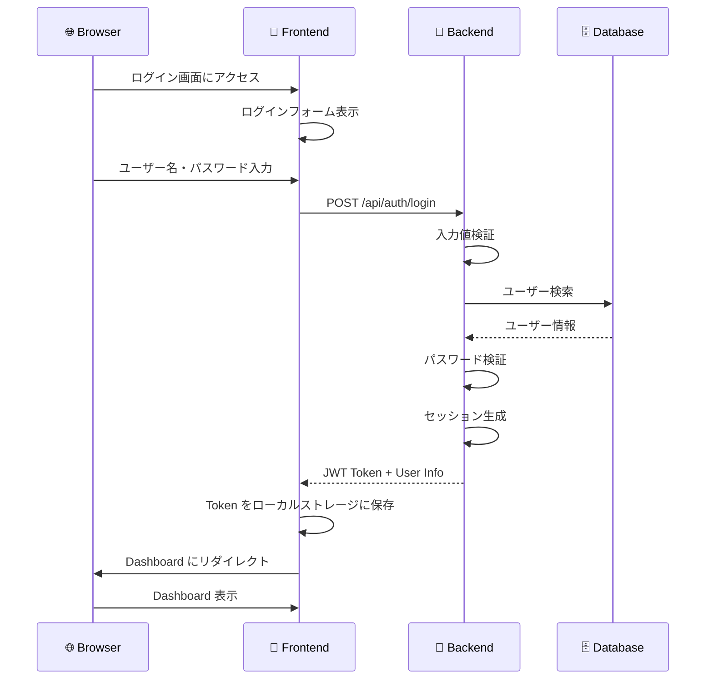
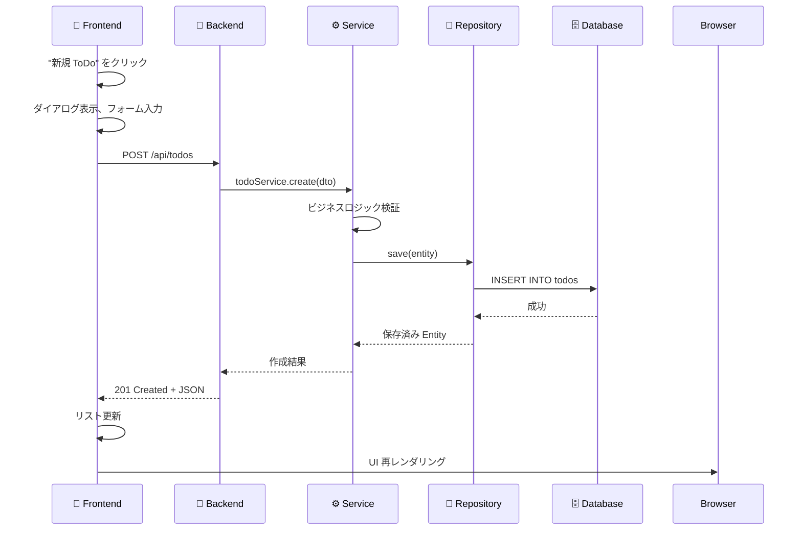
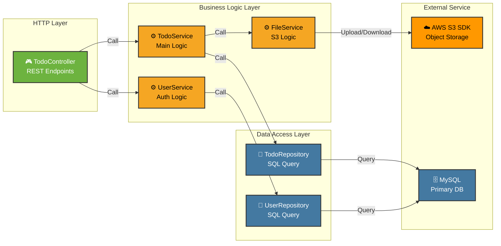
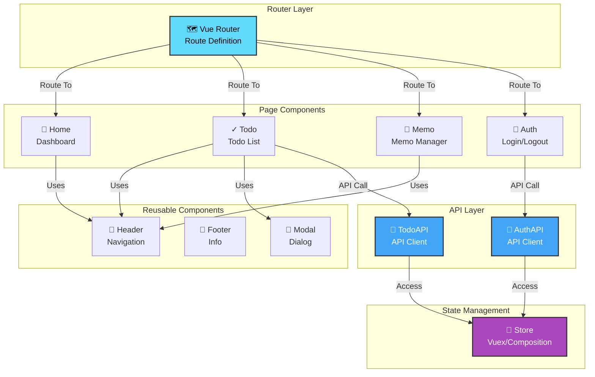
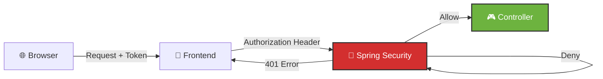
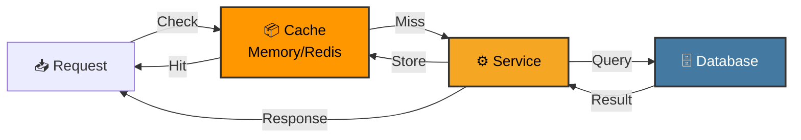
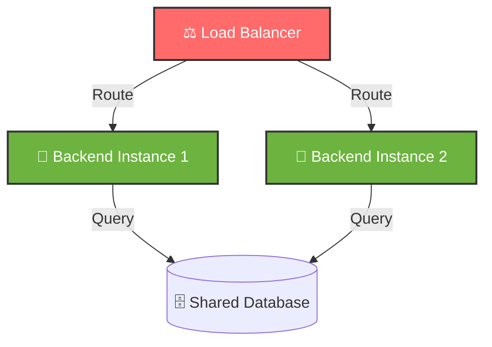

# 🏗️ 3. アーキテクチャ

このセクションでは、Test App のシステム設計とコンポーネント構成について説明します。

---

## 📐 全体システム構成図

---

## 🔢 レイヤードアーキテクチャ

Test App は **3 層のレイヤードアーキテクチャ** を採用しています。

### レイヤー構成

### 各レイヤーの役割

| レイヤー | コンポーネント | 責務 |
|---------|----------------|------|
| **Presentation Layer** | Vue Components | UI 表示、ユーザーインタラクション処理 |
| **Presentation Layer** | Vue Router | ページ遷移、ルート管理 |
| **Controller Layer** | @RestController | HTTP リクエスト受け取り、JSON レスポンス返却 |
| **Service Layer** | @Service | ビジネスロジック実装、トランザクション管理 |
| **Repository Layer** | JPA Repository | データベースアクセス、ORM マッピング |
| **Entity Layer** | @Entity | ドメインオブジェクト定義、テーブル構造定義 |
| **Persistence** | MySQL | データの永続化 |
| **Storage** | S3/LocalStack | ファイル・オブジェクト管理 |

---

## 🔄 通信フロー

### ユーザーのログインフロー

### ToDo 作成フロー

---

## 📊 コンポーネント間の関係性

### Backend コンポーネント図

### Frontend コンポーネント図

---

## 🔐 セキュリティアーキテクチャ

**セキュリティ対策：**
- JWT トークンベースの認証
- Spring Security によるリクエスト検証
- CORS 設定による API アクセス制限
- パスワードハッシュ化（BCrypt）

---

## 📈 スケーラビリティの考慮

### キャッシング戦略

### 負荷分散の考慮

---

## 📚 次のステップ

- [リポジトリ構造](./04-リポジトリ構造.md) - ファイルレイアウト詳細
- [データモデル](./05-データモデル.md) - ER図とエンティティ設計
- [コアコンポーネント](./06-コアコンポーネント.md) - 実装詳細
