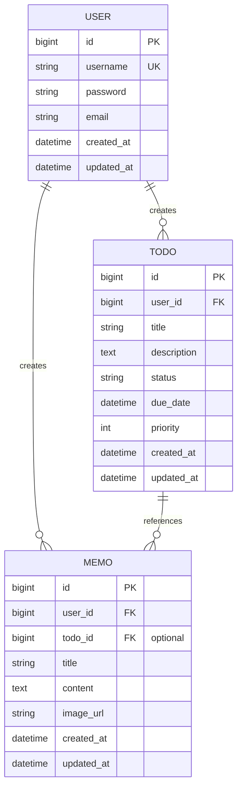

# 🗄️ 5. データモデル

このセクションでは、Test App が使用するエンティティ（テーブル）構造とデータモデルについて説明します。

---

## 📊 ER 図（Entity Relationship Diagram）



---

## 📋 エンティティ一覧と説明

### 1. User エンティティ（ユーザー）

ユーザー認証と基本情報を管理するテーブル。

```
テーブル名: users
用途: ユーザーアカウント情報管理
```

| カラム名 | 型 | 制約 | 説明 |
|---------|-----|------|------|
| `id` | `BIGINT` | PK, NOT NULL | ユーザーID（自動採番） |
| `username` | `VARCHAR(100)` | UNIQUE, NOT NULL | ログインID |
| `password` | `VARCHAR(255)` | NOT NULL | パスワード（ハッシュ化） |
| `email` | `VARCHAR(255)` | UNIQUE | メールアドレス |
| `is_active` | `BOOLEAN` | DEFAULT TRUE | アクティブフラグ |
| `created_at` | `DATETIME` | NOT NULL | 作成日時 |
| `updated_at` | `DATETIME` | NOT NULL | 更新日時 |

**インデックス：**
- PRIMARY KEY: `id`
- UNIQUE KEY: `username`, `email`

### 2. Todo エンティティ（タスク）

ユーザーの To-Do 項目を管理するテーブル。

```
テーブル名: todos
用途: タスク・やることリスト管理
```

| カラム名 | 型 | 制約 | 説明 |
|---------|-----|------|------|
| `id` | `BIGINT` | PK, NOT NULL | タスクID |
| `user_id` | `BIGINT` | FK, NOT NULL | 作成者ユーザーID |
| `title` | `VARCHAR(200)` | NOT NULL | タスクタイトル |
| `description` | `TEXT` | | タスク説明・詳細 |
| `status` | `VARCHAR(20)` | DEFAULT 'TODO' | ステータス（TODO, IN_PROGRESS, DONE） |
| `priority` | `INT` | DEFAULT 0 | 優先度（0:低, 1:中, 2:高） |
| `due_date` | `DATETIME` | | 期限日時 |
| `completed_at` | `DATETIME` | | 完了日時 |
| `is_deleted` | `BOOLEAN` | DEFAULT FALSE | 削除フラグ（論理削除） |
| `created_at` | `DATETIME` | NOT NULL | 作成日時 |
| `updated_at` | `DATETIME` | NOT NULL | 更新日時 |

**インデックス：**
- PRIMARY KEY: `id`
- FOREIGN KEY: `user_id` → `users(id)`
- INDEX: `user_id`, `status`, `due_date`

### 3. Memo エンティティ（メモ）

ユーザーのメモ情報（テキスト＋画像）を管理するテーブル。

```
テーブル名: memos
用途: メモ・ノート管理、画像アップロード
```

| カラム名 | 型 | 制約 | 説明 |
|---------|-----|------|------|
| `id` | `BIGINT` | PK, NOT NULL | メモID |
| `user_id` | `BIGINT` | FK, NOT NULL | 作成者ユーザーID |
| `todo_id` | `BIGINT` | FK | 関連タスクID（オプション） |
| `title` | `VARCHAR(200)` | NOT NULL | メモタイトル |
| `content` | `LONGTEXT` | NOT NULL | メモ内容 |
| `image_url` | `VARCHAR(500)` | | 画像 URL（S3） |
| `image_key` | `VARCHAR(255)` | | S3 オブジェクトキー |
| `file_size` | `LONG` | | ファイルサイズ（バイト） |
| `mime_type` | `VARCHAR(100)` | | MIME タイプ |
| `is_pinned` | `BOOLEAN` | DEFAULT FALSE | ピン留めフラグ |
| `is_deleted` | `BOOLEAN` | DEFAULT FALSE | 削除フラグ（論理削除） |
| `created_at` | `DATETIME` | NOT NULL | 作成日時 |
| `updated_at` | `DATETIME` | NOT NULL | 更新日時 |

**インデックス：**
- PRIMARY KEY: `id`
- FOREIGN KEY: `user_id` → `users(id)`
- FOREIGN KEY: `todo_id` → `todos(id)` (OPTIONAL)
- INDEX: `user_id`, `is_pinned`, `created_at`

---

## 📝 テーブル定義（SQL）

### users テーブル

```sql
CREATE TABLE users (
  id BIGINT PRIMARY KEY AUTO_INCREMENT,
  username VARCHAR(100) NOT NULL UNIQUE,
  password VARCHAR(255) NOT NULL,
  email VARCHAR(255) UNIQUE,
  is_active BOOLEAN DEFAULT TRUE,
  created_at DATETIME NOT NULL DEFAULT CURRENT_TIMESTAMP,
  updated_at DATETIME NOT NULL DEFAULT CURRENT_TIMESTAMP ON UPDATE CURRENT_TIMESTAMP,
  INDEX idx_username (username),
  INDEX idx_email (email)
) ENGINE=InnoDB DEFAULT CHARSET=utf8mb4 COLLATE=utf8mb4_unicode_ci;
```

### todos テーブル

```sql
CREATE TABLE todos (
  id BIGINT PRIMARY KEY AUTO_INCREMENT,
  user_id BIGINT NOT NULL,
  title VARCHAR(200) NOT NULL,
  description TEXT,
  status VARCHAR(20) DEFAULT 'TODO',
  priority INT DEFAULT 0,
  due_date DATETIME,
  completed_at DATETIME,
  is_deleted BOOLEAN DEFAULT FALSE,
  created_at DATETIME NOT NULL DEFAULT CURRENT_TIMESTAMP,
  updated_at DATETIME NOT NULL DEFAULT CURRENT_TIMESTAMP ON UPDATE CURRENT_TIMESTAMP,
  FOREIGN KEY (user_id) REFERENCES users(id) ON DELETE CASCADE,
  INDEX idx_user_id (user_id),
  INDEX idx_status (status),
  INDEX idx_due_date (due_date),
  INDEX idx_is_deleted (is_deleted)
) ENGINE=InnoDB DEFAULT CHARSET=utf8mb4 COLLATE=utf8mb4_unicode_ci;
```

### memos テーブル

```sql
CREATE TABLE memos (
  id BIGINT PRIMARY KEY AUTO_INCREMENT,
  user_id BIGINT NOT NULL,
  todo_id BIGINT,
  title VARCHAR(200) NOT NULL,
  content LONGTEXT NOT NULL,
  image_url VARCHAR(500),
  image_key VARCHAR(255),
  file_size LONG,
  mime_type VARCHAR(100),
  is_pinned BOOLEAN DEFAULT FALSE,
  is_deleted BOOLEAN DEFAULT FALSE,
  created_at DATETIME NOT NULL DEFAULT CURRENT_TIMESTAMP,
  updated_at DATETIME NOT NULL DEFAULT CURRENT_TIMESTAMP ON UPDATE CURRENT_TIMESTAMP,
  FOREIGN KEY (user_id) REFERENCES users(id) ON DELETE CASCADE,
  FOREIGN KEY (todo_id) REFERENCES todos(id) ON DELETE SET NULL,
  INDEX idx_user_id (user_id),
  INDEX idx_todo_id (todo_id),
  INDEX idx_is_pinned (is_pinned),
  INDEX idx_created_at (created_at),
  INDEX idx_is_deleted (is_deleted)
) ENGINE=InnoDB DEFAULT CHARSET=utf8mb4 COLLATE=utf8mb4_unicode_ci;
```

---

## 🔗 リレーションシップ説明

### User → Todo （1:N）

- 1 人のユーザーが複数のタスクを作成可能
- ユーザー削除時は CASCADE で関連タスクも削除

```
User (id: 1) → Todo (user_id: 1) [複数件]
User (id: 2) → Todo (user_id: 2) [複数件]
```

### User → Memo （1:N）

- 1 人のユーザーが複数のメモを作成可能
- ユーザー削除時は CASCADE で関連メモも削除

```
User (id: 1) → Memo (user_id: 1) [複数件]
```

### Todo → Memo （1:N, オプション）

- 1 つのタスクに複数のメモを関連付け可能
- メモは独立して存在可能（todo_id は NULL 許可）
- タスク削除時は SET NULL でメモの todo_id は NULL になる

```
Todo (id: 5) → Memo (todo_id: 5) [複数件、またはなし]
```

---

## 🔍 主要なデータベースクエリ例

### ユーザー認証

```sql
-- ユーザーログイン時の検索
SELECT id, username, password FROM users 
WHERE username = ? AND is_active = TRUE;
```

### ユーザーのタスク一覧取得

```sql
-- ユーザーの全タスク（削除済みを除外）
SELECT id, title, status, priority, due_date, created_at 
FROM todos 
WHERE user_id = ? AND is_deleted = FALSE 
ORDER BY due_date ASC, priority DESC;
```

### タスク別メモ一覧

```sql
-- 特定タスクに関連するメモ取得
SELECT id, title, content, image_url, created_at 
FROM memos 
WHERE todo_id = ? AND is_deleted = FALSE 
ORDER BY is_pinned DESC, created_at DESC;
```

### メモのファイル情報

```sql
-- メモの画像情報取得（ダウンロード用）
SELECT id, image_url, image_key, file_size, mime_type 
FROM memos 
WHERE id = ? AND user_id = ? AND is_deleted = FALSE;
```

---

## 📊 データモデルの特徴

### 論理削除（Soft Delete）

- `is_deleted` フラグを使用して削除されたレコードを保持
- **メリット：** データ復旧が可能、履歴管理が容易
- **クエリ時の注意：** WHERE 句に `is_deleted = FALSE` を追加

### オプショナルな外部キー

- `Memo.todo_id` は NULL 許可
- メモはタスクに関連付けずに独立して存在可能

### 自動タイムスタンプ

- `created_at`: 作成時に自動設定（変更不可）
- `updated_at`: 作成時に設定、更新時に自動更新

---

## 💾 初期データ

### サンプルユーザー

```sql
INSERT INTO users (username, password, email) VALUES
('user', 'hashed_password_for_user', 'user@example.com'),
('admin', 'hashed_password_for_admin', 'admin@example.com');
```

### サンプルタスク

```sql
INSERT INTO todos (user_id, title, description, status, priority) VALUES
(1, 'プロジェクト設計', 'システムアーキテクチャ設計を完了する', 'IN_PROGRESS', 2),
(1, 'ドキュメント作成', 'API 仕様書を作成する', 'TODO', 1),
(2, 'レビュー', 'コードレビューを実施する', 'DONE', 1);
```

---

## 📈 パフォーマンス最適化

### インデックス戦略

| テーブル | カラム | 理由 |
|---------|--------|------|
| `users` | `username`, `email` | 検索頻度が高い |
| `todos` | `user_id`, `status`, `due_date` | ユーザーごと・ステータス別検索 |
| `memos` | `user_id`, `is_pinned`, `created_at` | ユーザー別・ピン別検索 |

### クエリ最適化のポイント

1. **ユーザー別クエリ時：** `user_id` インデックスを活用
2. **削除フラグ：** `is_deleted = FALSE` フィルターは必須
3. **ソート：** `created_at` DESC がよく使われるのでインデックス活用

---

## 📚 次のステップ

- [コアコンポーネント](./06-コアコンポーネント.md) - Java エンティティクラス詳細
- [APIドキュメント](./07-APIドキュメント.md) - API エンドポイント仕様
- [テスト戦略](./08-テスト戦略.md) - データモデルテスト例
