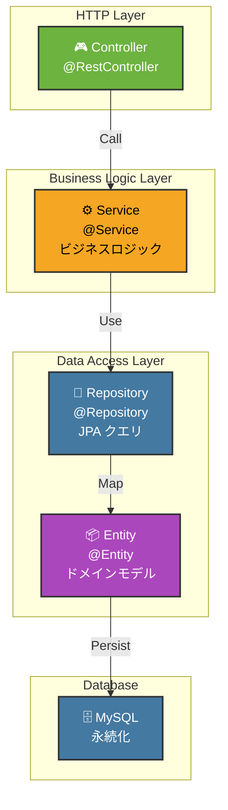

# ⚙️ 6. コアコンポーネント

このセクションでは、Test App のコアとなるコンポーネント（Entity、Repository、Service、Controller）の詳細実装について説明します。

---

## 🏗️ Backend コンポーネント構成



---

## 📦 Entity（JPA エンティティ）

### Todo エンティティ

JPA マッピング：`@Entity` で `todos` テーブルにマッピング

```java
package com.example.project.entity;

import jakarta.persistence.*;
import lombok.Data;
import java.time.LocalDateTime;

@Entity
@Table(name = "todos", indexes = {
    @Index(name = "idx_user_id", columnList = "user_id"),
    @Index(name = "idx_status", columnList = "status"),
    @Index(name = "idx_due_date", columnList = "due_date")
})
@Data
public class Todo {
    
    @Id
    @GeneratedValue(strategy = GenerationType.IDENTITY)
    private Long id;
    
    @Column(nullable = false)
    private Long userId;
    
    @Column(nullable = false, length = 200)
    private String title;
    
    @Column(columnDefinition = "TEXT")
    private String description;
    
    @Column(nullable = false, length = 20)
    private String status; // TODO, IN_PROGRESS, DONE
    
    @Column(nullable = false)
    private Integer priority; // 0: 低, 1: 中, 2: 高
    
    private LocalDateTime dueDate;
    
    private LocalDateTime completedAt;
    
    @Column(columnDefinition = "BOOLEAN DEFAULT FALSE")
    private Boolean isDeleted;
    
    @Column(nullable = false, updatable = false)
    private LocalDateTime createdAt;
    
    @Column(nullable = false)
    private LocalDateTime updatedAt;
    
    @PrePersist
    protected void onCreate() {
        createdAt = LocalDateTime.now();
        updatedAt = LocalDateTime.now();
        isDeleted = false;
    }
    
    @PreUpdate
    protected void onUpdate() {
        updatedAt = LocalDateTime.now();
    }
}
```

**主要アノテーション：**
- `@Entity` - JPA エンティティ
- `@Table` - テーブル定義、インデックス指定
- `@Id` - 主キー
- `@GeneratedValue` - 自動採番
- `@Column` - カラム定義（NOT NULL、長さ等）
- `@PrePersist` - 保存前処理
- `@PreUpdate` - 更新前処理

### Memo エンティティ

```java
package com.example.project.entity;

import jakarta.persistence.*;
import lombok.Data;
import java.time.LocalDateTime;

@Entity
@Table(name = "memos")
@Data
public class Memo {
    
    @Id
    @GeneratedValue(strategy = GenerationType.IDENTITY)
    private Long id;
    
    @Column(nullable = false)
    private Long userId;
    
    private Long todoId;
    
    @Column(nullable = false, length = 200)
    private String title;
    
    @Column(nullable = false, columnDefinition = "LONGTEXT")
    private String content;
    
    private String imageUrl;
    
    private String imageKey; // S3 キー
    
    private Long fileSize;
    
    private String mimeType;
    
    @Column(columnDefinition = "BOOLEAN DEFAULT FALSE")
    private Boolean isPinned;
    
    @Column(columnDefinition = "BOOLEAN DEFAULT FALSE")
    private Boolean isDeleted;
    
    @Column(nullable = false, updatable = false)
    private LocalDateTime createdAt;
    
    @Column(nullable = false)
    private LocalDateTime updatedAt;
    
    @PrePersist
    protected void onCreate() {
        createdAt = LocalDateTime.now();
        updatedAt = LocalDateTime.now();
        isPinned = false;
        isDeleted = false;
    }
    
    @PreUpdate
    protected void onUpdate() {
        updatedAt = LocalDateTime.now();
    }
}
```

---

## 💾 Repository（データアクセス層）

### TodoRepository

```java
package com.example.project.repository;

import com.example.project.entity.Todo;
import org.springframework.data.jpa.repository.JpaRepository;
import org.springframework.data.jpa.repository.Query;
import org.springframework.data.repository.query.Param;
import org.springframework.stereotype.Repository;
import java.time.LocalDateTime;
import java.util.List;
import java.util.Optional;

@Repository
public interface TodoRepository extends JpaRepository<Todo, Long> {
    
    // ユーザーのタスク一覧（削除済み除外）
    @Query("SELECT t FROM Todo t WHERE t.userId = :userId AND t.isDeleted = FALSE " +
           "ORDER BY t.dueDate ASC, t.priority DESC")
    List<Todo> findByUserIdOrderByDueDate(@Param("userId") Long userId);
    
    // ステータス別タスク検索
    @Query("SELECT t FROM Todo t WHERE t.userId = :userId AND t.status = :status " +
           "AND t.isDeleted = FALSE")
    List<Todo> findByUserIdAndStatus(@Param("userId") Long userId, @Param("status") String status);
    
    // 期限が来ているタスク
    @Query("SELECT t FROM Todo t WHERE t.userId = :userId AND t.dueDate <= :now " +
           "AND t.status != 'DONE' AND t.isDeleted = FALSE")
    List<Todo> findOverdueTodos(@Param("userId") Long userId, @Param("now") LocalDateTime now);
    
    // タスク詳細取得
    Optional<Todo> findByIdAndUserId(Long id, Long userId);
    
    // 削除済みを含めて取得（管理者用）
    Optional<Todo> findById(Long id);
}
```

**メソッド説明：**
- `findByUserIdOrderByDueDate()` - ユーザーの全タスク（期限順）
- `findByUserIdAndStatus()` - ステータス別検索
- `findOverdueTodos()` - 期限超過タスク検索
- `findByIdAndUserId()` - 権限チェック付きで詳細取得

### MemoRepository

```java
package com.example.project.repository;

import com.example.project.entity.Memo;
import org.springframework.data.jpa.repository.JpaRepository;
import org.springframework.data.jpa.repository.Query;
import org.springframework.data.repository.query.Param;
import org.springframework.stereotype.Repository;
import java.util.List;
import java.util.Optional;

@Repository
public interface MemoRepository extends JpaRepository<Memo, Long> {
    
    // ユーザーのメモ一覧（ピン順、新順）
    @Query("SELECT m FROM Memo m WHERE m.userId = :userId AND m.isDeleted = FALSE " +
           "ORDER BY m.isPinned DESC, m.createdAt DESC")
    List<Memo> findByUserIdOrderByPinned(@Param("userId") Long userId);
    
    // タスク別メモ一覧
    @Query("SELECT m FROM Memo m WHERE m.todoId = :todoId AND m.isDeleted = FALSE " +
           "ORDER BY m.createdAt DESC")
    List<Memo> findByTodoId(@Param("todoId") Long todoId);
    
    // メモ詳細取得
    Optional<Memo> findByIdAndUserId(Long id, Long userId);
}
```

---

## ⚙️ Service（ビジネスロジック層）

### TodoService

```java
package com.example.project.service;

import com.example.project.entity.Todo;
import com.example.project.repository.TodoRepository;
import com.example.project.dto.TodoDTO;
import lombok.RequiredArgsConstructor;
import org.springframework.stereotype.Service;
import org.springframework.transaction.annotation.Transactional;
import java.time.LocalDateTime;
import java.util.List;
import java.util.stream.Collectors;

@Service
@RequiredArgsConstructor
@Transactional
public class TodoService {
    
    private final TodoRepository todoRepository;
    
    // タスク作成
    public TodoDTO createTodo(Long userId, TodoDTO dto) {
        Todo todo = new Todo();
        todo.setUserId(userId);
        todo.setTitle(dto.getTitle());
        todo.setDescription(dto.getDescription());
        todo.setStatus("TODO");
        todo.setPriority(dto.getPriority() != null ? dto.getPriority() : 0);
        todo.setDueDate(dto.getDueDate());
        
        Todo saved = todoRepository.save(todo);
        return convertToDTO(saved);
    }
    
    // タスク更新
    public TodoDTO updateTodo(Long userId, Long todoId, TodoDTO dto) {
        Todo todo = todoRepository.findByIdAndUserId(todoId, userId)
            .orElseThrow(() -> new RuntimeException("Todo not found"));
        
        todo.setTitle(dto.getTitle());
        todo.setDescription(dto.getDescription());
        if (dto.getStatus() != null) {
            todo.setStatus(dto.getStatus());
            if ("DONE".equals(dto.getStatus())) {
                todo.setCompletedAt(LocalDateTime.now());
            }
        }
        if (dto.getPriority() != null) {
            todo.setPriority(dto.getPriority());
        }
        if (dto.getDueDate() != null) {
            todo.setDueDate(dto.getDueDate());
        }
        
        Todo updated = todoRepository.save(todo);
        return convertToDTO(updated);
    }
    
    // タスク削除（論理削除）
    public void deleteTodo(Long userId, Long todoId) {
        Todo todo = todoRepository.findByIdAndUserId(todoId, userId)
            .orElseThrow(() -> new RuntimeException("Todo not found"));
        
        todo.setIsDeleted(true);
        todoRepository.save(todo);
    }
    
    // ユーザーのタスク一覧
    @Transactional(readOnly = true)
    public List<TodoDTO> getUserTodos(Long userId) {
        return todoRepository.findByUserIdOrderByDueDate(userId)
            .stream()
            .map(this::convertToDTO)
            .collect(Collectors.toList());
    }
    
    // タスク詳細取得
    @Transactional(readOnly = true)
    public TodoDTO getTodo(Long userId, Long todoId) {
        Todo todo = todoRepository.findByIdAndUserId(todoId, userId)
            .orElseThrow(() -> new RuntimeException("Todo not found"));
        return convertToDTO(todo);
    }
    
    // DTO 変換
    private TodoDTO convertToDTO(Todo todo) {
        TodoDTO dto = new TodoDTO();
        dto.setId(todo.getId());
        dto.setTitle(todo.getTitle());
        dto.setDescription(todo.getDescription());
        dto.setStatus(todo.getStatus());
        dto.setPriority(todo.getPriority());
        dto.setDueDate(todo.getDueDate());
        dto.setCompletedAt(todo.getCompletedAt());
        dto.setCreatedAt(todo.getCreatedAt());
        dto.setUpdatedAt(todo.getUpdatedAt());
        return dto;
    }
}
```

**メソッド説明：**
- `createTodo()` - 新規タスク作成
- `updateTodo()` - タスク更新
- `deleteTodo()` - タスク削除（論理削除）
- `getUserTodos()` - ユーザーのタスク一覧取得
- `getTodo()` - タスク詳細取得

### MemoService

```java
package com.example.project.service;

import com.example.project.entity.Memo;
import com.example.project.repository.MemoRepository;
import com.example.project.dto.MemoDTO;
import lombok.RequiredArgsConstructor;
import org.springframework.stereotype.Service;
import org.springframework.transaction.annotation.Transactional;
import java.util.List;
import java.util.stream.Collectors;

@Service
@RequiredArgsConstructor
@Transactional
public class MemoService {
    
    private final MemoRepository memoRepository;
    private final FileService fileService;
    
    // メモ作成
    public MemoDTO createMemo(Long userId, MemoDTO dto) {
        Memo memo = new Memo();
        memo.setUserId(userId);
        memo.setTodoId(dto.getTodoId());
        memo.setTitle(dto.getTitle());
        memo.setContent(dto.getContent());
        
        // 画像アップロード処理
        if (dto.getImageFile() != null) {
            String imageUrl = fileService.uploadFile(dto.getImageFile(), userId);
            memo.setImageUrl(imageUrl);
        }
        
        Memo saved = memoRepository.save(memo);
        return convertToDTO(saved);
    }
    
    // メモ更新
    public MemoDTO updateMemo(Long userId, Long memoId, MemoDTO dto) {
        Memo memo = memoRepository.findByIdAndUserId(memoId, userId)
            .orElseThrow(() -> new RuntimeException("Memo not found"));
        
        memo.setTitle(dto.getTitle());
        memo.setContent(dto.getContent());
        
        // ピン留めフラグ更新
        if (dto.getIsPinned() != null) {
            memo.setIsPinned(dto.getIsPinned());
        }
        
        Memo updated = memoRepository.save(memo);
        return convertToDTO(updated);
    }
    
    // メモ削除（論理削除）
    public void deleteMemo(Long userId, Long memoId) {
        Memo memo = memoRepository.findByIdAndUserId(memoId, userId)
            .orElseThrow(() -> new RuntimeException("Memo not found"));
        
        memo.setIsDeleted(true);
        memoRepository.save(memo);
    }
    
    // ユーザーのメモ一覧
    @Transactional(readOnly = true)
    public List<MemoDTO> getUserMemos(Long userId) {
        return memoRepository.findByUserIdOrderByPinned(userId)
            .stream()
            .map(this::convertToDTO)
            .collect(Collectors.toList());
    }
    
    // DTO 変換
    private MemoDTO convertToDTO(Memo memo) {
        MemoDTO dto = new MemoDTO();
        dto.setId(memo.getId());
        dto.setTitle(memo.getTitle());
        dto.setContent(memo.getContent());
        dto.setImageUrl(memo.getImageUrl());
        dto.setIsPinned(memo.getIsPinned());
        dto.setCreatedAt(memo.getCreatedAt());
        dto.setUpdatedAt(memo.getUpdatedAt());
        return dto;
    }
}
```

---

## 🎮 Controller（HTTP リクエストハンドラー）

### TodoController

```java
package com.example.project.controller;

import com.example.project.dto.TodoDTO;
import com.example.project.dto.ApiResponse;
import com.example.project.service.TodoService;
import lombok.RequiredArgsConstructor;
import org.springframework.http.HttpStatus;
import org.springframework.http.ResponseEntity;
import org.springframework.web.bind.annotation.*;
import java.util.List;

@RestController
@RequestMapping("/api/todos")
@RequiredArgsConstructor
public class TodoController {
    
    private final TodoService todoService;
    
    // タスク一覧取得
    @GetMapping
    public ResponseEntity<ApiResponse<List<TodoDTO>>> getTodos(
            @RequestAttribute Long userId) {
        List<TodoDTO> todos = todoService.getUserTodos(userId);
        return ResponseEntity.ok(ApiResponse.success(todos));
    }
    
    // タスク詳細取得
    @GetMapping("/{id}")
    public ResponseEntity<ApiResponse<TodoDTO>> getTodo(
            @PathVariable Long id,
            @RequestAttribute Long userId) {
        TodoDTO todo = todoService.getTodo(userId, id);
        return ResponseEntity.ok(ApiResponse.success(todo));
    }
    
    // タスク作成
    @PostMapping
    public ResponseEntity<ApiResponse<TodoDTO>> createTodo(
            @RequestBody TodoDTO dto,
            @RequestAttribute Long userId) {
        TodoDTO created = todoService.createTodo(userId, dto);
        return ResponseEntity.status(HttpStatus.CREATED)
                .body(ApiResponse.success(created));
    }
    
    // タスク更新
    @PutMapping("/{id}")
    public ResponseEntity<ApiResponse<TodoDTO>> updateTodo(
            @PathVariable Long id,
            @RequestBody TodoDTO dto,
            @RequestAttribute Long userId) {
        TodoDTO updated = todoService.updateTodo(userId, id, dto);
        return ResponseEntity.ok(ApiResponse.success(updated));
    }
    
    // タスク削除
    @DeleteMapping("/{id}")
    public ResponseEntity<ApiResponse<Void>> deleteTodo(
            @PathVariable Long id,
            @RequestAttribute Long userId) {
        todoService.deleteTodo(userId, id);
        return ResponseEntity.ok(ApiResponse.success(null));
    }
}
```

**エンドポイント：**
- `GET /api/todos` - タスク一覧
- `GET /api/todos/{id}` - タスク詳細
- `POST /api/todos` - タスク作成
- `PUT /api/todos/{id}` - タスク更新
- `DELETE /api/todos/{id}` - タスク削除

### MemoController

```java
package com.example.project.controller;

import com.example.project.dto.MemoDTO;
import com.example.project.dto.ApiResponse;
import com.example.project.service.MemoService;
import lombok.RequiredArgsConstructor;
import org.springframework.http.HttpStatus;
import org.springframework.http.ResponseEntity;
import org.springframework.web.bind.annotation.*;
import org.springframework.web.multipart.MultipartFile;
import java.util.List;

@RestController
@RequestMapping("/api/memos")
@RequiredArgsConstructor
public class MemoController {
    
    private final MemoService memoService;
    
    // メモ一覧取得
    @GetMapping
    public ResponseEntity<ApiResponse<List<MemoDTO>>> getMemos(
            @RequestAttribute Long userId) {
        List<MemoDTO> memos = memoService.getUserMemos(userId);
        return ResponseEntity.ok(ApiResponse.success(memos));
    }
    
    // メモ作成（ファイルアップロード対応）
    @PostMapping(consumes = "multipart/form-data")
    public ResponseEntity<ApiResponse<MemoDTO>> createMemo(
            @RequestPart String title,
            @RequestPart String content,
            @RequestPart(required = false) MultipartFile image,
            @RequestAttribute Long userId) {
        MemoDTO dto = new MemoDTO();
        dto.setTitle(title);
        dto.setContent(content);
        if (image != null) {
            dto.setImageFile(image);
        }
        
        MemoDTO created = memoService.createMemo(userId, dto);
        return ResponseEntity.status(HttpStatus.CREATED)
                .body(ApiResponse.success(created));
    }
    
    // メモ更新
    @PutMapping("/{id}")
    public ResponseEntity<ApiResponse<MemoDTO>> updateMemo(
            @PathVariable Long id,
            @RequestBody MemoDTO dto,
            @RequestAttribute Long userId) {
        MemoDTO updated = memoService.updateMemo(userId, id, dto);
        return ResponseEntity.ok(ApiResponse.success(updated));
    }
    
    // メモ削除
    @DeleteMapping("/{id}")
    public ResponseEntity<ApiResponse<Void>> deleteMemo(
            @PathVariable Long id,
            @RequestAttribute Long userId) {
        memoService.deleteMemo(userId, id);
        return ResponseEntity.ok(ApiResponse.success(null));
    }
}
```

---

## 📡 DTO（データ転送オブジェクト）

### TodoDTO

```java
package com.example.project.dto;

import lombok.Data;
import java.time.LocalDateTime;

@Data
public class TodoDTO {
    private Long id;
    private String title;
    private String description;
    private String status;
    private Integer priority;
    private LocalDateTime dueDate;
    private LocalDateTime completedAt;
    private LocalDateTime createdAt;
    private LocalDateTime updatedAt;
}
```

### MemoDTO

```java
package com.example.project.dto;

import lombok.Data;
import org.springframework.web.multipart.MultipartFile;
import java.time.LocalDateTime;

@Data
public class MemoDTO {
    private Long id;
    private String title;
    private String content;
    private String imageUrl;
    private Boolean isPinned;
    private LocalDateTime createdAt;
    private LocalDateTime updatedAt;
    
    // ファイルアップロード用（リクエストのみ）
    private transient MultipartFile imageFile;
}
```

---

## 📚 次のステップ

- [APIドキュメント](./07-APIドキュメント.md) - API 仕様詳細
- [テスト戦略](./08-テスト戦略.md) - ユニットテスト例
- [デプロイメント](./09-デプロイメント.md) - ビルド・実行方法
