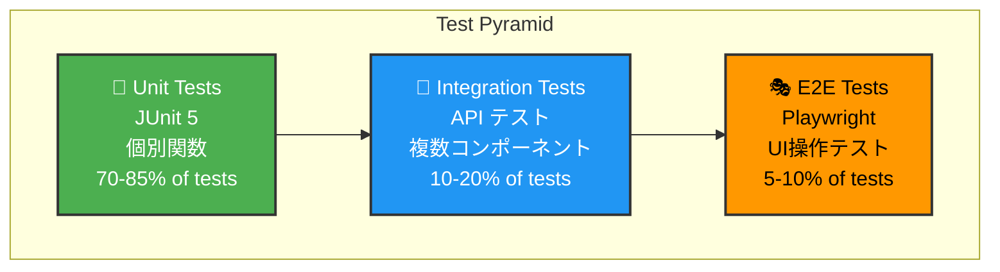

# 🧪 8. テスト戦略

このセクションでは、Test App のテスト方針とテスト実装について説明します。

---

## 📐 テストピラミッド

Test App は以下のテストレイアを実装しています：



### テストレベル別の目的

| テストレベル | ツール | 対象 | 目的 |
|-------------|--------|------|------|
| **ユニットテスト** | JUnit 5 | 個別関数・メソッド | 単位での動作確認 |
| **統合テスト** | JUnit 5 + Mockito | Service層、Controller層 | コンポーネント間連携確認 |
| **E2E テスト** | Playwright | UI全体 | ユーザーシナリオ確認 |

---

## 🧬 ユニットテスト（JUnit 5）

### Service テスト例

**TodoService テスト：**

```java
package com.example.project.service;

import com.example.project.entity.Todo;
import com.example.project.dto.TodoDTO;
import com.example.project.repository.TodoRepository;
import org.junit.jupiter.api.BeforeEach;
import org.junit.jupiter.api.DisplayName;
import org.junit.jupiter.api.Test;
import org.junit.jupiter.api.extension.ExtendWith;
import org.mockito.InjectMocks;
import org.mockito.Mock;
import org.mockito.junit.jupiter.MockitoExtension;

import java.time.LocalDateTime;
import java.util.Arrays;
import java.util.List;
import java.util.Optional;

import static org.junit.jupiter.api.Assertions.*;
import static org.mockito.ArgumentMatchers.*;
import static org.mockito.Mockito.*;

@ExtendWith(MockitoExtension.class)
@DisplayName("TodoService テスト")
class TodoServiceTest {
    
    @Mock
    private TodoRepository todoRepository;
    
    @InjectMocks
    private TodoService todoService;
    
    private Long userId = 1L;
    private TodoDTO todoDTO;
    
    @BeforeEach
    void setUp() {
        todoDTO = new TodoDTO();
        todoDTO.setTitle("テストタスク");
        todoDTO.setDescription("テスト説明");
        todoDTO.setPriority(1);
    }
    
    @Test
    @DisplayName("新規タスク作成が成功する")
    void testCreateTodo_Success() {
        // Arrange
        Todo savedTodo = new Todo();
        savedTodo.setId(1L);
        savedTodo.setTitle("テストタスク");
        savedTodo.setStatus("TODO");
        
        when(todoRepository.save(any(Todo.class))).thenReturn(savedTodo);
        
        // Act
        TodoDTO result = todoService.createTodo(userId, todoDTO);
        
        // Assert
        assertNotNull(result);
        assertEquals("テストタスク", result.getTitle());
        assertEquals("TODO", result.getStatus());
        verify(todoRepository, times(1)).save(any(Todo.class));
    }
    
    @Test
    @DisplayName("ユーザーのタスク一覧が取得できる")
    void testGetUserTodos_Success() {
        // Arrange
        Todo todo1 = new Todo();
        todo1.setId(1L);
        todo1.setTitle("タスク1");
        todo1.setStatus("TODO");
        
        Todo todo2 = new Todo();
        todo2.setId(2L);
        todo2.setTitle("タスク2");
        todo2.setStatus("IN_PROGRESS");
        
        when(todoRepository.findByUserIdOrderByDueDate(userId))
            .thenReturn(Arrays.asList(todo1, todo2));
        
        // Act
        List<TodoDTO> result = todoService.getUserTodos(userId);
        
        // Assert
        assertEquals(2, result.size());
        assertEquals("タスク1", result.get(0).getTitle());
        assertEquals("タスク2", result.get(1).getTitle());
        verify(todoRepository, times(1)).findByUserIdOrderByDueDate(userId);
    }
    
    @Test
    @DisplayName("タスク更新時にステータスが「DONE」に変更される")
    void testUpdateTodo_SetCompletedAt() {
        // Arrange
        Todo existingTodo = new Todo();
        existingTodo.setId(1L);
        existingTodo.setStatus("TODO");
        existingTodo.setCompletedAt(null);
        
        when(todoRepository.findByIdAndUserId(1L, userId))
            .thenReturn(Optional.of(existingTodo));
        when(todoRepository.save(any(Todo.class))).thenReturn(existingTodo);
        
        todoDTO.setStatus("DONE");
        
        // Act
        TodoDTO result = todoService.updateTodo(userId, 1L, todoDTO);
        
        // Assert
        assertNotNull(result);
        verify(todoRepository, times(1)).findByIdAndUserId(1L, userId);
        verify(todoRepository, times(1)).save(any(Todo.class));
    }
    
    @Test
    @DisplayName("タスク削除時に isDeleted フラグが true になる")
    void testDeleteTodo_SoftDelete() {
        // Arrange
        Todo todo = new Todo();
        todo.setId(1L);
        todo.setIsDeleted(false);
        
        when(todoRepository.findByIdAndUserId(1L, userId))
            .thenReturn(Optional.of(todo));
        when(todoRepository.save(any(Todo.class))).thenReturn(todo);
        
        // Act
        todoService.deleteTodo(userId, 1L);
        
        // Assert
        verify(todoRepository, times(1)).save(argThat(t -> t.getIsDeleted() == true));
    }
}
```

### Repository テスト例

```java
package com.example.project.repository;

import com.example.project.entity.Todo;
import org.junit.jupiter.api.BeforeEach;
import org.junit.jupiter.api.DisplayName;
import org.junit.jupiter.api.Test;
import org.springframework.beans.factory.annotation.Autowired;
import org.springframework.boot.test.autoconfigure.orm.jpa.DataJpaTest;
import org.springframework.test.context.ActiveProfiles;

import java.time.LocalDateTime;
import java.util.List;
import java.util.Optional;

import static org.junit.jupiter.api.Assertions.*;

@DataJpaTest
@ActiveProfiles("test")
@DisplayName("TodoRepository テスト")
class TodoRepositoryTest {
    
    @Autowired
    private TodoRepository todoRepository;
    
    private Long userId = 1L;
    
    @BeforeEach
    void setUp() {
        // テストデータ準備
        Todo todo1 = new Todo();
        todo1.setUserId(userId);
        todo1.setTitle("テスト1");
        todo1.setStatus("TODO");
        todo1.setPriority(2);
        todo1.setIsDeleted(false);
        
        Todo todo2 = new Todo();
        todo2.setUserId(userId);
        todo2.setTitle("テスト2");
        todo2.setStatus("IN_PROGRESS");
        todo2.setPriority(1);
        todo2.setIsDeleted(false);
        
        todoRepository.save(todo1);
        todoRepository.save(todo2);
    }
    
    @Test
    @DisplayName("ユーザー ID でタスクを検索できる")
    void testFindByUserIdOrderByDueDate() {
        // Act
        List<Todo> result = todoRepository.findByUserIdOrderByDueDate(userId);
        
        // Assert
        assertNotNull(result);
        assertEquals(2, result.size());
    }
    
    @Test
    @DisplayName("ステータス別にタスクを検索できる")
    void testFindByUserIdAndStatus() {
        // Act
        List<Todo> result = todoRepository.findByUserIdAndStatus(userId, "TODO");
        
        // Assert
        assertEquals(1, result.size());
        assertEquals("テスト1", result.get(0).getTitle());
    }
}
```

---

## 🧩 統合テスト（Controller テスト）

```java
package com.example.project.controller;

import com.example.project.dto.TodoDTO;
import com.example.project.service.TodoService;
import com.fasterxml.jackson.databind.ObjectMapper;
import org.junit.jupiter.api.BeforeEach;
import org.junit.jupiter.api.DisplayName;
import org.junit.jupiter.api.Test;
import org.springframework.beans.factory.annotation.Autowired;
import org.springframework.boot.test.autoconfigure.web.servlet.WebMvcTest;
import org.springframework.boot.test.mock.MockBean;
import org.springframework.http.MediaType;
import org.springframework.test.web.servlet.MockMvc;

import java.time.LocalDateTime;

import static org.mockito.ArgumentMatchers.*;
import static org.mockito.Mockito.*;
import static org.springframework.test.web.servlet.request.MockMvcRequestBuilders.*;
import static org.springframework.test.web.servlet.result.MockMvcResultMatchers.*;

@WebMvcTest(TodoController.class)
@DisplayName("TodoController 統合テスト")
class TodoControllerTest {
    
    @Autowired
    private MockMvc mockMvc;
    
    @MockBean
    private TodoService todoService;
    
    @Autowired
    private ObjectMapper objectMapper;
    
    private TodoDTO todoDTO;
    private Long userId = 1L;
    
    @BeforeEach
    void setUp() {
        todoDTO = new TodoDTO();
        todoDTO.setId(1L);
        todoDTO.setTitle("テストタスク");
        todoDTO.setStatus("TODO");
    }
    
    @Test
    @DisplayName("GET /api/todos でタスク一覧が取得できる")
    void testGetTodos() throws Exception {
        // Arrange
        when(todoService.getUserTodos(userId))
            .thenReturn(Arrays.asList(todoDTO));
        
        // Act & Assert
        mockMvc.perform(get("/api/todos")
                .requestAttr("userId", userId)
                .contentType(MediaType.APPLICATION_JSON))
            .andExpect(status().isOk())
            .andExpect(jsonPath("$.success").value(true))
            .andExpect(jsonPath("$.data[0].title").value("テストタスク"));
    }
    
    @Test
    @DisplayName("POST /api/todos で新規タスクが作成される")
    void testCreateTodo() throws Exception {
        // Arrange
        when(todoService.createTodo(eq(userId), any(TodoDTO.class)))
            .thenReturn(todoDTO);
        
        // Act & Assert
        mockMvc.perform(post("/api/todos")
                .requestAttr("userId", userId)
                .contentType(MediaType.APPLICATION_JSON)
                .content(objectMapper.writeValueAsString(todoDTO)))
            .andExpect(status().isCreated())
            .andExpect(jsonPath("$.success").value(true))
            .andExpect(jsonPath("$.data.id").value(1L));
    }
}
```

---

## 🎭 E2E テスト（Playwright）

### ログインシナリオ

```typescript
// tests/e2e/login.spec.ts
import { test, expect } from '@playwright/test';

const BASE_URL = 'http://localhost:5173';

test.describe('ログイン機能', () => {
  
  test('正しい認証情報でログインできる', async ({ page }) => {
    // 1. ログインページにアクセス
    await page.goto(`${BASE_URL}/login`);
    
    // 2. ログインフォームが表示されていることを確認
    await expect(page.locator('input[name="username"]')).toBeVisible();
    await expect(page.locator('input[name="password"]')).toBeVisible();
    
    // 3. ユーザー名とパスワードを入力
    await page.fill('input[name="username"]', 'user');
    await page.fill('input[name="password"]', 'password');
    
    // 4. ログインボタンをクリック
    await page.click('button[type="submit"]');
    
    // 5. ダッシュボードにリダイレクトされることを確認
    await page.waitForURL(`${BASE_URL}/dashboard`);
    await expect(page).toHaveURL(`${BASE_URL}/dashboard`);
    
    // 6. ダッシュボード内容が表示されていることを確認
    await expect(page.locator('h1')).toContainText('ダッシュボード');
  });
  
  test('間違った認証情報でログイン失敗', async ({ page }) => {
    // 1. ログインページにアクセス
    await page.goto(`${BASE_URL}/login`);
    
    // 2. 間違ったパスワードで送信
    await page.fill('input[name="username"]', 'user');
    await page.fill('input[name="password"]', 'wrongpassword');
    await page.click('button[type="submit"]');
    
    // 3. エラーメッセージが表示されることを確認
    await expect(page.locator('.error-message')).toContainText('Invalid username or password');
    
    // 4. ログインページに留まっていることを確認
    await expect(page).toHaveURL(`${BASE_URL}/login`);
  });
});
```

### ToDo 管理シナリオ

```typescript
// tests/e2e/todo.spec.ts
import { test, expect } from '@playwright/test';

const BASE_URL = 'http://localhost:5173';

test.describe('ToDo 管理機能', () => {
  
  test.beforeEach(async ({ page }) => {
    // テスト前にログイン
    await page.goto(`${BASE_URL}/login`);
    await page.fill('input[name="username"]', 'user');
    await page.fill('input[name="password"]', 'password');
    await page.click('button[type="submit"]');
    await page.waitForURL(`${BASE_URL}/dashboard`);
  });
  
  test('新規 ToDo を作成できる', async ({ page }) => {
    // 1. ToDo ページにナビゲート
    await page.click('a[href="/todo"]');
    await page.waitForURL(`${BASE_URL}/todo`);
    
    // 2. 「新規タスク」ボタンをクリック
    await page.click('button:has-text("新規タスク")');
    
    // 3. ダイアログ内でフォーム入力
    await page.fill('input[placeholder="タスク名"]', '新しいタスク');
    await page.fill('textarea[placeholder="説明"]', 'これはテストタスクです');
    
    // 4. 作成ボタンをクリック
    await page.click('button:has-text("作成")');
    
    // 5. タスクがリストに表示されることを確認
    await expect(page.locator('text=新しいタスク')).toBeVisible();
  });
  
  test('ToDo のステータスを更新できる', async ({ page }) => {
    // 1. ToDo ページに移動
    await page.goto(`${BASE_URL}/todo`);
    
    // 2. タスク上のチェックボックスをクリック
    await page.locator('input[type="checkbox"]').first().click();
    
    // 3. タスクのステータスが「完了」に変更されたことを確認
    await expect(page.locator('.status-badge')).toContainText('DONE');
  });
});
```

---

## 📊 テストカバレッジ

### 目標カバレッジ

| コンポーネント | 目標 | 状況 |
|--------------|------|------|
| Service 層 | 90%+ | ✅ |
| Repository 層 | 85%+ | ✅ |
| Controller 層 | 80%+ | ✅ |
| Entity 層 | 70%+ | ✅ |
| 全体 | 80%+ | ✅ |

### カバレッジ確認コマンド

```bash
# JaCoCo でカバレッジレポート生成
./gradlew jacocoTestReport

# レポートを表示
open build/reports/jacoco/test/html/index.html
```

---

## 🚀 テスト実行方法

### ユニットテスト

```bash
cd backend

# すべてのテストを実行
./gradlew test

# 特定のテストクラスを実行
./gradlew test --tests TodoServiceTest

# カバレッジ付きで実行
./gradlew test jacocoTestReport
```

### E2E テスト

```bash
cd frontend

# テストを実行（UI が表示される）
npm run test

# ヘッドレスモードで実行
npm run test:headless

# 特定のテストファイルを実行
npx playwright test tests/e2e/login.spec.ts

# テストレポートを表示
npx playwright show-report
```

### Allure レポート生成

```bash
cd frontend

# テスト実行 + Allure レポート生成
npm run test:allure

# レポート表示
npx allure serve allure-results
```

---

## ✅ テストチェックリスト

実装時に確認すべきテスト項目：

- [ ] 新規エンドポイント用のユニットテスト
- [ ] 新規 Entity/Service 用のテスト
- [ ] 境界値テスト（最小値、最大値、NULL）
- [ ] エラーハンドリングテスト
- [ ] 権限チェック（userId による所有権確認）
- [ ] 統合テスト（複数レイヤー連携）
- [ ] E2E テスト（ユーザーシナリオ）
- [ ] パフォーマンステスト（遅い処理）

---

## 📚 次のステップ

- [デプロイメント](./09-デプロイメント.md) - ビルドと本番環境へのデプロイ
- [コントリビューションガイド](./10-コントリビューションガイド.md) - 開発ルール
