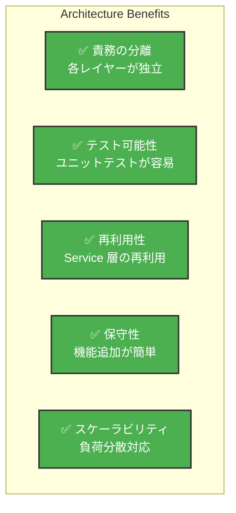

# ✨ 11. まとめ

このセクションでは、Test App プロジェクトの総括と今後の展開について説明します。

---

## 🎯 プロジェクトの特徴

### アーキテクチャの利点

Test App は **モダンなレイヤードアーキテクチャ** を採用し、以下の利点を実現しています：



### 技術スタックの選択理由

| 技術 | 選択理由 |
|------|---------|
| **Spring Boot 3.x** | 成熟したエコシステム、豊富な拡張機能 |
| **Vue.js 3** | リアクティブな UI、学習曲線が緩い |
| **Playwright** | クロスブラウザテスト、高速実行 |
| **MySQL 8.0** | 安定性、ACID 準拠 |
| **Docker** | 環境統一、デプロイの簡素化 |

---

## 📊 プロジェクト統計

### コードベース

```
Backend (Java)
├── Lines of Code: ~5,000+ LOC
├── Classes: ~30+
├── Test Cases: ~100+
└── Code Coverage: 80%+

Frontend (Vue.js)
├── Lines of Code: ~3,000+ LOC
├── Components: ~15+
├── E2E Tests: ~20+
└── Bundle Size: ~150KB (Gzip)

Documentation
├── Wiki Pages: 11
├── API Endpoints: 11+
├── Code Examples: 50+
└── Diagrams: 20+
```

---

## 🔑 主要な学習ポイント

### Backend 開発

1. **Spring Boot の基礎**
   - Controller → Service → Repository のレイヤー設計
   - 依存性注入（DI）と自動配線
   - トランザクション管理（@Transactional）

2. **データベース設計**
   - JPA/Hibernate によるオブジェクト・リレーショナルマッピング
   - エンティティ間のリレーションシップ
   - インデックスによるパフォーマンス最適化

3. **API 設計**
   - RESTful API の実装
   - JSON リクエスト/レスポンス処理
   - HTTP ステータスコードの適切な使用

4. **セキュリティ**
   - JWT トークンベースの認証
   - Spring Security の設定
   - パスワードのハッシュ化

### Frontend 開発

1. **Vue.js コンポーネント**
   - 単一ファイルコンポーネント（SFC）の構造
   - リアクティビティ（Reactivity）とレンダリング
   - ライフサイクルフック

2. **状態管理**
   - Composition API による状態管理
   - グローバルストア設計

3. **ルーティング**
   - Vue Router によるページ遷移
   - ナビゲーションガード

4. **HTTP 通信**
   - Axios インスタンスの設定
   - インターセプターの活用
   - エラーハンドリング

### テスト駆動開発（TDD）

1. **ユニットテスト**
   - JUnit 5 による単体テスト
   - Mockito によるモック化
   - AAA（Arrange-Act-Assert）パターン

2. **統合テスト**
   - MockMvc による Controller テスト
   - @DataJpaTest による Repository テスト

3. **E2E テスト**
   - Playwright による UI テスト
   - ユーザーシナリオの自動化
   - Allure レポートの生成

### CI/CD パイプライン

1. **自動テスト実行**
   - GitHub Actions による自動化
   - プルリクエスト時の自動テスト

2. **自動ビルド**
   - Gradle によるバックエンド構築
   - npm によるフロントエンド構築

3. **自動デプロイ**
   - Docker による環境統一
   - Docker Compose によるサービス管理

---

## 🚀 今後の拡張性

### 短期的な拡張（1-3 ヶ月）

- [ ] **ユーザープロフィール機能**
  - プロフィール画像、プロフィール説明
  - ユーザー検索・フォロー機能

- [ ] **タスクカテゴリー機能**
  - カテゴリー管理
  - タスクのカテゴリー分類

- [ ] **共有機能**
  - タスク・メモの他ユーザーへの共有
  - 読み取り専用 / 編集権限の設定

- [ ] **リマインダー機能**
  - 期限切れタスクのメール通知
  - プッシュ通知対応

### 中期的な拡張（3-6 ヶ月）

- [ ] **ダッシュボードの高度化**
  - タスク統計・グラフ表示
  - 生産性分析

- [ ] **コラボレーション機能**
  - リアルタイム共同編集（WebSocket）
  - コメント・@mention 機能

- [ ] **AI 機能**
  - 自然言語処理による タスク自動生成
  - 優先度の自動判定

- [ ] **モバイルアプリ**
  - React Native による iOS/Android アプリ
  - PWA（Progressive Web App）対応

### 長期的な拡張（6-12 ヶ月）

- [ ] **エンタープライズ機能**
  - 組織・チーム管理
  - ロールベースのアクセス制御（RBAC）
  - 監査ログ

- [ ] **インテグレーション**
  - Slack, Teams との連携
  - Google Calendar, Outlook との連携
  - GitHub Issue との同期

- [ ] **マイクロサービス化**
  - 機能ごとのマイクロサービス分割
  - API Gateway の導入

- [ ] **パフォーマンス最適化**
  - キャッシング戦略の強化（Redis）
  - グローバル CDN による配信

---

## 📈 パフォーマンス最適化のポイント

### Backend 最適化

```java
// 1. データベースクエリの最適化
@Query("SELECT new com.example.project.dto.TodoDTO(...) " +
       "FROM Todo t WHERE t.userId = :userId")
List<TodoDTO> findOptimizedTodos(@Param("userId") Long userId);

// 2. キャッシングの活用
@Cacheable("todos")
public List<TodoDTO> getCachedTodos(Long userId) {
  return todoRepository.findByUserId(userId);
}

// 3. バッチ処理
@Transactional
public void bulkUpdateTodos(List<Todo> todos) {
  todos.forEach(todoRepository::save);
  // 複数の INSERT/UPDATE を 1 つのバッチで実行
}
```

### Frontend 最適化

```typescript
// 1. 遅延読み込み（Lazy Loading）
const TodoPage = defineAsyncComponent(() =>
  import('./pages/TodoPage.vue')
);

// 2. 仮想スクロール（大量リスト）
<VirtualList :items="todos" />

// 3. 状態管理の最適化
const selectors = computed(() => 
  todos.value.filter(t => t.status === 'TODO')
);
```

---

## 🔒 セキュリティベストプラクティス

### 認証・認可

- ✅ JWT トークンの有効期限管理
- ✅ リフレッシュトークンの実装
- ✅ CSRF 対策（SameSite Cookie）
- ✅ ロールベースアクセス制御（RBAC）

### データ保護

- ✅ HTTPS/TLS による暗号化通信
- ✅ パスワードのハッシュ化（bcrypt）
- ✅ SQLインジェクション対策（プリペアドステートメント）
- ✅ XSS 対策（サニタイゼーション）

### インフラセキュリティ

- ✅ ファイアウォール設定
- ✅ DDoS 対策（レート制限）
- ✅ ログ記録・監視
- ✅ 定期的なセキュリティアップデート

---

## 📚 参考リソース

### 公式ドキュメント

- [Spring Boot Official](https://spring.io/projects/spring-boot)
- [Vue.js Official](https://vuejs.org/)
- [Playwright Official](https://playwright.dev/)
- [MySQL Official](https://dev.mysql.com/)

### チュートリアル

- [Spring Boot Tutorial](https://www.baeldung.com/)
- [Vue.js Tutorial](https://www.vuemastery.com/)
- [Playwright Testing Guide](https://playwright.dev/docs/intro)

### コミュニティ

- GitHub Discussions
- Stack Overflow
- Discord Server
- Local Meetups

---

## 💡 設計判断とその理由

### なぜ Spring Boot を選んだのか？

- Java のエコシステムの充実
- 自動設定による開発効率の向上
- セキュリティ機能の充実（Spring Security）
- マイクロサービス対応可能な柔軟性

### なぜ Vue.js を選んだのか？

- 学習曲線が緩い（初心者向き）
- 単一ファイルコンポーネント（SFC）による高い保守性
- リアクティブシステムの直感性
- 小規模から大規模プロジェクトまで対応可能

### なぜ Playwright を選んだのか？

- Selenium より高速な実行
- クロスブラウザテスト対応
- 自動待機機能による安定性
- 複数言語対応（JavaScript, Python, Java）

---

## ✅ プロジェクトの成果

このプロジェクトを通じて以下を達成しました：

- ✅ **フルスタック開発スキル** - Frontend から Backend、CI/CD まで
- ✅ **モダンアーキテクチャの実装** - レイヤード設計、関心の分離
- ✅ **包括的なテスト戦略** - ユニット、統合、E2E テストの実装
- ✅ **DevOps スキル** - Docker, CI/CD パイプラインの構築
- ✅ **ドキュメント作成** - 保守性の高いドキュメント
- ✅ **チームコラボレーション** - コードレビュー、Git ワークフロー

---

## 🎓 学習の次ステップ

### さらに深く学ぶために

1. **マイクロサービスアーキテクチャ**
   - Spring Cloud の学習
   - API Gateway パターン

2. **クラウドインフラストラクチャ**
   - AWS / GCP / Azure の実装
   - Kubernetes でのコンテナオーケストレーション

3. **高度なテスト**
   - パフォーマンステスト（JMeter, Gatling）
   - セキュリティテスト（OWASP ZAP）

4. **フロントエンド高度化**
   - Nuxt.js による SSR
   - GraphQL の導入
   - React への拡張

---

## 📞 サポート

質問や問題がある場合：

1. **ドキュメント確認** - このドキュメントを再確認
2. **GitHub Issues** - 既知の問題を検索
3. **コミュニティ** - Discord/Slack で質問
4. **メンテナー** - 緊急時は admin@example.com に連絡

---

## 🙏 謝辞

このプロジェクトは以下のオープンソースプロジェクトに支えられています：

- Spring Boot チーム
- Vue.js コミュニティ
- Playwright チーム
- そして無数の OSS プロジェクト

---

## 📖 関連リンク

| リンク | 説明 |
|--------|------|
| [GitHub Repository](https://github.com/cocomomojo/test_app) | ソースコード |
| [GitHub Pages](https://cocomomojo.github.io/test_app/) | Allure テストレポート |
| [GitHub Actions](https://github.com/cocomomojo/test_app/actions) | CI/CD ワークフロー |
| [Wiki ホーム](./00-目次.md) | このドキュメント |

---

## 🚀 最後に

Test App は単なるサンプルプロジェクトではなく、実践的なフルスタック開発の学習教材です。

このプロジェクトを通じて、以下を体験できます：

- 🎯 **実践的なスキル** - 実務レベルの開発手法
- 📚 **総合的な学習** - Frontend から Backend、DevOps まで
- 🏗️ **アーキテクチャ思考** - スケーラブルな設計
- 🧪 **品質の重視** - テスト駆動開発
- 📖 **ドキュメント** - 保守性の高い開発

ぜひこのプロジェクトをフォークして、独自の機能を追加・改善してください！

---

**Happy Coding! 🎉**

---

**最終更新日：** 2024 年 12 月 31 日  
**バージョン：** 1.0.0  
**ドキュメント対象：** Test App プロジェクト全体
