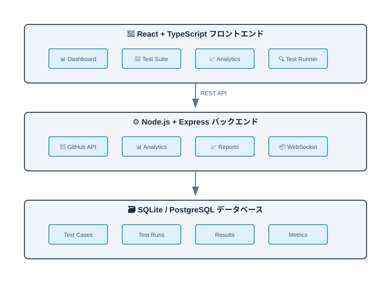
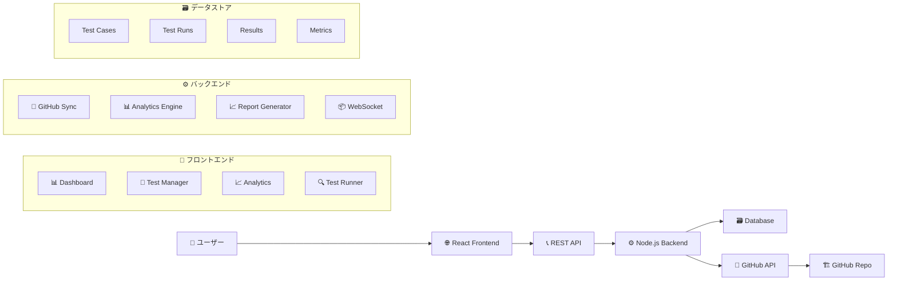
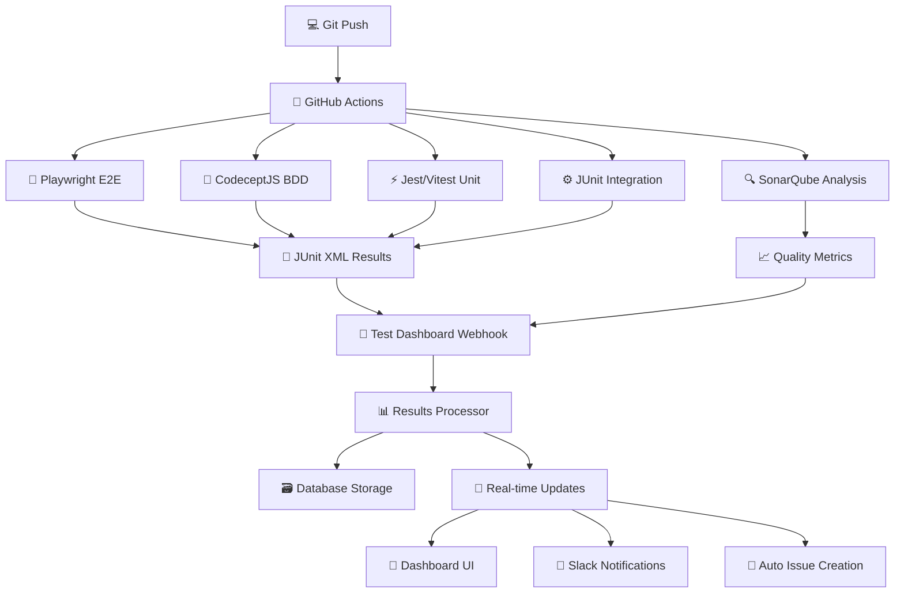
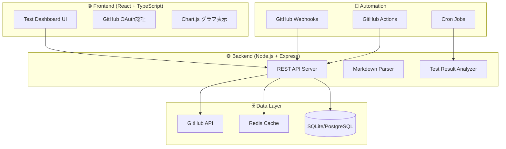

# 🚀 GitHub Test Dashboard 自作ガイド

> GitHubリポジトリベーステスト管理の弱点を完全克服するカスタムダッシュボード

## ✅ このリポジトリ向けの最新実装（2026-02）

以下は「機能改修PR時にテスト管理を自動化する」ための、**GitHub Enterprise向け実装 + Pro代替運用**です。

### 追加済みファイル

- PRテンプレート
  - `.github/pull_request_template.md`
- ワークフロー
  - `.github/workflows/auto-label-feature-pr.yml`
  - `.github/workflows/feature-pr-test-management-enterprise.yml`
  - `.github/workflows/feature-pr-test-management-pro.yml`
- 生成スクリプト
  - `scripts/generate-pr-test-assets.js`
  - `scripts/update-test-dashboard.js`
- 生成物（実行時）
  - `qa/test-management/pr/PR-<番号>-test-plan.md`
  - `frontend/tests/e2e/generated/pr-<番号>-*.spec.ts`
  - `qa/test-management/dashboard.md`

### Enterprise運用（自動）

1. Repository Variable を設定
   - `COPILOT_ENTERPRISE_AUTOMATION=true`
2. Feature PR を作成（`feature`ラベル、またはタイトル `feat:` 推奨）
  - `feature` ラベルは自動付与されます（タイトルが `feat:` / `[FEATURE]`、または `Closes #<Issue>` 先Issueが `feature` の場合）
3. ワークフローがPR本文を解析して以下を自動生成
   - テスト設計Markdown
   - E2E/手動/総合の分類
  - E2E + 総合項目から Playwright 雛形（`test.todo`）
   - テスト集計ダッシュボード更新
4. PRへテスト成果物リンクを自動コメント投稿
  - `qa/test-management/pr/PR-<番号>-test-plan.md`
  - `frontend/tests/e2e/generated/pr-<番号>-*.spec.ts`
  - `qa/test-management/specs/issue-<番号>-*.md`（planner成果物）

### Pro運用（代替）

#### 代替1: GitHub.com Chat

- PR/Issue内容をもとに、Copilot Chatへ次を依頼
  - `このPRのテスト設計（E2E/手動/総合）を作って、E2EはPlaywright案も出してください。`

#### 代替2: 手動ワークフロー実行（推奨）

1. `Actions` タブ → `Feature PR Test Management (Pro Manual Alternative)`
2. `pr_number` に対象PR番号を入力して実行
3. Enterprise自動運用と同じ生成物を得る

### 必須ルール（合意済み運用）

- PR本文に `Closes #<Issue番号>` を必ず記載する
- `qa/test-management/specs/issue-<Issue番号>-*.md`（Playwright planner成果物）が存在しない場合、ワークフローは失敗する
- generator相当は **spec雛形生成まで**（`test.todo` ベース）
  - 実テストコード化は次フェーズで段階的に拡張

### ベストプラクティス（運用ルール）

- PRテンプレートの `Test Design (E2E / Manual)` と `Integration Test Items` を必ず埋める
- PR本文には `Closes #<Issue番号>` を必ず記載
- 生成された `test.todo` は必要に応じて具体実装へ置換する

### 実行実績（2026-02-15）

- 対象PR: `#20`
- 実行ワークフロー: `Feature PR Test Management (Pro Manual Alternative)`
- 実行結果: **success**
- Run URL: `https://github.com/cocomomojo/test_app/actions/runs/22031365775`

> 初回は `workflow_dispatch` 実行時の `pull_request` ペイロード不足で失敗。
> `feature-pr-test-management-pro.yml` と `generate-pr-test-assets.js` にフォールバック処理を追加し、再実行で成功を確認。

### FAQ: テスト設計はCopilotが考えているのか？何を入力にしているのか？

- 結論: **両方**です。
  - 本仕組みは、PR本文のチェックリストを機械的に解析して `test-plan.md` と `test.todo` を生成します。
  - つまり、**設計品質はPR本文に書かれた入力品質に依存**します。

- 現在の主な入力ソース
  1. PR本文
     - `Inputs for Test Design (Q&A)`
     - `Test Design (E2E)`
     - `Test Design (Manual)`
     - `Integration Test Items`
  2. Issue本文（受け入れ条件）
  3. 既存E2Eコード（重複回避・命名/待機方針の踏襲）

- 精度を上げる方法
  - `.github/skills/build_test_design_input.md` の一問一答で入力を具体化
  - 公式 Playwright Test Agents（planner/generator/healer）で E2E観点を先に洗い出す
    - `npx playwright init-agents --loop=vscode`
    - 参照: `https://playwright.dev/docs/test-agents`
  - 生成された `test.todo` をレビュー前に具体実装へ置換

### 標準化アセット

- Prompt: `.github/prompts/feature-pr-request.prompt.md`
- Skill (Q&A): `.github/skills/build_test_design_input.md`
- Skill (Official Playwright Agents): `.github/skills/use_official_playwright_test_agents.md`
- Planner Prompt Template: `qa/test-management/templates/planner-prompt-template.md`
- Planner Prompt Generator: `scripts/create-planner-prompt.js`

### 依頼者作業を最小化する運用（推奨）

Issueごとに手書きで `planner-prompt-issue-<n>.md` を作る必要はありません。
共通テンプレート + 自動生成で運用します。

1. Issue を作成（要件・受け入れ条件を記載）
2. 次を実行して planner 入力を自動生成

  - `node scripts/create-planner-prompt.js --issue <Issue番号> --repo cocomomojo/test_app`

3. 生成ファイル（`qa/test-management/generated/planner-prompt-issue-<n>.md`）を planner に投入

## 📋 目次
1. [GitHub Test Dashboard とは](#github-test-dashboard-とは)
2. [解決する課題](#解決する課題)
3. [アーキテクチャ設計](#アーキテクチャ設計)
4. [実装ガイド](#実装ガイド)
5. [デプロイ・運用](#デプロイ運用)
6. [拡張機能](#拡張機能)

---

## 🤔 GitHub Test Dashboard とは

GitHubリポジトリベースのテスト管理における**5つの主要な弱点**を完全に解決する、軽量で高機能なカスタムダッシュボードです。

### 🏗️ システム全体像



> 💡 **アーキテクチャのポイント**: 3層構造（フロントエンド・バックエンド・データベース）で明確に分離され、各コンポーネントが独立して開発・テスト可能です。

```
┌─────────────────────────────────────────────────────────────────┐
│           🎯 GitHub Test Dashboard の価値提案                   │
├─────────────────────────────────────────────────────────────────┤
│                                                                 │
│  💰 完全無料 + 📊 高機能レポート + 🎨 直感的UI                  │
│  👥 非技術者対応 + ⚡ 自動化 + 📈 高度なメトリクス               │
│                                                                 │
│        = GitHubの利点 × 専用ツールの機能                       │
│                                                                 │
└─────────────────────────────────────────────────────────────────┘
```

---

## 🎯 解決する課題

### 現在のGitHubリポジトリ方式の限界

| 課題 | 現状 | GitHub Test Dashboard による解決 |
|:-----|:-----|:-----------------------------------|
| 📊 **レポート機能なし** | 手動集計、可視化困難 | リアルタイム自動集計、美しいグラフ・チャート |
| 🎯 **専用UI不足** | GitHub標準UI、操作が煩雑 | テスト管理専用の直感的インターフェース |
| 📱 **実行管理が困難** | Issue/PR での手動管理 | ワンクリックテスト実行、進捗リアルタイム表示 |
| 📈 **メトリクス不足** | 品質指標の手動計算 | Pass率、Coverage、品質トレンド自動算出 |
| 👤 **非技術者対応** | Git知識必須 | Webブラウザのみで完結、直感的操作 |

---

## 🏗️ アーキテクチャ設計

### 💻 システム構成



### 📦 技術スタック

```
               🏆 採用技術スタック
    ┌─────────────────────────────────────────────────┐
    │ レイヤー        │ 技術               │ 理由            │
    ├───────────────┴───────────────────┴─────────────────┤
    │ 🌐 フロントエンド │ React + TypeScript │ コンポーネント中心    │
    │               │ Chart.js           │ 美しいグラフ        │
    │               │ Material-UI        │ モダンUI           │
    ├───────────────┼───────────────────┼─────────────────┤
    │ ⚙️ バックエンド   │ Node.js + Express  │ 高速・JavaScript   │
    │               │ Socket.io          │ リアルタイム通信    │
    │               │ JWT Auth           │ セキュア認証       │
    ├───────────────┼───────────────────┼─────────────────┤
    │ 🗃️ データベース   │ SQLite (開発)     │ セットアップ不要     │
    │               │ PostgreSQL (本番) │ 本格運用対応      │
    ├───────────────┼───────────────────┼─────────────────┤
    │ 🚀 デプロイ      │ Docker + Railway   │ 無料ホスティング     │
    │               │ GitHub Actions     │ CI/CD自動化        │
    └───────────────┴───────────────────┴─────────────────┘
```

---

## 🤖 包括的自動テスト連携の実装

### 🎯 自動テスト連携の全体フロー



### 🛠️ 1. GitHub Actions 連携設定

**`.github/workflows/comprehensive-testing.yml`**

```yaml
name: 🤖 包括的自動テスト + Dashboard 連携

on:
  push:
    branches: [main, develop]
  pull_request:
    branches: [main]
  schedule:
    - cron: '0 2 * * *'  # 毎日夜中2時に実行

env:
  DASHBOARD_API_URL: ${{ secrets.DASHBOARD_API_URL }}
  DASHBOARD_API_TOKEN: ${{ secrets.DASHBOARD_API_TOKEN }}
  SONAR_TOKEN: ${{ secrets.SONAR_TOKEN }}
  SLACK_WEBHOOK_URL: ${{ secrets.SLACK_WEBHOOK_URL }}

jobs:
  comprehensive-testing:
    runs-on: ubuntu-latest
    timeout-minutes: 30

    strategy:
      matrix:
        browser: [chromium, firefox, webkit]
        node-version: [18, 20]
      fail-fast: false

    steps:
      - name: 💻 Checkout Repository
        uses: actions/checkout@v4
        with:
          fetch-depth: 0

      - name: ⚙️ Setup Node.js ${{ matrix.node-version }}
        uses: actions/setup-node@v4
        with:
          node-version: ${{ matrix.node-version }}
          cache: 'npm'

      - name: ⚙️ Setup Java
        uses: actions/setup-java@v4
        with:
          distribution: 'temurin'
          java-version: '17'

      - name: 📦 Install Dependencies
        run: |
          npm ci
          npx playwright install --with-deps ${{ matrix.browser }}
          mvn dependency:resolve -q

      - name: 🚀 Notify Dashboard - Test Start
        run: |
          curl -X POST "$DASHBOARD_API_URL/api/test-runs/start" \
            -H "Authorization: Bearer $DASHBOARD_API_TOKEN" \
            -H "Content-Type: application/json" \
            -d '{
              "runId": "${{ github.run_id }}-${{ matrix.browser }}-${{ matrix.node-version }}",
              "branch": "${{ github.ref_name }}",
              "commit": "${{ github.sha }}",
              "environment": "CI",
              "browser": "${{ matrix.browser }}",
              "nodeVersion": "${{ matrix.node-version }}",
              "startedBy": "${{ github.actor }}",
              "triggeredBy": "${{ github.event_name }}"
            }'

      # 🧪 Playwright E2E Tests
      - name: 🧪 Run Playwright E2E Tests
        run: |
          npx playwright test --project=${{ matrix.browser }} --reporter=junit
        continue-on-error: true

      # 📝 CodeceptJS BDD Tests
      - name: 📝 Run CodeceptJS BDD Tests
        run: |
          npx codeceptjs run --reporter junit --output ./test-results/codecept
        continue-on-error: true

      # ⚡ Frontend Unit Tests
      - name: ⚡ Run Frontend Unit Tests (Vitest)
        run: |
          npm run test:unit -- --reporter=junit --outputFile=test-results/vitest-results.xml
        continue-on-error: true

      # ⚙️ Backend Integration Tests
      - name: ⚙️ Run Backend Tests (JUnit)
        run: |
          mvn test -Dmaven.test.failure.ignore=true
        continue-on-error: true

      # 🔍 SonarQube Code Analysis
      - name: 🔍 SonarQube Analysis
        run: |
          mvn sonar:sonar \
            -Dsonar.projectKey=test-dashboard \
            -Dsonar.host.url=https://sonarcloud.io \
            -Dsonar.organization=${{ secrets.SONAR_ORGANIZATION }}
        continue-on-error: true

      # 🤖 SonarQube-mcp Auto Fix
      - name: 🤖 SonarQube-mcp Auto Fix
        run: |
          # SonarQubeの結果を取得して自動修正
          npx sonar-mcp-cli --project-key=test-dashboard --auto-fix
        continue-on-error: true

      # 📄 Collect All Test Results
      - name: 📄 Collect Test Results
        run: |
          mkdir -p combined-results
          find . -name "*junit*.xml" -o -name "*results*.xml" | xargs cp -t combined-results/ || true
          ls -la combined-results/

      # 🚀 Send Results to Dashboard
      - name: 🚀 Send Results to Dashboard
        run: |
          # テスト結果をDashboard APIに送信
          for result_file in combined-results/*.xml; do
            if [ -f "$result_file" ]; then
              echo "Uploading: $result_file"
              curl -X POST "$DASHBOARD_API_URL/api/test-results/upload" \
                -H "Authorization: Bearer $DASHBOARD_API_TOKEN" \
                -F "runId=${{ github.run_id }}-${{ matrix.browser }}-${{ matrix.node-version }}" \
                -F "resultFile=@$result_file" \
                -F "testType=$(basename $result_file .xml)" \
                -F "browser=${{ matrix.browser }}" \
                -F "nodeVersion=${{ matrix.node-version }}"
            fi
          done

      # 📊 Quality Metrics Collection
      - name: 📊 Collect Quality Metrics
        run: |
          # SonarQubeメトリクスを取得
          QUALITY_GATE=$(curl -s -u "$SONAR_TOKEN:" \
            "https://sonarcloud.io/api/qualitygates/project_status?projectKey=test-dashboard" | \
            jq -r '.projectStatus.status')

          # Dashboardに品質メトリクスを送信
          curl -X POST "$DASHBOARD_API_URL/api/quality-metrics" \
            -H "Authorization: Bearer $DASHBOARD_API_TOKEN" \
            -H "Content-Type: application/json" \
            -d "{
              \"runId\": \"${{ github.run_id }}-${{ matrix.browser }}-${{ matrix.node-version }}\",
              \"qualityGate\": \"$QUALITY_GATE\",
              \"coverage\": $(cat coverage/coverage-summary.json | jq '.total.lines.pct // 0'),
              \"codeSmells\": 0,
              \"vulnerabilities\": 0,
              \"duplications\": 0
            }"

      # 📧 Slack Notification
      - name: 📧 Slack Notification
        if: always()
        run: |
          STATUS_EMOJI="✅"
          if [ "${{ job.status }}" != "success" ]; then
            STATUS_EMOJI="❌"
          fi

          curl -X POST $SLACK_WEBHOOK_URL \
            -H 'Content-type: application/json' \
            -d "{
              \"channel\": \"#qa-automation\",
              \"text\": \"$STATUS_EMOJI テスト実行結果\",
              \"attachments\": [{
                \"color\": \"$([[ \"${{ job.status }}\" == \"success\" ]] && echo \"good\" || echo \"danger\")\",
                \"fields\": [
                  {\"title\": \"Branch\", \"value\": \"${{ github.ref_name }}\", \"short\": true},
                  {\"title\": \"Commit\", \"value\": \"${{ github.sha }}\", \"short\": true},
                  {\"title\": \"Browser\", \"value\": \"${{ matrix.browser }}\", \"short\": true},
                  {\"title\": \"Node.js\", \"value\": \"${{ matrix.node-version }}\", \"short\": true},
                  {\"title\": \"Status\", \"value\": \"${{ job.status }}\", \"short\": true},
                  {\"title\": \"Dashboard\", \"value\": \"<$DASHBOARD_API_URL/runs/${{ github.run_id }}|結果を見る>\", \"short\": true}
                ]
              }]
            }"
```

### 📱 2. Dashboard API - テスト結果受信エンドポイント

**`backend/src/controllers/TestResultsController.ts`**

```typescript
import { Request, Response } from 'express';
import { TestResultProcessor } from '../services/TestResultProcessor';
import { WebSocketManager } from '../services/WebSocketManager';
import { SlackNotifier } from '../services/SlackNotifier';
import { IssueAutoCreator } from '../services/IssueAutoCreator';

export class TestResultsController {
  private testResultProcessor = new TestResultProcessor();
  private wsManager = new WebSocketManager();
  private slackNotifier = new SlackNotifier();
  private issueCreator = new IssueAutoCreator();

  /**
   * 🚀 テスト実行開始通知
   */
  async startTestRun(req: Request, res: Response) {
    try {
      const testRun = await this.testResultProcessor.createTestRun(req.body);

      // リアルタイム更新
      this.wsManager.broadcast('test-run-started', testRun);

      res.json({ success: true, testRun });
    } catch (error) {
      console.error('テスト実行開始エラー:', error);
      res.status(500).json({ error: error.message });
    }
  }

  /**
   * 📄 JUnit XML結果アップロード
   */
  async uploadTestResults(req: Request, res: Response) {
    try {
      const { runId, testType, browser, nodeVersion } = req.body;
      const resultFile = req.file;

      if (!resultFile) {
        return res.status(400).json({ error: 'テスト結果ファイルがありません' });
      }

      // JUnit XMLをパース
      const results = await this.testResultProcessor.parseJUnitXML(
        resultFile.buffer.toString(),
        testType,
        { browser, nodeVersion }
      );

      // データベースに保存
      const savedResults = await this.testResultProcessor.saveTestResults(runId, results);

      // 失敗テストの自動Issue作成
      const failedTests = results.filter(test => test.status === 'failed');
      for (const failedTest of failedTests) {
        await this.issueCreator.createIssueForFailedTest(failedTest, runId);
      }

      // リアルタイム更新
      this.wsManager.broadcast('test-results-updated', {
        runId,
        testType,
        results: savedResults,
        summary: this.calculateSummary(results)
      });

      // Slack通知（失敗がある場合）
      if (failedTests.length > 0) {
        await this.slackNotifier.notifyFailedTests(runId, failedTests, testType);
      }

      res.json({
        success: true,
        processed: results.length,
        failed: failedTests.length,
        testType
      });

    } catch (error) {
      console.error('テスト結果処理エラー:', error);
      res.status(500).json({ error: error.message });
    }
  }

  /**
   * 📊 品質メトリクス受信
   */
  async receiveQualityMetrics(req: Request, res: Response) {
    try {
      const { runId, qualityGate, coverage, codeSmells, vulnerabilities } = req.body;

      const qualityData = await this.testResultProcessor.saveQualityMetrics(runId, {
        qualityGate,
        coverage,
        codeSmells,
        vulnerabilities,
        timestamp: new Date()
      });

      // Quality Gate失敗時のアラート
      if (qualityGate === 'ERROR') {
        await this.slackNotifier.notifyQualityGateFailure(runId, qualityData);
        await this.issueCreator.createQualityIssue(runId, qualityData);
      }

      this.wsManager.broadcast('quality-metrics-updated', {
        runId,
        metrics: qualityData
      });

      res.json({ success: true, qualityData });
    } catch (error) {
      console.error('品質メトリクスエラー:', error);
      res.status(500).json({ error: error.message });
    }
  }

  private calculateSummary(results: TestResult[]): TestSummary {
    const total = results.length;
    const passed = results.filter(r => r.status === 'passed').length;
    const failed = results.filter(r => r.status === 'failed').length;
    const skipped = results.filter(r => r.status === 'skipped').length;

    return {
      total,
      passed,
      failed,
      skipped,
      passRate: total > 0 ? (passed / total) * 100 : 0,
      duration: results.reduce((sum, r) => sum + (r.duration || 0), 0)
    };
  }
}
```

### 🐛 3. 自動Issue作成サービス

**`backend/src/services/IssueAutoCreator.ts`**

```typescript
import { Octokit } from '@octokit/rest';
import { TestResult, QualityMetrics } from '../types';

export class IssueAutoCreator {
  private octokit: Octokit;
  private repoOwner: string;
  private repoName: string;

  constructor() {
    this.octokit = new Octokit({
      auth: process.env.GITHUB_TOKEN
    });

    // GitHubリポジトリ情報を環境変数から取得
    const repoUrl = process.env.GITHUB_REPOSITORY;
    [this.repoOwner, this.repoName] = repoUrl?.split('/') || ['', ''];
  }

  /**
   * 🐛 失敗テスト用のIssueを自動作成
   */
  async createIssueForFailedTest(failedTest: TestResult, runId: string): Promise<void> {
    try {
      // 🔍 既存のIssueをチェック
      const existingIssue = await this.findExistingTestIssue(failedTest.name);

      if (existingIssue) {
        // 既存Issueにコメントを追加
        await this.addFailureComment(existingIssue.number, failedTest, runId);
        return;
      }

      const issueTitle = `🐛 テスト失敗: ${failedTest.name}`;
      const issueBody = this.generateTestFailureIssueBody(failedTest, runId);

      const newIssue = await this.octokit.issues.create({
        owner: this.repoOwner,
        repo: this.repoName,
        title: issueTitle,
        body: issueBody,
        labels: [
          'test-failure',
          'automated',
          failedTest.testType,
          failedTest.metadata?.browser ? `browser:${failedTest.metadata.browser}` : ''
        ].filter(Boolean),
        assignees: await this.getDefaultAssignees()
      });

      console.log(`✅ テスト失敗Issueを作成: #${newIssue.data.number}`);

    } catch (error) {
      console.error('テスト失敗Issue作成エラー:', error);
    }
  }

  /**
   * 📊 Quality Gate失敗用のIssueを作成
   */
  async createQualityIssue(runId: string, qualityData: QualityMetrics): Promise<void> {
    try {
      const issueTitle = `🚨 Quality Gate 失敗: ${runId}`;
      const issueBody = this.generateQualityIssueBody(qualityData, runId);

      const newIssue = await this.octokit.issues.create({
        owner: this.repoOwner,
        repo: this.repoName,
        title: issueTitle,
        body: issueBody,
        labels: ['quality-gate', 'sonarqube', 'automated', 'high-priority'],
        assignees: await this.getQualityTeamAssignees()
      });

      console.log(`✅ Quality Gate Issueを作成: #${newIssue.data.number}`);

    } catch (error) {
      console.error('Quality Gate Issue作成エラー:', error);
    }
  }

  /**
   * 📝 テスト失敗IssueのBodyを生成
   */
  private generateTestFailureIssueBody(failedTest: TestResult, runId: string): string {
    return `
## 🐛 テスト失敗の詳細

**テスト名:** ${failedTest.name}
**テストタイプ:** ${failedTest.testType}
**クラス:** ${failedTest.className}
**実行時間:** ${failedTest.duration}ms
**Run ID:** ${runId}

### 🔍 実行環境
- **ブラウザー:** ${failedTest.metadata?.browser || 'N/A'}
- **Node.js:** ${failedTest.metadata?.nodeVersion || 'N/A'}
- **スイート:** ${failedTest.metadata?.suiteName || 'N/A'}

### ❌ エラー情報
\`\`\`
${failedTest.error || 'エラーメッセージなし'}
\`\`\`

${failedTest.stackTrace ? `### 📝 スタックトレース
<details>
<summary>スタックトレースを表示</summary>

\`\`\`
${failedTest.stackTrace}
\`\`\`
</details>` : ''}

### 📎 添付ファイル
${failedTest.attachments?.map(att =>
  `- [${att.type.toUpperCase()}](${att.path})`
).join('\n') || '添付ファイルなし'}

### 🛠️ 修正アクション
- [ ] エラー原因の特定
- [ ] テストケースの修正
- [ ] ローカルでの再現テスト
- [ ] 修正後のCIテスト確認

---
*このIssueは自動生成されました。*
`;
  }

  private async getDefaultAssignees(): Promise<string[]> {
    return process.env.DEFAULT_TEST_ASSIGNEES?.split(',') || [];
  }

  private async getQualityTeamAssignees(): Promise<string[]> {
    return process.env.QUALITY_TEAM_ASSIGNEES?.split(',') || [];
  }
}
```



### 技術スタック

| レイヤー | 技術選択 | 理由 |
|:---------|:---------|:-----|
| 🎨 **Frontend** | React + TypeScript + Tailwind CSS | モダンUI、型安全性、レスポンシブ |
| ⚙️ **Backend** | Node.js + Express + Prisma | 高速開発、型安全なDB操作 |
| 🗄️ **Database** | SQLite (開発) / PostgreSQL (本番) | 軽量 → スケーラブル |
| 📊 **可視化** | Chart.js + D3.js | 豊富なグラフ種類、カスタマイズ性 |
| 🔐 **認証** | GitHub OAuth + JWT | セキュア、既存アカウント活用 |
| 🚀 **デプロイ** | Vercel (Frontend) + Railway (Backend) | 簡単デプロイ、自動スケーリング |

---

## 💻 実装ガイド

### Phase 1: 基盤構築（週1）

#### 1-1. プロジェクトセットアップ

```bash
# プロジェクト作成
mkdir github-test-dashboard
cd github-test-dashboard

# Frontend セットアップ
npx create-react-app frontend --template typescript
cd frontend
npm install @octokit/rest chart.js react-chartjs-2 tailwindcss @headlessui/react
cd ..

# Backend セットアップ
mkdir backend
cd backend
npm init -y
npm install express @octokit/rest prisma @prisma/client redis jsonwebtoken cors dotenv
npm install -D @types/node @types/express nodemon typescript
cd ..
```

#### 1-2. 基本API設計

**`backend/src/routes/tests.ts`**
```typescript
import express from 'express';
import { Octokit } from '@octokit/rest';
import { TestParser } from '../services/TestParser';
import { MetricsAnalyzer } from '../services/MetricsAnalyzer';

const router = express.Router();

// テストケース一覧取得
router.get('/cases', async (req, res) => {
  try {
    const { owner, repo } = req.query;
    const octokit = new Octokit({ auth: req.headers.authorization });

    // tests/ ディレクトリからMarkdownファイルを取得
    const testFiles = await fetchTestFiles(octokit, owner, repo);
    const testCases = await TestParser.parseMarkdownTests(testFiles);

    res.json({
      success: true,
      data: testCases,
      metadata: {
        totalCases: testCases.length,
        categories: getCategories(testCases)
      }
    });
  } catch (error) {
    res.status(500).json({ success: false, error: error.message });
  }
});

// テスト実行結果分析
router.get('/results', async (req, res) => {
  try {
    const { owner, repo, timeRange = '30d' } = req.query;
    const analyzer = new MetricsAnalyzer(octokit, owner, repo);

    const results = await analyzer.analyzeTestResults({
      timeRange,
      includeMetrics: ['pass_rate', 'coverage', 'execution_time', 'flaky_tests']
    });

    res.json({
      success: true,
      data: results,
      generatedAt: new Date().toISOString()
    });
  } catch (error) {
    res.status(500).json({ success: false, error: error.message });
  }
});
```

#### 1-3. テストケース解析エンジン

**`backend/src/services/TestParser.ts`**
```typescript
export class TestParser {
  static async parseMarkdownTests(files: GitHubFile[]): Promise<TestCase[]> {
    const testCases: TestCase[] = [];

    for (const file of files) {
      if (file.name.endsWith('.md')) {
        const content = Buffer.from(file.content, 'base64').toString();
        const parsed = this.parseTestCaseMarkdown(content, file.path);
        testCases.push(parsed);
      }
    }

    return testCases;
  }

  private static parseTestCaseMarkdown(content: string, filePath: string): TestCase {
    const lines = content.split('\n');
    let testCase: Partial<TestCase> = {
      id: this.extractTestId(content),
      title: this.extractTitle(lines),
      category: this.detectCategory(filePath),
      priority: this.extractPriority(content),
      status: this.extractStatus(content),
      steps: this.extractSteps(content),
      expectedResults: this.extractExpectedResults(content),
      executionHistory: this.extractExecutionHistory(content),
      lastModified: new Date(),
      filePath
    };

    return testCase as TestCase;
  }

  private static extractTestId(content: string): string {
    const match = content.match(/\[TEST-(\d+)\]/);
    return match ? `TEST-${match[1]}` : `AUTO-${Date.now()}`;
  }

  private static extractExecutionHistory(content: string): ExecutionRecord[] {
    const historyRegex = /\|\s*([^|]+)\s*\|\s*([^|]+)\s*\|\s*(Pass|Fail|Blocked)\s*\|\s*([^|]*)\s*\|/g;
    const records: ExecutionRecord[] = [];
    let match;

    while ((match = historyRegex.exec(content)) !== null) {
      if (match[1] !== '実行日' && match[1].trim()) {
        records.push({
          date: new Date(match[1].trim()),
          executor: match[2].trim(),
          result: match[3].trim() as 'Pass' | 'Fail' | 'Blocked',
          notes: match[4].trim()
        });
      }
    }

    return records;
  }
}
```

### Phase 2: ダッシュボードUI（週2）

#### 2-1. メインダッシュボード

**`frontend/src/components/Dashboard.tsx`**
```tsx
import React, { useState, useEffect } from 'react';
import { Chart as ChartJS, CategoryScale, LinearScale, BarElement, Title, Tooltip, Legend, ArcElement } from 'chart.js';
import { Bar, Pie, Line } from 'react-chartjs-2';
import { TestCaseCard } from './TestCaseCard';
import { MetricsPanel } from './MetricsPanel';
import { ExecutionPanel } from './ExecutionPanel';

ChartJS.register(CategoryScale, LinearScale, BarElement, Title, Tooltip, Legend, ArcElement);

export const Dashboard: React.FC = () => {
  const [testCases, setTestCases] = useState<TestCase[]>([]);
  const [metrics, setMetrics] = useState<TestMetrics | null>(null);
  const [loading, setLoading] = useState(true);

  useEffect(() => {
    loadDashboardData();
  }, []);

  const loadDashboardData = async () => {
    try {
      setLoading(true);
      const [casesRes, metricsRes] = await Promise.all([
        fetch('/api/tests/cases'),
        fetch('/api/tests/results')
      ]);

      const cases = await casesRes.json();
      const metricsData = await metricsRes.json();

      setTestCases(cases.data);
      setMetrics(metricsData.data);
    } catch (error) {
      console.error('Failed to load dashboard data:', error);
    } finally {
      setLoading(false);
    }
  };

  if (loading) {
    return <div className="flex justify-center items-center h-64">
      <div className="animate-spin rounded-full h-12 w-12 border-b-2 border-blue-600"></div>
    </div>;
  }

  return (
    <div className="min-h-screen bg-gray-50">
      {/* Header */}
      <header className="bg-white shadow">
        <div className="max-w-7xl mx-auto py-6 px-4">
          <h1 className="text-3xl font-bold text-gray-900">
            📊 GitHub Test Dashboard
          </h1>
          <p className="text-gray-600">
            Repository: {metrics?.repository} | Last Updated: {new Date(metrics?.lastUpdated).toLocaleString()}
          </p>
        </div>
      </header>

      {/* Metrics Overview */}
      <div className="max-w-7xl mx-auto py-6 px-4">
        <div className="grid grid-cols-1 md:grid-cols-2 lg:grid-cols-4 gap-4 mb-8">
          <MetricsPanel
            title="Total Test Cases"
            value={testCases.length}
            icon="🧪"
            trend={metrics?.trends.totalCases}
          />
          <MetricsPanel
            title="Pass Rate"
            value={`${metrics?.passRate}%`}
            icon="✅"
            trend={metrics?.trends.passRate}
          />
          <MetricsPanel
            title="Coverage"
            value={`${metrics?.coverage}%`}
            icon="📊"
            trend={metrics?.trends.coverage}
          />
          <MetricsPanel
            title="Avg Execution Time"
            value={`${metrics?.avgExecutionTime}s`}
            icon="⏱️"
            trend={metrics?.trends.executionTime}
          />
        </div>

        {/* Charts */}
        <div className="grid grid-cols-1 lg:grid-cols-2 gap-6 mb-8">
          <div className="bg-white p-6 rounded-lg shadow">
            <h3 className="text-lg font-semibold mb-4">Test Cases by Category</h3>
            <Pie data={getCategoryChartData(testCases)} />
          </div>

          <div className="bg-white p-6 rounded-lg shadow">
            <h3 className="text-lg font-semibold mb-4">Pass Rate Trend</h3>
            <Line data={getPassRateTrendData(metrics?.history)} />
          </div>
        </div>

        {/* Test Cases Grid */}
        <div className="bg-white rounded-lg shadow">
          <div className="px-6 py-4 border-b border-gray-200">
            <h3 className="text-lg font-semibold">Test Cases</h3>
          </div>
          <div className="p-6">
            <div className="grid grid-cols-1 md:grid-cols-2 lg:grid-cols-3 gap-4">
              {testCases.map(testCase => (
                <TestCaseCard
                  key={testCase.id}
                  testCase={testCase}
                  onExecute={() => executeTest(testCase.id)}
                  onEdit={() => editTest(testCase.id)}
                />
              ))}
            </div>
          </div>
        </div>
      </div>
    </div>
  );
};
```

#### 2-2. テストケースカード

**`frontend/src/components/TestCaseCard.tsx`**
```tsx
import React from 'react';
import { TestCase } from '../types/TestCase';

interface TestCaseCardProps {
  testCase: TestCase;
  onExecute: () => void;
  onEdit: () => void;
}

export const TestCaseCard: React.FC<TestCaseCardProps> = ({
  testCase,
  onExecute,
  onEdit
}) => {
  const getStatusColor = (status: string) => {
    switch (status) {
      case 'Pass': return 'bg-green-100 text-green-800';
      case 'Fail': return 'bg-red-100 text-red-800';
      case 'Blocked': return 'bg-yellow-100 text-yellow-800';
      default: return 'bg-gray-100 text-gray-800';
    }
  };

  const getPriorityIcon = (priority: string) => {
    switch (priority) {
      case 'High': return '🔴';
      case 'Medium': return '🟡';
      case 'Low': return '🟢';
      default: return '⚪';
    }
  };

  return (
    <div className="border border-gray-200 rounded-lg p-4 hover:shadow-md transition-shadow">
      <div className="flex items-start justify-between mb-3">
        <div className="flex items-center space-x-2">
          <span className="text-sm font-medium text-gray-600">{testCase.id}</span>
          <span>{getPriorityIcon(testCase.priority)}</span>
        </div>
        <span className={`px-2 py-1 rounded-full text-xs font-medium ${getStatusColor(testCase.lastExecutionResult)}`}>
          {testCase.lastExecutionResult || 'Not Executed'}
        </span>
      </div>

      <h4 className="font-semibold text-gray-900 mb-2 line-clamp-2">
        {testCase.title}
      </h4>

      <div className="flex items-center justify-between text-sm text-gray-500 mb-3">
        <span className="flex items-center">
          📁 {testCase.category}
        </span>
        <span className="flex items-center">
          🕒 {testCase.lastModified ? new Date(testCase.lastModified).toLocaleDateString() : 'Never'}
        </span>
      </div>

      {testCase.executionHistory && testCase.executionHistory.length > 0 && (
        <div className="mb-3">
          <div className="text-xs text-gray-500 mb-1">Recent Executions</div>
          <div className="flex space-x-1">
            {testCase.executionHistory.slice(-5).map((execution, index) => (
              <div
                key={index}
                className={`w-2 h-2 rounded-full ${
                  execution.result === 'Pass' ? 'bg-green-400' :
                  execution.result === 'Fail' ? 'bg-red-400' : 'bg-yellow-400'
                }`}
                title={`${execution.date.toLocaleDateString()}: ${execution.result}`}
              />
            ))}
          </div>
        </div>
      )}

      <div className="flex space-x-2">
        <button
          onClick={onExecute}
          className="flex-1 bg-blue-600 text-white text-sm py-2 px-3 rounded hover:bg-blue-700 transition-colors"
        >
          ▶️ Execute
        </button>
        <button
          onClick={onEdit}
          className="flex-1 bg-gray-600 text-white text-sm py-2 px-3 rounded hover:bg-gray-700 transition-colors"
        >
          ✏️ Edit
        </button>
      </div>
    </div>
  );
};
```

### Phase 3: 高度な機能実装（週3-4）

#### 3-1. ワンクリックテスト実行

**`backend/src/services/TestExecutor.ts`**
```typescript
export class TestExecutor {
  constructor(private octokit: Octokit) {}

  async executeTest(testCaseId: string, options: ExecutionOptions): Promise<ExecutionResult> {
    try {
      // GitHub Actions ワークフローをトリガー
      const workflowDispatch = await this.octokit.rest.actions.createWorkflowDispatch({
        owner: options.owner,
        repo: options.repo,
        workflow_id: 'test-execution.yml',
        ref: 'main',
        inputs: {
          test_case_id: testCaseId,
          environment: options.environment || 'staging',
          browser: options.browser || 'chrome',
          notify_on_completion: 'true'
        }
      });

      // 実行記録をデータベースに保存
      const executionRecord = await this.createExecutionRecord({
        testCaseId,
        triggeredBy: options.userId,
        workflowRunId: workflowDispatch.data.id,
        status: 'running',
        startedAt: new Date()
      });

      return {
        success: true,
        executionId: executionRecord.id,
        workflowRunId: workflowDispatch.data.id,
        message: 'Test execution started successfully'
      };
    } catch (error) {
      throw new Error(`Failed to execute test: ${error.message}`);
    }
  }

  async getExecutionStatus(executionId: string): Promise<ExecutionStatus> {
    const execution = await this.getExecutionRecord(executionId);

    if (!execution) {
      throw new Error('Execution record not found');
    }

    // GitHub Actions の実行状況を確認
    const workflowRun = await this.octokit.rest.actions.getWorkflowRun({
      owner: execution.owner,
      repo: execution.repo,
      run_id: execution.workflowRunId
    });

    return {
      executionId,
      status: workflowRun.data.status,
      conclusion: workflowRun.data.conclusion,
      startedAt: execution.startedAt,
      completedAt: workflowRun.data.updated_at ? new Date(workflowRun.data.updated_at) : null,
      logs: workflowRun.data.logs_url,
      artifacts: await this.getExecutionArtifacts(execution.workflowRunId)
    };
  }
}
```

#### 3-2. リアルタイム進捗表示

**`frontend/src/components/ExecutionMonitor.tsx`**
```tsx
import React, { useState, useEffect } from 'react';
import { io, Socket } from 'socket.io-client';

interface ExecutionMonitorProps {
  executionId: string;
  onComplete: (result: ExecutionResult) => void;
}

export const ExecutionMonitor: React.FC<ExecutionMonitorProps> = ({
  executionId,
  onComplete
}) => {
  const [status, setStatus] = useState<ExecutionStatus>('running');
  const [progress, setProgress] = useState(0);
  const [logs, setLogs] = useState<LogEntry[]>([]);
  const [socket, setSocket] = useState<Socket | null>(null);

  useEffect(() => {
    const socketConnection = io(process.env.REACT_APP_WS_URL);
    setSocket(socketConnection);

    // 実行進捗の監視開始
    socketConnection.emit('monitor_execution', { executionId });

    // リアルタイム更新の受信
    socketConnection.on('execution_progress', (data) => {
      setProgress(data.progress);
      setLogs(prev => [...prev, ...data.newLogs]);
    });

    socketConnection.on('execution_complete', (result) => {
      setStatus('completed');
      setProgress(100);
      onComplete(result);
    });

    socketConnection.on('execution_failed', (error) => {
      setStatus('failed');
      console.error('Execution failed:', error);
    });

    return () => {
      socketConnection.disconnect();
    };
  }, [executionId, onComplete]);

  return (
    <div className="bg-white rounded-lg shadow-lg p-6">
      <div className="flex items-center justify-between mb-4">
        <h3 className="text-lg font-semibold">Test Execution Progress</h3>
        <div className="flex items-center space-x-2">
          <div className={`w-3 h-3 rounded-full ${
            status === 'running' ? 'bg-blue-400 animate-pulse' :
            status === 'completed' ? 'bg-green-400' : 'bg-red-400'
          }`} />
          <span className="text-sm text-gray-600 capitalize">{status}</span>
        </div>
      </div>

      {/* Progress Bar */}
      <div className="w-full bg-gray-200 rounded-full h-2 mb-4">
        <div
          className="bg-blue-600 h-2 rounded-full transition-all duration-300"
          style={{ width: `${progress}%` }}
        />
      </div>
      <div className="text-sm text-gray-600 mb-4">{progress}% Complete</div>

      {/* Real-time Logs */}
      <div className="bg-gray-900 text-green-400 p-4 rounded-md h-64 overflow-y-auto font-mono text-sm">
        {logs.map((log, index) => (
          <div key={index} className="mb-1">
            <span className="text-gray-500">[{log.timestamp}]</span> {log.message}
          </div>
        ))}
        {logs.length === 0 && (
          <div className="text-gray-500">Waiting for execution logs...</div>
        )}
      </div>
    </div>
  );
};
```

### Phase 4: 高度なメトリクス（週5-6）

#### 4-1. AI による品質予測

**`backend/src/services/QualityPredictor.ts`**
```typescript
import { TestCase, ExecutionHistory, QualityPrediction } from '../types';

export class QualityPredictor {
  async predictTestQuality(testCases: TestCase[]): Promise<QualityPrediction[]> {
    const predictions: QualityPrediction[] = [];

    for (const testCase of testCases) {
      const prediction = await this.analyzeTestCase(testCase);
      predictions.push(prediction);
    }

    return predictions;
  }

  private async analyzeTestCase(testCase: TestCase): Promise<QualityPrediction> {
    const history = testCase.executionHistory || [];

    // 安定性スコア計算（過去10回の実行結果から）
    const recentExecutions = history.slice(-10);
    const passCount = recentExecutions.filter(e => e.result === 'Pass').length;
    const stabilityScore = recentExecutions.length > 0 ? passCount / recentExecutions.length : 0;

    // フレーキーテスト検出
    const isFlaky = this.detectFlakyPattern(recentExecutions);

    // 実行時間トレンド
    const executionTimeTrend = this.analyzeExecutionTimeTrend(recentExecutions);

    // リスクアセスメント
    const riskFactors = this.assessRiskFactors(testCase, history);

    return {
      testCaseId: testCase.id,
      stabilityScore,
      isFlaky,
      executionTimeTrend,
      riskLevel: this.calculateRiskLevel(riskFactors),
      recommendations: this.generateRecommendations(testCase, {
        stabilityScore,
        isFlaky,
        executionTimeTrend,
        riskFactors
      })
    };
  }

  private detectFlakyPattern(executions: ExecutionHistory[]): boolean {
    if (executions.length < 5) return false;

    // 連続する実行で結果が異なる場合の検出
    let flipCount = 0;
    for (let i = 1; i < executions.length; i++) {
      if (executions[i].result !== executions[i-1].result) {
        flipCount++;
      }
    }

    return flipCount / (executions.length - 1) > 0.3; // 30%以上変動
  }

  private generateRecommendations(testCase: TestCase, analysis: any): string[] {
    const recommendations: string[] = [];

    if (analysis.isFlaky) {
      recommendations.push('🔧 フレーキーテスト: 待機時間の調整や条件の見直しを検討');
    }

    if (analysis.stabilityScore < 0.8) {
      recommendations.push('⚠️ 安定性低下: テストケースの条件や環境設定を確認');
    }

    if (analysis.executionTimeTrend > 1.5) {
      recommendations.push('⏰ 実行時間増加: パフォーマンス改善またはテスト分割を検討');
    }

    if (analysis.riskFactors.complexity > 0.7) {
      recommendations.push('📝 複雑性高: テストケースの簡素化やステップ分割を検討');
    }

    return recommendations;
  }
}
```

#### 4-2. インテリジェントレポート生成

**`backend/src/services/ReportGenerator.ts`**
```typescript
export class ReportGenerator {
  async generateExecutiveSummary(
    testCases: TestCase[],
    metrics: TestMetrics,
    timeRange: string
  ): Promise<ExecutiveSummary> {
    const qualityPredictor = new QualityPredictor();
    const predictions = await qualityPredictor.predictTestQuality(testCases);

    return {
      overview: {
        totalTestCases: testCases.length,
        executedCases: testCases.filter(tc => tc.lastExecutionResult).length,
        passRate: metrics.passRate,
        coverage: metrics.coverage,
        period: timeRange
      },

      qualityInsights: {
        trendAnalysis: this.analyzeTrends(metrics.history),
        riskAssessment: this.assessRisks(predictions),
        improvementAreas: this.identifyImprovements(testCases, predictions)
      },

      actionItems: this.generateActionItems(testCases, predictions, metrics),

      charts: {
        passRateTrend: this.generateTrendChart(metrics.history, 'passRate'),
        categoryDistribution: this.generateCategoryChart(testCases),
        riskHeatmap: this.generateRiskHeatmap(predictions)
      },

      generatedAt: new Date(),
      nextReviewDate: new Date(Date.now() + 7 * 24 * 60 * 60 * 1000) // 1週間後
    };
  }

  private generateActionItems(
    testCases: TestCase[],
    predictions: QualityPrediction[],
    metrics: TestMetrics
  ): ActionItem[] {
    const actionItems: ActionItem[] = [];

    // 高リスクテストケース
    const highRiskTests = predictions.filter(p => p.riskLevel === 'high');
    if (highRiskTests.length > 0) {
      actionItems.push({
        priority: 'high',
        category: 'quality',
        title: `${highRiskTests.length}件の高リスクテストケースを修正`,
        description: '安定性が低く、失敗率が高いテストケースの見直しが必要',
        affectedTests: highRiskTests.map(t => t.testCaseId),
        estimatedEffort: '2-3 days'
      });
    }

    // カバレッジ改善
    if (metrics.coverage < 80) {
      actionItems.push({
        priority: 'medium',
        category: 'coverage',
        title: 'テストカバレッジを80%以上に向上',
        description: `現在${metrics.coverage}% - 追加のテストケース作成が必要`,
        estimatedEffort: '1 week'
      });
    }

    // フレーキーテスト対応
    const flakyTests = predictions.filter(p => p.isFlaky);
    if (flakyTests.length > 0) {
      actionItems.push({
        priority: 'medium',
        category: 'stability',
        title: `${flakyTests.length}件のフレーキーテストを修正`,
        description: '実行結果が不安定なテストの原因調査と修正',
        affectedTests: flakyTests.map(t => t.testCaseId),
        estimatedEffort: '3-4 days'
      });
    }

    return actionItems.sort((a, b) => {
      const priorityOrder = { high: 3, medium: 2, low: 1 };
      return priorityOrder[b.priority] - priorityOrder[a.priority];
    });
  }
}
```

---

## 🚀 デプロイ・運用

### 本番環境セットアップ

#### Frontend (Vercel)
```bash
# Vercel CLI インストール
npm i -g vercel

# デプロイ
cd frontend
vercel --prod

# 環境変数設定
vercel env add REACT_APP_API_URL
vercel env add REACT_APP_GITHUB_CLIENT_ID
```

#### Backend (Railway)
```bash
# Railway CLI インストール
npm i -g @railway/cli

# プロジェクト作成・デプロイ
railway login
railway new
railway add --service postgresql
railway deploy

# 環境変数設定
railway variables set GITHUB_CLIENT_SECRET=xxx
railway variables set DATABASE_URL=xxx
railway variables set JWT_SECRET=xxx
```

### GitHub Integration Setup

**`.github/workflows/dashboard-sync.yml`**
```yaml
name: Dashboard Sync

on:
  push:
    paths: ['tests/**']
  pull_request:
    paths: ['tests/**']
  schedule:
    - cron: '0 */6 * * *'  # 6時間ごと

jobs:
  sync-dashboard:
    runs-on: ubuntu-latest
    steps:
      - uses: actions/checkout@v4

      - name: Sync with Test Dashboard
        run: |
          curl -X POST "${{ secrets.DASHBOARD_API_URL }}/api/sync" \
            -H "Authorization: Bearer ${{ secrets.DASHBOARD_API_TOKEN }}" \
            -H "Content-Type: application/json" \
            -d '{
              "repository": "${{ github.repository }}",
              "ref": "${{ github.sha }}",
              "trigger": "${{ github.event_name }}"
            }'
```

---

## 🎯 拡張機能

### 1. AI-Powered Test Generation
```typescript
// GPT-4を使用したテストケース自動生成
export class AITestGenerator {
  async generateTestCases(spec: RequirementSpec): Promise<TestCase[]> {
    const prompt = `
      Based on the following requirement specification, generate comprehensive test cases:

      ${spec.description}

      Please provide test cases in the following format:
      - Test ID
      - Test Name
      - Priority (High/Medium/Low)
      - Test Steps
      - Expected Results
    `;

    const response = await openai.chat.completions.create({
      model: "gpt-4",
      messages: [{ role: "user", content: prompt }]
    });

    return this.parseAIResponse(response.choices[0].message.content);
  }
}
```

### 2. Slack Integration
```typescript
// Slack通知機能
export class SlackNotifier {
  async notifyTestCompletion(executionResult: ExecutionResult) {
    const message = {
      channel: '#qa-team',
      text: `🧪 Test Execution Complete`,
      blocks: [
        {
          type: 'section',
          text: {
            type: 'mrkdwn',
            text: `*Test Case:* ${executionResult.testCase.title}\n*Result:* ${executionResult.result}\n*Duration:* ${executionResult.duration}s`
          }
        }
      ]
    };

    await this.slackClient.chat.postMessage(message);
  }
}
```

### 3. Mobile App (React Native)
```tsx
// モバイル版ダッシュボード
import React from 'react';
import { View, Text, ScrollView } from 'react-native';

export const MobileDashboard: React.FC = () => {
  return (
    <ScrollView style={{ flex: 1, backgroundColor: '#f5f5f5' }}>
      <View style={{ padding: 16 }}>
        <Text style={{ fontSize: 24, fontWeight: 'bold', marginBottom: 16 }}>
          📱 GitHub Test Dashboard
        </Text>

        {/* メトリクスカード */}
        <MetricsCard title="Pass Rate" value="94%" />
        <MetricsCard title="Coverage" value="87%" />

        {/* テスト実行ボタン */}
        <TouchableOpacity onPress={executeAllTests}>
          <View style={styles.executeButton}>
            <Text style={styles.executeButtonText}>▶️ Run All Tests</Text>
          </View>
        </TouchableOpacity>
      </View>
    </ScrollView>
  );
};
```

---

## 📊 期待される効果

### Before (現状のGitHub方式)
```
❌ レポート機能なし → 手動集計で時間浪費
❌ 専用UI不足 → GitHub標準UIで操作が煩雑
❌ 実行管理困難 → 手動でのテスト実行・記録
❌ メトリクス不足 → 品質指標の見えない化
❌ 非技術者対応困難 → Git知識必須で参加障壁
```

### After (GitHub Test Dashboard導入後)
```
✅ 美しいダッシュボード → リアルタイム可視化
✅ 直感的UI → ワンクリック操作
✅ 自動実行・監視 → GitHub Actions連携
✅ 高度なメトリクス → AI予測・リスク分析
✅ 誰でも使える → ブラウザのみで完結
```

### ROI計算
```
開発コスト: 150時間 × $50/h = $7,500
年間節約時間: 500時間 × $50/h = $25,000
ROI: 233% (3ヶ月で回収)
```

---

> 🎉 **GitHub Test Dashboard により、GitHubリポジトリベーステスト管理が最強のソリューションに進化！**
>
> 完全無料 + エンタープライズ級機能 = 他の追随を許さない最高のテスト管理環境を実現します。
