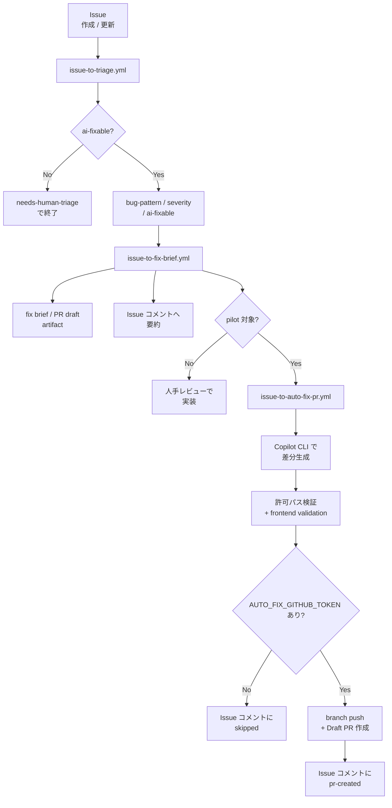
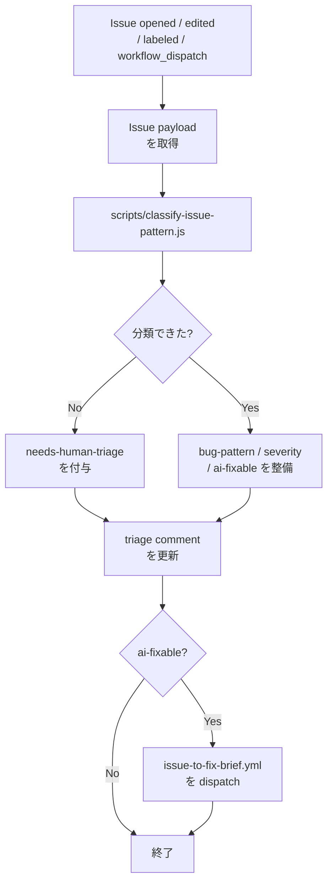
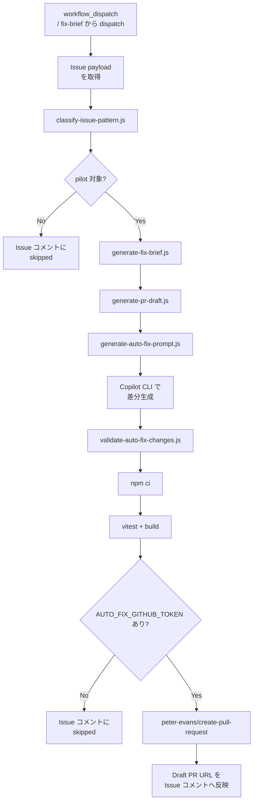
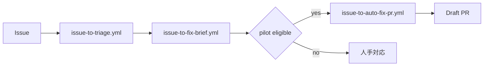

# AI修正提案ワークフローガイド

## 概要

このガイドでは、エラー解析 Issue を起点に **不具合の分類 → fix brief 生成 → AI による最小差分作成 → 検証 → Draft PR 作成** まで進めるフローを説明します。

現在の実装は **pilot 版の自動 PR 作成まで動作確認済み** です。特に `frontend-ui-text` × `low|medium` の組み合わせでは、Issue #35 を使った実運用で Draft PR 作成まで成功しています。

## 現在のスコープ

### 自動化される範囲

- Issue の分類（triage）
- fix brief / PR draft 生成
- Copilot CLI による最小差分作成
- changed files の許可パス検証
- frontend validation の実行
- Draft PR の作成

### pilot 対象

- bug pattern: `frontend-ui-text`
- severity: `low`, `medium`

### 自動 PR 作成に必要な secret

- `COPILOT_GITHUB_TOKEN`
  - Copilot CLI 実行用
- `AUTO_FIX_GITHUB_TOKEN`
  - branch push / Draft PR 作成用

## このフローで使う主なファイル

### Workflows

- `.github/workflows/issue-to-triage.yml`
  - Issue を分類し、`bug-pattern:*` / `severity:*` / `ai-fixable` / `needs-human-triage` を更新
- `.github/workflows/issue-to-fix-brief.yml`
  - fix brief と PR draft の artifact を生成し、Issue コメントに要約を残す
- `.github/workflows/issue-to-auto-fix-pr.yml`
  - pilot 対象 Issue に対して AI 修正 → 検証 → Draft PR 作成を行う

### Scripts

- `scripts/classify-issue-pattern.js`
- `scripts/generate-fix-brief.js`
- `scripts/generate-pr-draft.js`
- `scripts/generate-auto-fix-prompt.js`
- `scripts/validate-auto-fix-changes.js`

### Templates

- `qa/test-management/templates/fix-brief-*.md`

## 対応している不具合パターン

- `frontend-ui-text`
- `frontend-unit-test`
- `backend`
- `ci-config`
- `e2e-environment`
- `docs-manual`

## 全体像

### workflow 全体のつながり



### 各 workflow の責務

| Workflow | 主な責務 | 出力 |
|---|---|---|
| `issue-to-triage.yml` | Issue の分類と managed label 更新 | labels, triage comment |
| `issue-to-fix-brief.yml` | fix brief / PR draft 生成と pilot 判定 | artifacts, fix-brief comment |
| `issue-to-auto-fix-pr.yml` | AI 修正、検証、Draft PR 作成 | branch, draft PR, auto-fix comment |

## Mermaid フロー

### 1. `issue-to-triage.yml`



### 2. `issue-to-fix-brief.yml`

```mermaid
flowchart TD
  A[workflow_dispatch<br/>/ triage から dispatch] --> B[Issue payload と<br/>triage を取得]
    B --> C[generate-fix-brief.js]
    C --> D[fix-brief-issue-<n>.json / .md]
    D --> E[generate-pr-draft.js]
    E --> F[pr-draft-issue-<n>.json / .md]
  F --> G[artifact を<br/>upload]
  F --> H[Issue コメントへ<br/>要約]
    H --> I{frontend-ui-text かつ low|medium?}
    I -->|No| J[終了]
  I -->|Yes| K[issue-to-auto-fix-pr.yml<br/>を dispatch]
    K --> J
```

### 3. `issue-to-auto-fix-pr.yml`



### 4. workflow 間の接続だけを見たい図



## 成功パターン: Issue #35

Issue #35 では、ログイン画面の表示文言が `こんばんわー` に変わっていたのに、E2E テストが `こんばんは` のままだったため失敗していました。

### 実運用で確認できたこと

- triage が `frontend-ui-text` / `severity: medium` / `ai-fixable: true` を判定
- fix brief が候補ファイルと allowed paths を生成
- auto-fix workflow が Copilot CLI で最小差分を生成
- changed files 検証と frontend validation を通過
- `AUTO_FIX_GITHUB_TOKEN` 登録後、Draft PR 作成まで成功

### 実際の成果物

- 対応 Issue: `#35`
- 作成された Draft PR: `#41`
- 変更ファイル: `frontend/tests/e2e/login.spec.ts`
- 変更内容: `こんばんは` → `こんばんわー`

### 成功パターンの要点

- source of truth が UI 実装側にある場合はテスト期待値を最小変更で追随
- AI の変更対象を `allowedPaths` で制限する
- PR 作成用 token を Copilot 実行用 token と分離する

## 運用手順

### 自動チェーンで動かす場合

1. エラー解析 Issue を作成する
2. `issue-to-triage.yml` が分類する
3. `issue-to-fix-brief.yml` が fix brief / PR draft を作る
4. pilot 対象なら `issue-to-auto-fix-pr.yml` が起動する
5. Draft PR をレビューする

### 手動で再実行する場合

#### triage

1. GitHub の **Actions** タブを開く
2. **Issue Triage for AI Fix Flow** を選択
3. **Run workflow** をクリック
4. `issue_number` に対象番号を入力して実行

#### fix brief

1. GitHub の **Actions** タブを開く
2. **Issue to Fix Brief** を選択
3. **Run workflow** をクリック
4. `issue_number` に対象番号を入力して実行

#### auto-fix PR

1. GitHub の **Actions** タブを開く
2. **Issue to Auto Fix PR (Pilot)** を選択
3. **Run workflow** をクリック
4. branch を選ぶ
5. `issue_number` に対象番号を入力して実行

## パターン別の見る場所

### `frontend-ui-text`

- 実装: `frontend/src/components/**`
- E2E: `frontend/tests/e2e/**`
- unit: `frontend/src/test/**`

### `frontend-unit-test`

- 実装: `frontend/src/**`
- unit: `frontend/src/test/**`

### `backend`

- 実装: `backend/src/main/**`
- テスト: `backend/src/test/**`

### `ci-config`

- `.github/workflows/**`
- `infra/**`
- Dockerfile 群

### `e2e-environment`

- `infra/**`
- `.github/workflows/e2e.yml`
- `frontend/tests/e2e/**`

### `docs-manual`

- `wiki/**`
- `wiki/manual/**`
- `README.md`

## 運用ルール

- triage / fix brief / auto-fix は **追加型** の workflow として扱い、既存 workflow の責務を変えない
- `e2e-failure-analysis.yml`、`e2e.yml`、`pr-quality.yml` の trigger / 役割は維持する
- fix brief は **artifact を正本**、Issue コメントは要約とする
- `high` / `critical` は自動実装の対象外とし、人手レビュー前提にする
- `AUTO_FIX_GITHUB_TOKEN` が未設定なら PR 作成は skip し、Issue コメントで理由を残す
- 分類に迷う Issue は `needs-human-triage` に退避する

## トラブルシューティング

### triage が `needs-human-triage` になった

原因候補:

- Issue 本文に手掛かりが少ない
- 複数パターンが混在している
- Form の任意項目が未設定

対処:

- Issue 本文に対象ファイル、失敗ログ、再現手順を追記
- `bug-pattern` / `severity` を Form で補完
- triage workflow を再実行

### fix brief が期待より抽象的

原因候補:

- Issue 本文に対象ファイルやログが不足している
- テンプレートが generic fallback に落ちている

対処:

- Issue 本文へ実ファイルパスを明記
- パターン別テンプレートの表現を改善
- `scripts/generate-fix-brief.js` の抽出ロジックを強化

### auto-fix が PR 作成前に止まる

原因候補:

- `AUTO_FIX_GITHUB_TOKEN` が未設定
- token 権限に `Contents: Read and write` / `Pull requests: Read and write` が不足

対処:

- repository secret `AUTO_FIX_GITHUB_TOKEN` を登録
- fine-grained PAT または GitHub App token の権限を見直す
- `Issue to Auto Fix PR (Pilot)` を再実行する

### ローカルでスクリプト実行できない

このリポジトリの GitHub Actions では Node.js を workflow 側でセットアップしています。
ローカルで試す場合は Node.js をインストールしてください。

## 今後の拡張候補

- `frontend-unit-test` など pilot 対象パターンの拡大
- backend 系の safe path 制限追加
- PR へのテスト結果要約の自動転記
- README / wiki / dashboard への traceability 連携強化

## 関連ドキュメント

- [21. E2E失敗解析ワークフローガイド](./21-E2E失敗解析ワークフローガイド.md)
- [22. AI修正運用フローガイド](./22-AI修正運用フローガイド.md)
