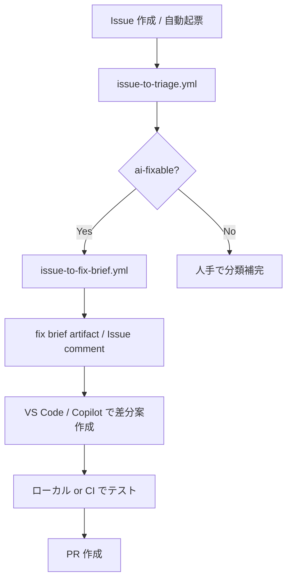

# AI修正提案ワークフローガイド

## 概要

このガイドでは、エラー解析 Issue を起点に **不具合の分類 → fix brief 生成 → VS Code / Copilot で差分案作成 → テスト → PR 作成** まで進める手順を説明します。

初版の方針は **提案中心** です。GitHub Actions は構造化された入力（triage / fix brief）を作成し、実際のコード変更・commit・push・PR 作成は人手で確認しながら行います。

## このフローで追加されたもの

### Workflow

- `.github/workflows/issue-to-triage.yml`
  - Issue を分類し、`bug-pattern:*` / `severity:*` / `ai-fixable` などのラベルを付与
- `.github/workflows/issue-to-fix-brief.yml`
  - Issue から fix brief を生成し、artifact と Issue コメントへ反映

### Scripts

- `scripts/classify-issue-pattern.js`
  - 不具合パターンをルールベースで分類
- `scripts/generate-fix-brief.js`
  - fix brief JSON / Markdown を生成

### Templates

- `qa/test-management/templates/fix-brief-*.md`
  - パターン別の fix brief テンプレート

## 対応している不具合パターン

- `frontend-ui-text`
- `frontend-unit-test`
- `backend`
- `ci-config`
- `e2e-environment`
- `docs-manual`

## 全体フロー



## Pilot: Issue #35 で試す手順

Issue #35 は `frontend-ui-text` の代表例です。ログイン画面の表示文言変更に対し、E2E テストの期待値が古いまま残っているケースを想定しています。

### 1. triage を実行する

#### 方法 A: 自動実行

- Issue が新規作成・編集・ラベル変更されたとき、`issue-to-triage.yml` が起動します。

#### 方法 B: 手動実行

1. GitHub の **Actions** タブを開く
2. **Issue Triage for AI Fix Flow** を選択
3. **Run workflow** をクリック
4. `issue_number` に `35` を入力して実行

### 2. triage 結果を確認する

Issue #35 に次のような情報が付く想定です。

- `bug-pattern:frontend-ui-text`
- `severity:medium`
- `ai-fixable`

また、Issue コメントに次の形式の要約が追加されます。

- bug pattern
- severity
- ai_fixable
- 次に実行すべき workflow

### 3. fix brief を生成する

#### 方法 A: ラベル起動

- triage によって `ai-fixable` が付いた時点で、`issue-to-fix-brief.yml` が起動します。

#### 方法 B: 手動実行

1. GitHub の **Actions** タブを開く
2. **Issue to Fix Brief** を選択
3. **Run workflow** をクリック
4. `issue_number` に `35` を入力して実行

### 4. fix brief を取得する

生成後、Actions の artifact から `fix-brief-issue-35` を取得します。

含まれるファイル:

- `fix-brief-issue-35.json`
- `fix-brief-issue-35.md`
- `pr-draft-issue-35.json`
- `pr-draft-issue-35.md`

Issue コメントにも冒頭プレビューが表示されますが、**完全版は artifact を正本** とします。

### 5. VS Code / Copilot に渡す

`fix-brief-issue-35.md` を開き、内容をそのまま Copilot Chat に渡します。

推奨の依頼例:

```text
この fix brief に従って最小変更の差分案を作成してください。
対象ファイル以外は原則変更しないでください。
必要ならテスト更新も含めてください。
```

### 6. 差分候補をレビューする

Issue #35 の場合、主な候補は次のはずです。

- `frontend/tests/e2e/login.spec.ts`
- `frontend/src/components/LoginPage.vue`

通常は、`LoginPage.vue` の実装文言が source of truth なら、E2E テスト側の期待値を追随修正します。

### 7. テストを実行する

#### 最低限

- 対象 E2E の再実行

#### 推奨

- `frontend` の unit test
- 必要に応じて `pr-quality.yml` 相当の確認

### 8. PR を作成する

`pr-draft-issue-35.md` をベースに PR 本文を作成します。PR 作成時は `.github/pull_request_template.md` に従い、少なくとも以下を満たします。

- `Closes #35`
- 変更概要
- Test Design 入力
- 変更確認チェック

## パターン別の見る場所

### frontend-ui-text

- 実装: `frontend/src/components/**`
- E2E: `frontend/tests/e2e/**`
- unit: `frontend/test/**`

### frontend-unit-test

- 実装: `frontend/src/**`
- unit: `frontend/test/**`

### backend

- 実装: `backend/src/main/**`
- テスト: `backend/src/test/**`

### ci-config

- `.github/workflows/**`
- `infra/**`
- Dockerfile 群

### e2e-environment

- `infra/**`
- `.github/workflows/e2e.yml`
- `frontend/tests/e2e/**`

### docs-manual

- `wiki/**`
- `wiki/manual/**`
- `README.md`

## 運用ルール

- triage は **追加型** の workflow として扱い、既存 workflow の責務を変えない
- `e2e-failure-analysis.yml`、`e2e.yml`、`pr-quality.yml` の trigger / 役割は維持する
- fix brief は **artifact を正本** とし、Issue コメントは要約のみとする
- `high` / `critical` は自動で実装せず、人手レビューを前提にする
- 分類に迷う Issue は `needs-human-triage` に退避する

## トラブルシューティング

### triage が `needs-human-triage` になった

原因候補:

- Issue 本文に手掛かりが少ない
- 複数パターンが混在している
- Form の任意項目が未設定

対処:

- Issue 本文に対象ファイル、失敗ログ、再現手順を追記
- `bug-pattern` / `severity` を Form で補完
- 再度 triage workflow を手動実行

### fix brief が期待より抽象的

原因候補:

- Issue 本文に対象ファイルやログが不足している
- テンプレートが generic fallback に落ちている

対処:

- Issue 本文へ実ファイルパスを明記
- パターン別テンプレートの表現を改善
- 必要なら `scripts/generate-fix-brief.js` の抽出ロジックを強化

### ローカルでスクリプト実行できない

このリポジトリの GitHub Actions では Node.js を workflow 側でセットアップしています。
ローカルで試す場合は Node.js をインストールしてください。

## 今後の拡張候補

- `auto-fix-and-pr.yml` の追加
- `bug-pattern` ごとの変更可能パス制限
- PR draft の自動生成強化
- README / wiki への traceability 連携
