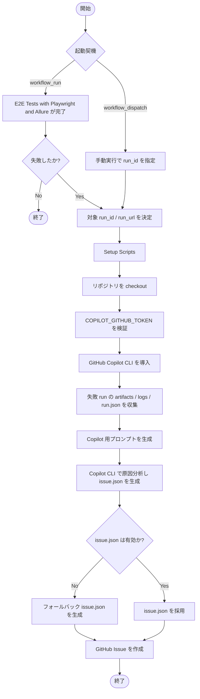

# E2E失敗解析ワークフローガイド

## 概要

このガイドでは、`.github/workflows/e2e-failure-analysis.yml` の処理内容を、**Mermaidフロー**とあわせて整理します。

このWorkflowは、E2E実行が失敗したときに **失敗ログ・artifact・run情報を収集し、GitHub Copilot CLIで原因分析したうえで GitHub Issue を自動起票する** ためのものです。

## 対象ファイル

- Workflow: `.github/workflows/e2e-failure-analysis.yml`
- 連携元Workflow: `E2E Tests with Playwright and Allure`

## 何をしているフローか

このWorkflowの役割は、ざっくり言うと次のとおりです。

1. E2Eの失敗を検知する
2. 対象runのログとartifactを集める
3. GitHub Copilot CLIに調査させる
4. 調査結果をIssue本文に整形する
5. 必要ならフォールバック本文を作る
6. GitHub Issueとして起票する

## 起動条件

### 自動起動

`workflow_run` により、`E2E Tests with Playwright and Allure` が完了したときに評価されます。

ただし、実際にジョブ `analyze-e2e-failure` が走るのは **完了結果が `failure` のときだけ** です。

### 手動起動

`workflow_dispatch` により手動実行もできます。

- 入力: `run_id`
- 条件: `run_id` が空でないこと

つまり、過去の失敗runをあとから調査したい場合も使えます。地味に便利です。

## 全体フロー

## ステップ詳細

### 1. 対象runを決定する

環境変数として次を組み立てています。

- `TARGET_RUN_ID`
- `TARGET_RUN_URL`

`workflow_run` の場合はイベントペイロードから取得し、`workflow_dispatch` の場合は入力された `run_id` からURLを構築します。

### 2. 実行環境を準備する

次の準備を行います。

- `gh-aw` の補助スクリプトをセットアップ
- リポジトリを checkout
- `COPILOT_GITHUB_TOKEN` の存在を検証
- GitHub Copilot CLI をインストール

この段階で、Copilot CLIが動くための最低限の足場を作っています。

### 3. 失敗runの証拠を収集する

`/tmp/e2e-analysis` 配下に作業ディレクトリを作り、次の情報を集めます。

- artifact 一式
- `run-summary.txt`
- `failed-steps.log`（取得できなければ `full.log`）
- `run.json`

収集対象は次の3系統です。

- `/tmp/e2e-analysis/artifacts`
- `/tmp/e2e-analysis/logs`
- `/tmp/e2e-analysis/output`

この証拠一式が、あとでCopilotに渡される入力になります。

### 4. Copilot向けプロンプトを生成する

`/tmp/e2e-analysis/output/prompt.txt` に、Copilotへ渡す調査依頼文を生成します。

プロンプトでは主に次を要求しています。

- 失敗原因を「確度の高い原因」と「仮説」に分けて整理する
- `/tmp/e2e-analysis/output/issue.json` をJSONで出力する
- `title` と `body` を含むIssue payload形式に従う
- 本文に所定の見出しを含める
- 最後に `Workflow Run: <URL>` を必ず入れる

### 5. Copilot CLIで原因分析する

Copilot CLI 実行時には、次のディレクトリを解析対象に含めています。

- `${GITHUB_WORKSPACE}`
- `/tmp/e2e-analysis`

これにより、**リポジトリの実装**と**失敗時の証拠**を合わせて見ながら、Issue本文の元になる `issue.json` を作らせています。

### 6. issue.json を検証し、必要ならフォールバックする

Copilotが期待どおりに `issue.json` を作れないケースに備え、フォールバック処理があります。

### フォールバック条件

- `issue.json` が存在しない
- JSONとして壊れている
- `title` または `body` が欠けている

### フォールバック時の挙動

最低限の内容を持つIssue payloadをPythonで生成します。

これにより、Copilot分析が不完全でも **Issue起票自体は止めない** 設計になっています。

### 7. GitHub Issue を作成する

最後に `actions/github-script@v7` で `issue.json` を読み込み、Issueを作成します。

Issue本文の先頭には次のマーカーが付与されます。

- `<!-- automated-e2e-failure-analysis -->`

このマーカーにより、あとから「このIssueは自動生成された失敗解析Issueだ」と識別しやすくなります。

## 入出力の整理

### 入力

- `workflow_run` イベント情報
- `workflow_dispatch.inputs.run_id`
- 対象runのログ
- 対象runのartifact
- `COPILOT_GITHUB_TOKEN`
- `GITHUB_TOKEN`

### 中間生成物

- `/tmp/e2e-analysis/logs/run-summary.txt`
- `/tmp/e2e-analysis/logs/failed-steps.log`
- `/tmp/e2e-analysis/logs/full.log`
- `/tmp/e2e-analysis/logs/run.json`
- `/tmp/e2e-analysis/output/prompt.txt`
- `/tmp/e2e-analysis/output/issue.json`

### 出力

- GitHub Issue 1件

## 権限

Workflowで宣言されている権限は以下です。

- `actions: read`
- `contents: read`
- `issues: write`

役割としてはシンプルで、**失敗runを読む**、**リポジトリ内容を読む**、**Issueを作る** の3点に絞られています。

## 運用上のポイント

### 失敗時のみ自動で走る

`workflow_run` は完了イベントで起動されますが、ジョブ条件で `conclusion == 'failure'` を見ています。

そのため、成功runではIssueは起票されません。

### 手動再調査ができる

`workflow_dispatch` で `run_id` を渡せば、過去runも再解析できます。

- 一度Issue化できなかったrunの再調査
- ログが揃った後の再評価
- 運用確認のための手動検証

といった用途に向いています。

### フォールバック設計が入っている

Copilotが毎回完璧とは限らないので、最後に安全網が入っています。

このため、

- 調査の品質はCopilotに委ねる
- 起票の可用性はWorkflow側で担保する

という責務分担になっています。

## こんなときに見るとよいポイント

### Issueは作られたが内容が薄い

確認ポイント:

- `failed-steps.log` に十分な情報があるか
- artifact が正常に取得できているか
- `prompt.txt` に必要な前提が入っているか

### Issueがフォールバック本文になっている

確認ポイント:

- `issue.json` が生成されているか
- JSONが壊れていないか
- Copilot CLI の実行結果にエラーがないか

### 自動起動しない

確認ポイント:

- 親Workflow名が `E2E Tests with Playwright and Allure` と一致しているか
- 対象runの結論が `failure` か
- 手動実行時に `run_id` が空でないか

## まとめ

`.github/workflows/e2e-failure-analysis.yml` は、E2E失敗時の一次解析を自動化するWorkflowです。

Mermaidで表すと、**失敗検知 → 証拠収集 → Copilot分析 → フォールバック補完 → Issue起票** という一直線の流れになっています。

運用面では、**自動起動**と**手動再調査**の両方を備えつつ、Copilotの結果が不完全でも起票を継続できるのがポイントです。
