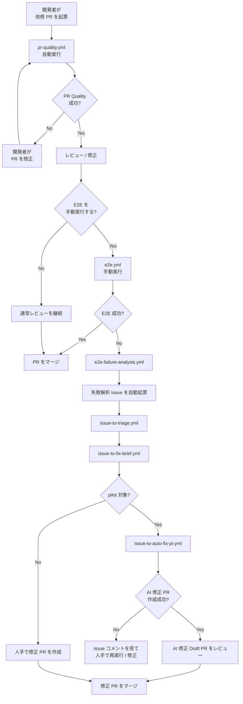
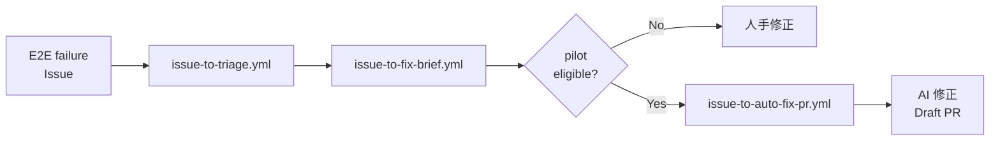
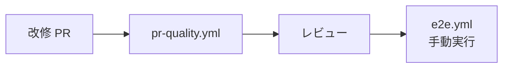
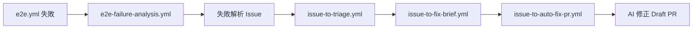

# AI修正運用フローガイド

## 概要

このガイドでは、**開発者がアプリの改修 PR を起票するところ**を起点に、既存の CI / E2E / 失敗解析 / AI 修正 PR 作成フローがどうつながるかを整理します。

ポイントは次の 3 つです。

- 改修 PR 自体には `PR Quality Checks` が自動で走る
- E2E は現状 `workflow_dispatch` による手動実行
- E2E 失敗時は失敗解析 Issue を起点に、triage → fix brief → auto-fix PR までつながる

## 運用フロー全体

## 運用フローの見方

### 1. 開発者の改修 PR

起点は通常のアプリ改修 PR です。

- trigger: `pull_request`
- workflow: `.github/workflows/pr-quality.yml`
- 自動実行される主な内容:
  - frontend unit test
  - backend unit test
  - SonarQube（設定時のみ）

### 2. E2E は手動実行

E2E workflow は現状、**自動実行ではなく手動実行** です。

- workflow: `.github/workflows/e2e.yml`
- trigger: `workflow_dispatch`

そのため、改修 PR の確認時に必要なら Actions から手動で E2E を流します。

### 3. E2E が失敗したら Issue が自動起票される

E2E が失敗すると、`.github/workflows/e2e-failure-analysis.yml` が失敗 run を解析し、GitHub Issue を自動起票します。

この Issue は AI 修正フローの入口になります。

## AI修正チェーン

## workflow ごとの接続

### 改修 PR 側の流れ

### E2E 失敗後の流れ

## 代表的な運用パターン

### パターン A: 改修 PR がそのまま通る

1. 開発者が改修 PR を起票
2. `pr-quality.yml` が成功
3. 必要なら `e2e.yml` を手動実行
4. 問題なければその PR をレビューしてマージ

### パターン B: E2E 失敗から AI 修正 PR へつなぐ

1. 開発者が改修 PR を起票
2. `pr-quality.yml` は通る
3. `e2e.yml` を手動実行すると失敗
4. `e2e-failure-analysis.yml` が失敗解析 Issue を自動起票
5. `issue-to-triage.yml` が分類
6. `issue-to-fix-brief.yml` が fix brief / PR draft を生成
7. pilot 対象なら `issue-to-auto-fix-pr.yml` が Draft PR を作成
8. 作成された AI 修正 PR をレビューしてマージ

## 現在の pilot 条件

- bug pattern: `frontend-ui-text`
- severity: `low`, `medium`
- PR 作成には `AUTO_FIX_GITHUB_TOKEN` が必要

## 実績

Issue #35 のケースでは、上記フローに沿って **Draft PR #41** の作成まで成功しました。

- 元の問題: UI 表示文言と E2E 期待値の不一致
- 自動起票された解析 Issue を起点に triage / fix brief / auto-fix を実施
- 最終的に `frontend/tests/e2e/login.spec.ts` の最小差分で Draft PR を作成

## 関連ドキュメント

- [20. AI修正提案ワークフローガイド](./20-AI修正提案ワークフローガイド.md)
- [21. E2E失敗解析ワークフローガイド](./21-E2E失敗解析ワークフローガイド.md)
- [15. Issue 自動生成ガイド](./15-Issue自動生成ガイド.md)
