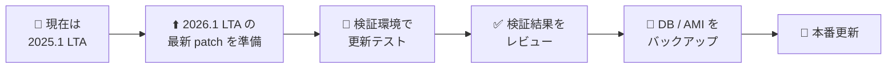
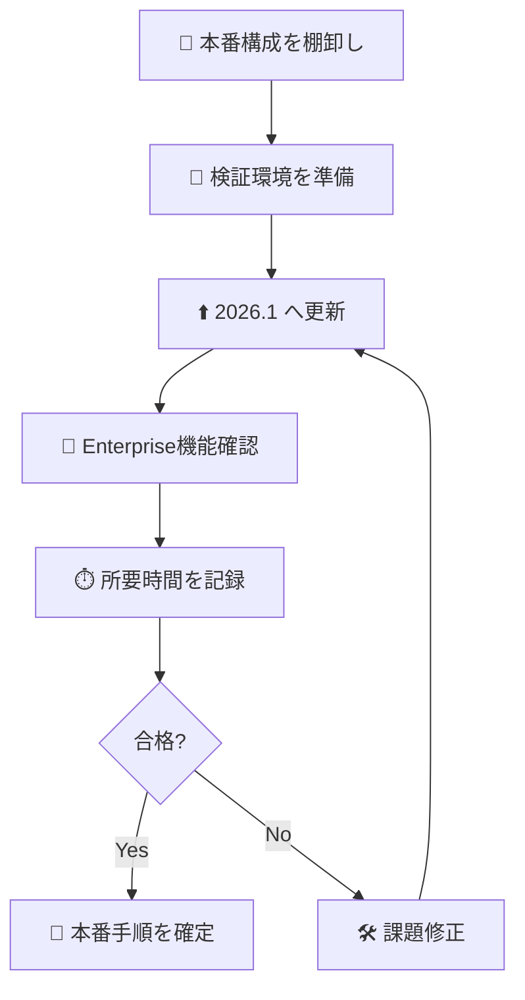
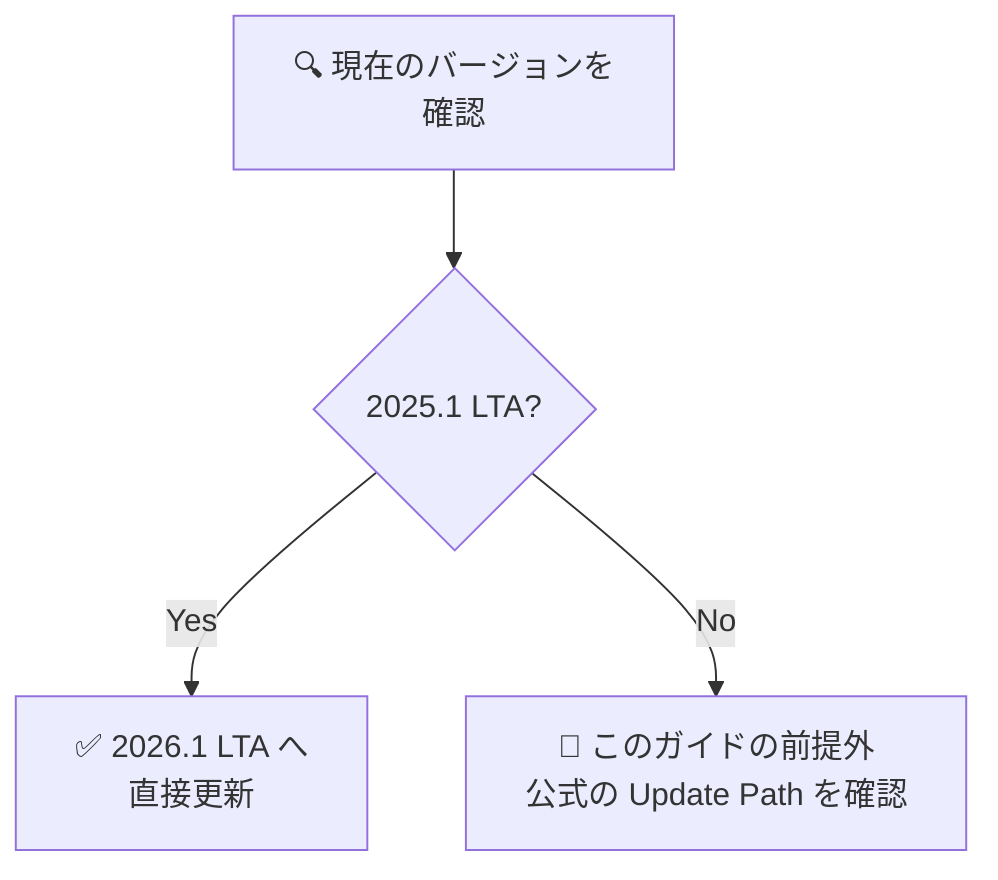
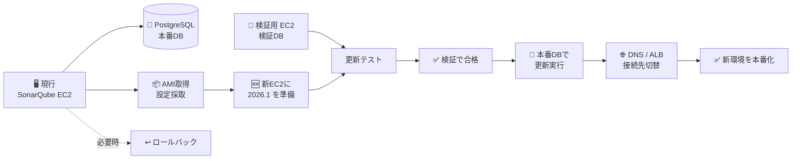
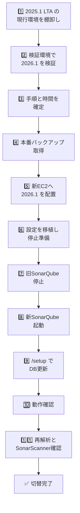
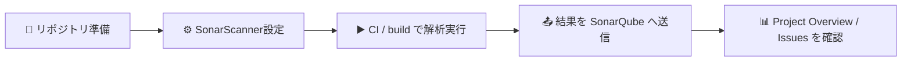

# 🔄 SonarQube Server 2026.1 LTA アップグレードガイド

> 対象: **AWS 上の AMI ベースの SonarQube Server Enterprise Edition** と **PostgreSQL** を利用している環境  
> 目的: **初心者でも迷わず、安全に SonarQube Server を 2026.1 LTA へ更新できるようにすること**

> 📌 **このガイドは、現状バージョンが `2025.1 LTA` である前提で更新済みです**

---

## はじめに 🎯

このガイドは、SonarSource の公式情報をもとに、**SonarQube Server のアップグレード手順**を日本語でわかりやすく整理したものです。

特に今回は、次の前提に合わせています。

- 🧭 **現在の SonarQube Server は `2025.1 LTA`**
- 🏢 **Edition は Enterprise Edition**
- 🧱 **Data Center Edition ではなく、単一サーバー前提の Enterprise Edition**
- ☁️ SonarQube Server は **AWS 上の EC2 / AMI ベース**で動いている
- 🐘 データベースは **PostgreSQL** を使っている
- 🧪 **まず検証環境で検証し、本番更新はその後に行う**
- 🧰 **ロールバック可能な形で更新したい**
- 🙋 SonarQube の更新にまだ慣れていない人でも理解できるようにしたい

この資料では、**SonarSource 公式ドキュメントに明記されている事実**を中心に記載し、  
**AWS / AMI / 検証環境運用に関する補足**は「運用補足」と明示して区別します。

---

## この資料の記載ルール 📘

| 区分 | 意味 |
| --- | --- |
| ✅ 公式事実 | SonarSource 公式ドキュメントに記載がある内容 |
| 📝 運用補足 | 公式手順を、この環境（AWS EC2 / AMI / PostgreSQL）へ当てはめるための補足 |

> 📌 以降、**公式に書かれていること**と、**この環境で実施しやすくするための補足**を分けて書きます。

---

## まず確定している事実 ✅

### 今回の前提で公式に確認できること

| 項目 | 内容 |
| --- | --- |
| 更新経路 | `2025.1 LTA` から `2026.1 LTA` へ **直接更新可能** |
| 更新前確認 | 公式は **Update notes / Pre-update steps / Scanner compatibility / Testing the update** の確認を求めている |
| DB バックアップ | 公式は **DB バックアップを強く推奨**している |
| 検証環境 | 公式は **staging environment を作って更新をテストすることを推奨**している |
| ZIP 更新 | 公式は **新しいディレクトリへ展開し、設定を必要箇所だけ反映して更新**する手順を示している |
| 更新後 | 公式は **SonarScanner 確認・サービス設定の向き先更新・再解析** を案内している |

### 今回の重要ポイントだけ先に把握 👀

| 項目 | 2026.1 で特に重要な点 |
| --- | --- |
| 🧭 更新経路 | **今回は `2025.1 LTA → 2026.1 LTA` を直接更新**すればよい |
| ☕ Java | **SonarQube Server 実行には JDK が必要**。**Java 21 以上**が必要。**Java 17 は不可** |
| 🐘 PostgreSQL | **PostgreSQL 14〜18 サポート**。**PostgreSQL 13 は非対応** |
| 📁 Elasticsearch | 2026.1 は **Elasticsearch 8.x** を含み、**`/tmp` への読み書き権限が必要** |
| 🧩 プラグイン | 旧プラグインの丸ごとコピーは非推奨。**互換バージョンを個別確認** |
| 🏢 Enterprise | Portfolio / Application / Security reports / Jira / Slack などの**主要機能も検証環境で確認**する |
| 🧪 更新後 | **`/setup` で DB マイグレーション** → **再解析** → **SonarScanner 更新確認** |

### この資料で採る作業順 🛣️



---

## Enterprise Edition 前提で見るポイント 🏢

今回は **Enterprise Edition** 前提なので、単に SonarQube が起動するかだけでは不十分です。  
**Enterprise 固有または Enterprise でよく使われる機能が更新後も問題なく使えるか**を、検証環境で先に確認しておくのが大切です。

### 検証環境で確認したい Enterprise 観点

| 観点 | 確認内容 |
| --- | --- |
| 📊 Portfolio / Application | 集約ビューが開けるか、集計が壊れていないか |
| 🔐 Security Reports | Enterprise で使っているセキュリティレポートが正常か |
| 🔗 DevOps連携 | GitHub / GitLab / Azure DevOps / Jira / Slack などの連携が維持されるか |
| 👥 権限 | グループ / Permission Template / SSO まわりが崩れていないか |
| 🧪 Quality Gate運用 | Sandbox 有効時の品質ゲート挙動が検証時の想定と一致するか |

> 💡 **Enterprise Edition は「起動確認」だけでは不十分**です。  
> 利用部門が多いほど、**代表操作を1つずつ検証環境でなぞる**のが安全です。

---

## まずは検証環境で検証する流れ 🧪

本番は後回しにして、まず検証環境で **手順・時間・互換性** を確定させます。

### 検証フロー



### 検証環境での確認基準

| 分類 | 確認基準 |
| --- | --- |
| 起動 | `/setup` 完了後に正常ログインできる |
| 解析 | 代表プロジェクトの解析が正常に完了する |
| Enterprise機能 | Portfolio / Security / 権限 / DevOps連携の代表操作が通る |
| 性能 | 更新時間・再解析時間が本番メンテ枠に収まりそう |
| ロールバック | どこで戻すか判断基準が明確 |

---

## `2025.1 LTA` から `2026.1 LTA` へ直接更新する詳細手順 ✅

> ✅ **このセクションは SonarSource 公式の**
> - Update roadmap
> - Pre-update steps
> - Performing the update
> - Post-update steps
> - LTA to LTA release notes
>
> を順番にまとめ直したものです。  
> 前提は **ZIP 配置 / Enterprise Edition / 単一サーバー / PostgreSQL** です。

### 手順 0: 更新経路を確定する

1. 現在の SonarQube Server が **`2025.1 LTA`** であることを確認する
2. 更新先を **`2026.1 LTA` の最新 patch** にする
3. `2025.1 LTA -> 2026.1 LTA` が **直接更新可能**であることを確認する

### 手順 1: 更新ノートを読む

公式の pre-update steps では、**現在バージョンと目標バージョンの間にある update notes を先に読む**よう案内されています。

この更新で最低限確認する内容:

- SonarQube Server runtime は **JDK が必要**
- **Java 21 以上**が必要
- **Java 17 はサーバー実行用として非対応**
- **PostgreSQL 14〜18** がサポート対象
- **PostgreSQL 13 は非対応**
- **Elasticsearch 8.x** のため `/tmp` 読み書きが必要
- Sandbox を使うなら、**初回解析前に設定**する

### 手順 2: ホスト要件と SonarScanner 互換性を確認する

更新前に次を確認します。

| 確認項目 | 何を確認するか |
| --- | --- |
| Java | サーバー実行環境が **JDK 21 または 25** |
| PostgreSQL | **14〜18** のいずれか |
| `/tmp` | SonarQube 実行ユーザーで読み書きできる |
| SonarScanner | 2026.1 に対応した SonarScanner を使用できる |
| プラグイン | 2026.1 互換版がある |

### 手順 3: データベースをバックアップする

公式では、**DB バックアップを強く推奨**しています。  
また、このバックアップは **検証環境でのテストにも使う**前提です。

確認ポイント:

| 項目 | 内容 |
| --- | --- |
| DB バックアップ | 取得済みであること |
| バックアップ時刻 | 記録しておく |
| DB 容量 | 更新中に一時的に **最大 2 倍程度** へ増える可能性がある |

### 手順 4: 検証環境で同じ更新を試す

公式の testing the update では、次の順序が示されています。

1. 本番 DB の最近のバックアップを使って **staging environment** を作る
2. その検証環境で更新を実施する
3. バックアップ / 復元 / 更新 / 動作確認にかかる時間を観測する

### 手順 5: PostgreSQL の事前メンテナンスを行う

公式の pre-update steps では、PostgreSQL に対して以下を示しています。

```sql
VACUUM FULL;
REINDEX DATABASE <db_name>;
ANALYZE;
```

> ✅ 公式事実: これらは **大規模インスタンスで役立つことがある** とされています。  
> ✅ 公式事実: これらのコマンドは **テーブルをロックする** ため、ダウンタイム枠で行います。

### 手順 6: 2026.1 Enterprise Edition を新しいディレクトリへ展開する

公式の ZIP 更新手順では、次を行います。

1. 対象 Edition の SonarQube Server distribution をダウンロードする
2. **新しいディレクトリ**へ unzip する  
    例: `<newSonarqubeHome>`

### 手順 7: プラグインを互換版で入れ直す

公式の ZIP 更新手順では、プラグインがある場合は次を行います。

1. **Plugin version matrix** で 2026.1 互換版を確認する
2. 互換プラグインを手動で配置する
3. 同じプラグインの旧 version があれば削除する

> ✅ 公式事実: **旧プラグインをそのままコピーすることは推奨されていません**。  
> 理由は、**非互換や重複で起動エラーになる可能性がある**ためです。

### 手順 8: `sonar.properties` を新ディレクトリへ反映する

公式の ZIP 更新手順では、**旧ファイルを丸ごとコピーせず**、  
`<oldSonarqubeHome>/conf` の設定内容を **`<newSonarqubeHome>/conf/sonar.properties` へ必要箇所だけ反映**します。

反映対象の例:

- Web server URL
- Database 接続設定
- LDAP / 認証設定
- 既存運用で必要な system properties

### 手順 9: 旧 SonarQube Server を停止する

公式手順では、設定反映後に **旧 SonarQube Server を停止**します。

### 手順 10: 新 SonarQube Server を起動する

公式手順では、旧サーバー停止後に **新しいディレクトリの SonarQube Server を起動**します。

### 手順 11: `/setup` で DB マイグレーションを完了する

公式手順では、次を行います。

1. `http://yourSonarQubeServerURL/setup` を開く
2. 画面の指示に従って `/setup` を完了する

この時に確認するもの:

- `web.log`
- `ce.log`
- `es.log`
- Web UI 表示

### 手順 12: サービス設定の向き先を新ディレクトリへ更新する

公式の post-update steps では、**script やサービス設定が新しい installation directory を向くように更新**するよう案内されています。

Linux / systemd では、実装に応じて `sonarqube.service` を更新します。

### 手順 13: SonarScanner を確認する

公式の post-update steps では、**利用中の SonarScanner を最新の互換版へ確認**するよう案内されています。

対象例:

- SonarScanner for Maven
- SonarScanner for Gradle
- SonarScanner for .NET
- SonarScanner for NPM
- SonarScanner CLI

### 手順 14: PostgreSQL の後処理を行う

公式の post-update steps では、PostgreSQL に対して **vacuuming** を行い、必要に応じて **reindex** を検討するよう案内されています。

### 手順 15: プロジェクトを再解析する

公式の ZIP 更新手順では、最後に **Reanalyze your projects** が案内されています。

初心者向けに言い換えると、次を順に実施します。

1. 代表的なバックエンドプロジェクトを解析する
2. 代表的なフロントエンドプロジェクトを解析する
3. CI からの通常解析が通ることを確認する
4. Quality Gate と Issues が表示されることを確認する

---

## 2026.1 LTA の主な改善点 🚀

公式の「What’s new」によると、2026.1 LTA では次のような改善があります。

| 分類 | 主な内容 |
| --- | --- |
| 🤖 AI / Agentic SDLC | AI IDE 連携、MCP Server、AI CodeFix 関連の強化 |
| 🔐 セキュリティ | SAST / SCA / SBOM / 悪性パッケージ検出の拡充 |
| ⚡ 性能・品質 | Python / Java / JS/TS などの解析高速化 |
| 📏 コンプライアンス | OWASP MASVS、OWASP Top 10 for LLM、WCAG などの強化 |
| 🛠️ 運用性 | **Sandbox**、製品内アップデート情報、IPv6 対応など |

### 更新時に確認しておきたい改善点 🌈

- 🧯 **Sandbox** により、アップグレードで新しく見つかった既存コードの issue が、いきなり品質ゲートを壊しにくくなります
- ⚡ 公式の What’s new には、解析速度改善に関する記載があります
- 🔐 セキュリティ検出のカバレッジが広がります

---

## 更新経路を決める 🧭

今回の前提では、SonarSource 公式の LTA to LTA リリースノートに沿って、**`2025.1 LTA` から `2026.1 LTA` へ直接更新可能**です。

### 今回の結論

| 現在のバージョン | 進み方 |
| --- | --- |
| `2025.1 LTA` | ✅ **そのまま `2026.1 LTA` へ直接更新** |
| `2025.1 LTA` の古い patch | ✅ **`2026.1` の最新 patch へ直接更新** |

### 今回用の判断フロー



> 💡 今回は **現状バージョンが `2025.1 LTA` と確定している前提**なので、途中で別の LTA を挟む必要はありません。

---

## AWS AMI + PostgreSQL 構成での実施パターン（運用補足）☁️

> 📝 このセクションは **SonarSource 公式の必須手順ではなく**、  
> **AWS EC2 / AMI 環境で実施しやすくするための運用補足**です。

AMI ベースの構成なら、更新方法は大きく 2 パターンあります。

### 比較表

| 方法 | 概要 | メリット | デメリット |
| --- | --- | --- | --- |
| 🟢 **新 EC2 / 新 AMI 方式** | 新しい EC2 側に 2026.1 を用意して切替 | 旧環境を残しやすい | 手順が増える |
| 🟡 **既存 EC2 上のインプレース更新** | 同じサーバー上で新ディレクトリに入替 | 構成が単純 | 旧環境と混ざりやすい |

### この資料で採っている前提

この資料では、**検証環境を先に作りやすい**ことと、**本番切戻しを考えやすい**ことから、  
`新 EC2 / 新 AMI 方式` を例として説明しています。

### 全体像



---

## 更新前チェックリスト 📝

更新作業に入る前に、以下を確認してください。

### 今回の前提で最初に確定していること

| 項目 | 状態 |
| --- | --- |
| 現状バージョン | ✅ `2025.1 LTA` |
| 目標バージョン | ✅ `2026.1 LTA` |
| Edition | ✅ `Enterprise Edition` |
| 更新経路 | ✅ 直接更新 |
| 更新順序 | ✅ **検証環境 → 本番** |

ここから先は、**経路の検討**ではなく **更新準備の精度を上げる作業**になります。

### 1. 現状把握

| 確認項目 | 確認内容 |
| --- | --- |
| SonarQube バージョン | 何から何へ上げるのか |
| Edition | **Enterprise Edition** であること |
| Java | **JDK 21 以上**になっているか |
| PostgreSQL | **14〜18**かどうか |
| 配置方法 | ZIP 配置か、systemd 管理か、Docker か |
| カスタム設定 | `sonar.properties`、LDAP、Proxy、TLS、URL 設定 |
| プラグイン | 使っているプラグインとその互換性 |
| スキャナ | Maven / Gradle / CLI / NPM などのバージョン |
| Enterprise機能 | Portfolio / Application / Security / DevOps連携 / 権限 |

### 2. 2026.1 向けの重要要件確認

| 項目 | チェック内容 |
| --- | --- |
| ☕ Java | **JRE ではなく JDK が必要** |
| ☕ Java 版 | **Java 21 または 25** を使う |
| 🐘 PostgreSQL | **13 は非対応**。14〜18 を利用する |
| 📁 `/tmp` | Elasticsearch 8.x のため **読み書き可能**であること |
| 🧠 メモリ/ディスク | 更新中は DB 使用量が一時的に増える可能性あり |
| 🧩 プラグイン | 旧環境からの丸コピーではなく **互換バージョンを確認** |

### 3. 事前に必ずやること

- ✅ **検証環境で手順を最後まで通す**
- ✅ **検証で所要時間を記録する**
- ✅ **本番 DB のバックアップ**
- ✅ **EC2 / AMI のバックアップ**
- ✅ **検証環境で更新リハーサル**
- ✅ **メンテナンス時間の確保**
- ✅ **更新ノートの確認**
- ✅ **ロールバック手順の準備**

---

## PostgreSQL 側の事前準備 🐘

SonarSource 公式では、更新前の DB メンテナンスを推奨しています。特に大きめの環境では効果が出やすいです。

### 目的

- 🧹 テーブル肥大化の整理
- 📈 統計情報の更新
- ⚡ マイグレーションの効率改善

### 推奨 SQL

```sql
VACUUM FULL;
REINDEX DATABASE <db_name>;
ANALYZE;
```

> ⚠️ これらの処理は **テーブルロックが発生**するため、**ダウンタイム枠で実施**するのが基本です。

### DB 容量の注意

公式では、更新中にテーブルが一時的に複製されることがあり、**DB 使用量が一時的に通常の最大 2 倍程度**になる可能性があると案内されています。  
そのため、**DB 使用率は 50% 未満**を目安にしておくのが安心です。

---

## 推奨手順: 新 EC2 / 新 AMI 方式で更新する 🚦

このセクションは、上で記載した **公式の直接更新手順（手順 0〜15）** を、  
**AWS EC2 / AMI 構成に当てはめた実施イメージ**として整理したものです。

### 手順の流れ



### AWS 構成に当てはめた実施項目

| フロー | AWS / Linux で確認するもの | 参照する公式手順 |
| --- | --- | --- |
| 1️⃣ 現行環境の棚卸し | EC2 名、AMI、`sonar.properties`、systemd、DB 接続先、プラグイン一覧 | 手順 1〜3 |
| 2️⃣ 検証環境で更新 | 検証 EC2、検証 DB、`/setup`、再解析、Enterprise 機能確認 | 手順 4〜15 |
| 3️⃣ 本番バックアップ取得 | RDS snapshot / `pg_dump`、AMI、EBS snapshot | 手順 3 |
| 4️⃣ 新 EC2 へ 2026.1 配置 | 新ディレクトリ展開、JDK、`/tmp`、プラグイン配置 | 手順 6〜8 |
| 5️⃣ 本番切替 | 旧停止、新起動、`/setup`、サービス設定更新、再解析 | 手順 9〜15 |

### AWS 構成で追加で記録するもの

| 項目 | 例 |
| --- | --- |
| SonarQube Home | `/opt/sonarqube` |
| 新 Home | `/opt/sonarqube-2026.1` |
| サービス設定 | `systemctl status sonarqube` |
| DB 接続先 | PostgreSQL のホスト名 / DB名 / ユーザー |
| Reverse Proxy / 経路 | Nginx / ALB / Route53 |
| プラグイン配置先 | `extensions/plugins` |

---

## プラグインの確認・インストール・削除方法 🧩

SonarSource 公式では、**プラグインは Marketplace から自動導入するのではなく、手動で管理**します。  
また、**2026.1 と互換のある version を Plugin version matrix で確認してから扱う**のが基本です。

### 1. 導入済みプラグインの確認方法

| 方法 | 手順 |
| --- | --- |
| UI で確認 | **Administration > Marketplace** を開いて認識されているプラグインを確認 |
| サーバー上で確認 | `<sonarqubeHome>/extensions/plugins` 配下の `.jar` を確認 |
| 更新前の棚卸し | 旧環境と新環境の `extensions/plugins` 一覧を比較 |

#### サーバー上での確認例

```bash
ls -1 /opt/sonarqube/extensions/plugins
```

### 2. プラグインのインストール方法

公式の ZIP インストール手順では、次の流れです。

1. **Plugin version matrix** で 2026.1 互換版を確認
2. 対象プラグインの `.jar` をダウンロード
3. `<sonarqubeHome>/extensions/plugins` に配置
4. **同じプラグインの旧 version があれば削除**
5. SonarQube Server を再起動
6. **Administration > Marketplace** で認識を確認

### 3. プラグインの削除方法

1. `<sonarqubeHome>/extensions/plugins` から対象プラグインの `.jar` を削除
2. SonarQube Server を再起動
3. UI 上で不要なプラグインが消えていることを確認

### 4. プラグイン管理の注意点

| 注意点 | 内容 |
| --- | --- |
| 互換性確認 | **Plugin version matrix** で必ず確認 |
| 丸コピー禁止 | 旧環境の jar をそのまま全部コピーしない |
| 自己責任 | 公式上、プラグインは Sonar 提供ではないため利用は自己責任 |
| Enterprise 連携 | 認証・権限・レポート系プラグインは検証環境で実操作を確認 |

---

## 解析の実施方法と代表機能の操作方法 🎛️

ここでは、更新後に **「どう使うか」** を初心者向けに整理します。

### 解析の基本的な流れ



### プロジェクトを作成する方法

| 方法 | 概要 |
| --- | --- |
| UI で作成 | SonarQube UI から project を作成 |
| 初回解析で自動作成 | 未登録の `projectKey` で解析すると自動作成される |

### 解析の代表的な実行方法

公式では、**CI か build pipeline に SonarQube analysis を組み込む**形が推奨です。

| 方法 | 代表例 | メモ |
| --- | --- | --- |
| Maven | `mvn ... sonar:sonar` | Java系でよく使う |
| Gradle | `gradle sonar` | Backend Gradle 構成で使いやすい |
| NPM | SonarScanner for NPM | Frontend 向け |
| CLI | `sonar-scanner` | 汎用的 |
| GitHub Actions | workflow に組み込む | 本リポジトリの運用にも合わせやすい |

> 💡 運用上は **手元の単発実行より、CI に組み込んだ解析処理を正式運用**にする方が安定します。

### 解析結果の見方

| 画面 / 機能 | 何を見るか |
| --- | --- |
| Project Overview | 品質の全体サマリ |
| Issues | バグ / 脆弱性 / Code Smell |
| Activity / History | 解析履歴、前回との差分 |
| Project Structure | モジュールやファイル単位の状態 |
| Background Tasks | 解析処理の成功 / 失敗 |

### 代表機能の操作方法

| 機能 | 操作の入口 | 確認ポイント |
| --- | --- | --- |
| プロジェクト閲覧 | Project 一覧から対象を選択 | Overview が表示される |
| Issues 確認 | Project > Issues | Severity / Status / Rule で絞り込める |
| Activity 確認 | Project > Activity | 解析日時と履歴差分が見える |
| Project Structure | Project > Code / Structure 相当画面 | ディレクトリ / ファイル単位で確認 |
| Quality Gate | Project Overview / Quality Gate | Pass / Fail の理由を確認 |
| Background Tasks | Administration / Project Administration の該当画面 | 実行状態と失敗理由 |

### Enterprise Edition でよく使う代表機能

| 機能 | 使いどころ |
| --- | --- |
| Portfolio | 複数プロジェクトの品質をまとめて見る |
| Application | システム全体の集約表示 |
| Security Reports | セキュリティ観点の説明資料や確認に使う |
| Jira / Slack 連携 | 通知・チケット連携 |

---

## インストール時間・実行時間を計測する方法 ⏱️

更新作業では、**できた / できない** だけでなく、**何分かかったか** も記録対象にします。

### 1. 検証環境でまず計測する

| 計測対象 | 計測開始 | 計測終了 |
| --- | --- | --- |
| SonarQube 更新作業全体 | 停止開始時刻 | 動作確認完了時刻 |
| `/setup` DB更新 | `/setup` 開始 | 完了表示 |
| 初回起動 | 起動コマンド実行 | ログイン画面表示 |
| 再解析 | 解析開始 | Quality Gate 反映確認 |

### 2. 手作業で簡単に記録する方法

| 方法 | 例 |
| --- | --- |
| 時刻を表で記録 | 開始 / 終了を手で記入 |
| shell の `time` を使う | 解析コマンドの所要時間を計測 |
| ログのタイムスタンプを見る | `web.log`, `ce.log`, `es.log` で前後比較 |
| CI 実行時間を見る | GitHub Actions / Jenkins などの job duration |

### 3. SonarQube 上で確認できる時間情報

| 観点 | 確認場所 |
| --- | --- |
| 解析処理時間 | **Background Tasks** |
| システムの健康状態 | `api/system/health` |
| リソース傾向 | JMX / Prometheus / OS監視 |
| 履歴比較 | Project Activity / History |

### 4. Enterprise 運用で確認する計測ポイント

| 項目 | 理由 |
| --- | --- |
| 更新全体の所要時間 | 本番メンテ枠の見積りに必要 |
| `/setup` 完了までの時間 | DB 更新時間の把握 |
| 代表プロジェクトの解析時間 | CI 影響を見積もれる |
| Compute Engine の詰まり具合 | 大規模運用でボトルネックになりやすい |
| CPU / Memory / Disk | Enterprise では利用者・解析量が多くなりやすい |

### 5. 記録テンプレート

| 項目 | 開始 | 終了 | 所要時間 | メモ |
| --- | --- | --- | --- | --- |
| 検証環境更新 |  |  |  |  |
| `/setup` |  |  |  |  |
| 初回起動 |  |  |  |  |
| バックエンド解析 |  |  |  |  |
| フロントエンド解析 |  |  |  |  |

---

## 既存 EC2 上でインプレース更新する場合 🛠️

「新 EC2 を作るほどではない」「同じホストで更新したい」場合は、次のやり方になります。

### 基本方針

- 同じ EC2 上でも、**旧ディレクトリを上書きせず新ディレクトリに展開**する
- 旧環境はすぐ削除しない
- DB バックアップを先に取る

### 簡易フロー

```mermaid
flowchart LR
    A[📦 旧<br/>SonarQube] --> B[🆕 新ディレクトリに<br/>2026.1 展開]
    B --> C[⚙️ 必要設定だけ<br/>移植]
    C --> D[⏹️ 旧停止]
    D --> E[▶️ 新起動]
    E --> F[/setup 実行]
    F --> G[✅ 確認]
```

### この方式の注意点

- ロールバック時に **DB も戻す必要**がある
- 旧/新の設定が混在すると、切替時の確認が難しくなる
- 作業に不慣れな場合、ログやサービス設定の向き先確認に時間を要しやすい

---

## 更新後の確認項目（要約）✅

更新後の確認項目は、上の**直接更新手順の 手順 12〜15** と内容が対応しています。  
ここでは、確認対象だけを要約して並べます。

| 確認項目 | 対応する詳細手順 |
| --- | --- |
| サービス設定（systemd など）の向き先更新 | 手順 12 |
| SonarScanner の互換性確認 | 手順 13 |
| PostgreSQL の後処理 | 手順 14 |
| プロジェクト再解析 | 手順 15 |
| Enterprise 機能の代表操作確認 | 検証環境の確認基準、および当日チェックシート |
| Web API の非推奨確認 | post-update steps |

---

## ロールバック方針 ↩️

更新作業では、**「失敗しないこと」より「失敗しても戻せること」**が大切です。

### ロールバックの基本原則

| 対象 | 戻し方 |
| --- | --- |
| SonarQube アプリ | 旧 EC2 / 旧ディレクトリへ戻す |
| PostgreSQL | **更新前バックアップへリストア** |
| ALB / DNS | 旧向き先へ切り戻す |

### 重要な注意

SonarQube 更新では **DB スキーマが更新**されます。  
そのため、**アプリだけ旧版に戻しても不十分**な場合があります。

> ⚠️ **ロールバック時は「SonarQube 本体」と「DB」をセットで戻す前提**で計画してください。

---

## 初心者向けの実行順 📚

実施順を把握しやすいように、作業の流れを上から順に並べています。

| 順番 | やること | 目的 |
| --- | --- | --- |
| 1 | 現在バージョン確認 | 更新経路を確定する |
| 2 | Java / PostgreSQL 要件確認 | 2026.1 で動けるか確かめる |
| 3 | プラグイン / SonarScanner / Enterprise機能棚卸し | 互換性の問題を防ぐ |
| 4 | 検証環境で更新テスト | 時間と手順を見積もる |
| 5 | 検証結果をレビューして本番可否判断 | 本番投入前の合格判定 |
| 6 | 本番 DB / AMI バックアップ | 戻せる状態にする |
| 7 | 新しい SonarQube を用意 | 2026.1 の実体を準備 |
| 8 | 本番停止 → 起動 → `/setup` | 更新実施 |
| 9 | 動作確認・再解析 | 実運用へ戻す |
| 10 | SonarScanner / サービス設定 / 後処理 | 後処理を完了する |

---

## よくある注意点 ⚠️

| 注意点 | 想定される事象 | 回避策 |
| --- | --- | --- |
| Java が JRE のまま | 起動しない / 不安定 | **JDK 21+** を入れる |
| PostgreSQL 13 のまま | サポート外 | **先に PostgreSQL を上げる** |
| `/tmp` 権限不足 | Elasticsearch 周りで問題 | `/tmp` 読み書きを確認 |
| プラグインを丸コピー | 起動失敗 | **互換版を個別確認** |
| Enterprise機能未確認 | 本番で利用者影響が出る | 検証環境で代表操作を確認 |
| 検証なしで本番更新 | 想定外に長引く | 検証環境で事前リハーサル |
| 再解析を忘れる | 新機能や新ルール反映が不十分 | 更新後に解析を回す |
| DB バックアップなし | 戻せない | 必ず事前取得 |

---

## 参考: 作業前のメモテンプレート 🗂️

更新前に以下を埋めておくと、記録と確認がしやすくなります。

| 項目 | 記入欄 |
| --- | --- |
| 現在の SonarQube バージョン |  |
| 目標バージョン | `2026.1.x LTA` |
| Edition | `Enterprise Edition` |
| Java バージョン |  |
| PostgreSQL バージョン |  |
| 検証環境での合格日 |  |
| 検証環境での更新所要時間 |  |
| EC2 名 / Instance ID |  |
| AMI バックアップ取得日時 |  |
| DB バックアップ取得日時 |  |
| メンテナンス時間 |  |
| ロールバック担当 |  |
| 動作確認担当 |  |

---

## 公式情報リンク集 🔗

今回のガイドは主に以下の公式情報をもとに整理しています。

- [What’s new in SonarQube Server 2026.1 LTA](https://www.sonarsource.com/products/sonarqube/whats-new/2026-1/)
- [SonarQube LTA Update Hub](https://www.sonarsource.com/products/sonarqube/lta-update-hub/)
- [Update roadmap](https://docs.sonarsource.com/sonarqube-server/2026.1/server-update-and-maintenance/update/roadmap)
- [Determining the update path](https://docs.sonarsource.com/sonarqube-server/2026.1/server-update-and-maintenance/update/determine-path)
- [Pre-update steps](https://docs.sonarsource.com/sonarqube-server/2026.1/server-update-and-maintenance/update/pre-update-steps)
- [Performing the update](https://docs.sonarsource.com/sonarqube-server/2026.1/server-update-and-maintenance/update/update)
- [Post-update steps](https://docs.sonarsource.com/sonarqube-server/2026.1/server-update-and-maintenance/update/post-update-steps)
- [LTA to LTA release notes](https://docs.sonarsource.com/sonarqube-server/2026.1/server-update-and-maintenance/lta-to-lta-release-notes)
- [Server host requirements](https://docs.sonarsource.com/sonarqube-server/2026.1/server-installation/server-host-requirements)
- [Plugin version matrix](https://docs.sonarsource.com/sonarqube-server/2026.1/server-installation/plugins/plugin-version-matrix)
- [Installing a plugin](https://docs.sonarsource.com/sonarqube-server/2026.1/server-installation/plugins/install-a-plugin)
- [Project analysis setup](https://docs.sonarsource.com/sonarqube-server/2026.1/analyzing-source-code/overview)
- [SonarScanner general requirements](https://docs.sonarsource.com/sonarqube-server/2026.1/analyzing-source-code/scanners/scanner-environment/general-requirements)
- [Viewing projects](https://docs.sonarsource.com/sonarqube-server/2026.1/user-guide/viewing-projects)
- [Monitoring SonarQube Server instance](https://docs.sonarsource.com/sonarqube-server/2026.1/server-update-and-maintenance/monitoring/instance)

---

## まとめ 🏁

この資料では、AWS の **AMI ベース SonarQube Server Enterprise Edition + PostgreSQL** 構成を前提に、`2025.1 LTA` から `2026.1 LTA` へ更新する手順を整理しています。  
更新時に確認する主要ポイントは次の 5 つです。

- 🧭 **正しい更新経路を選ぶ**
- ☕ **JDK 21+ を使う**
- 🐘 **PostgreSQL バージョンと容量を確認する**
- 🧪 **検証環境で先に試し、Enterprise の代表操作まで確認する**
- ↩️ **ロールバックできる状態で本番に入る**

この資料で採る進め方は、

> **「検証で試す → 合格判定 → DB/AMI をバックアップ → 新しい SonarQube を用意 → `/setup` で更新 → 再解析」**

です。

本番更新は、検証環境で確認した手順・時間・確認項目をそのまま使って進めます。