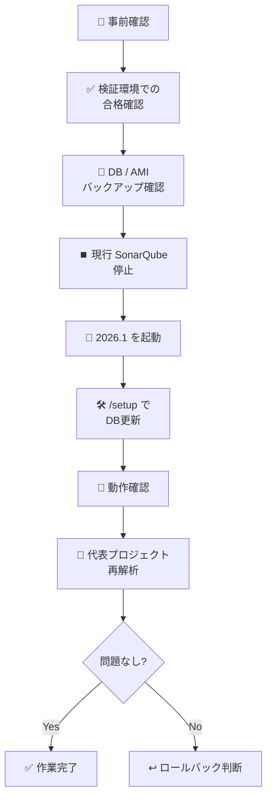

# ✅ SonarQube Server アップグレード当日チェックシート

> 対象: **SonarQube Server Enterprise Edition `2025.1 LTA` → `2026.1 LTA`**  
> 構成: **AWS EC2 / AMI ベース + PostgreSQL**  
> 用途: **当日の作業担当者が、そのまま読みながら進められる実行用チェックシート**

> 📌 **このシートは「検証環境で合格済み」であることを前提に、本番当日に使うシートです**

関連ガイド: [23-SonarQube-Serverアップグレードガイド](./23-SonarQube-Serverアップグレードガイド.md)

---

## 使い方 🧭

このシートは、次の順番で使う想定です。

1. 📝 作業前に担当者名・時間を埋める
2. ✅ 各チェック欄を上から順に確認する
3. ⚠️ 異常があれば、その場で「結果 / メモ」に記録する
4. ↩️ ロールバック判断が必要なら、無理に進めず停止する

---

## 基本情報記入欄 📋

| 項目 | 記入欄 |
| --- | --- |
| 作業日 |  |
| 作業開始時刻 |  |
| 作業終了時刻 |  |
| 作業担当 |  |
| 確認担当 |  |
| 現状バージョン | `2025.1 LTA` |
| 目標バージョン | `2026.1 LTA` |
| Edition | `Enterprise Edition` |
| SonarQube ホスト名 |  |
| PostgreSQL ホスト名 / RDS 名 |  |
| 変更管理番号 / チケット |  |
| 検証環境の合格日 |  |

---

## 当日の全体フロー 🌐



---

## フェーズ1: 作業開始前チェック 🔍

### 1-1. 前提確認

| No. | チェック内容 | 結果 |
| --- | --- | --- |
| 1 | 現状 SonarQube が **`2025.1 LTA`** である | ☐ |
| 2 | 更新先が **`2026.1 LTA` の最新 patch** である | ☐ |
| 3 | Edition が **Enterprise Edition** である | ☐ |
| 4 | 検証環境で更新と代表操作確認が完了している | ☐ |
| 5 | 本日のメンテナンス時間が確保されている | ☐ |
| 6 | 関係者へメンテナンス告知済み | ☐ |
| 7 | ロールバック担当者 / 判断者が決まっている | ☐ |

### 1-2. システム要件確認

| No. | チェック内容 | 結果 | メモ |
| --- | --- | --- | --- |
| 8 | SonarQube 実行環境が **JDK 21 以上** | ☐ |  |
| 9 | PostgreSQL バージョンが **14〜18** | ☐ |  |
| 10 | `/tmp` が読み書き可能 | ☐ |  |
| 11 | 2026.1 用プラグインの互換性確認済み | ☐ |  |
| 12 | SonarScanner の更新方針を確認済み | ☐ |  |
| 13 | Enterprise の代表機能確認項目が決まっている | ☐ |  |

---

## フェーズ2: バックアップ確認 💾

> 💡 **このフェーズが最重要**です。  
> ここが曖昧なら、無理に先へ進まず、確認を優先してください。

| No. | チェック内容 | 結果 | バックアップID / メモ |
| --- | --- | --- | --- |
| 14 | PostgreSQL のバックアップ取得済み | ☐ |  |
| 15 | バックアップの取得時刻を記録した | ☐ |  |
| 16 | EC2 の AMI または EBS Snapshot 取得済み | ☐ |  |
| 17 | ロールバック時の復元手順を確認済み | ☐ |  |
| 18 | 検証環境で同手順を試した | ☐ |  |
| 19 | 検証環境での所要時間を本番計画へ反映済み | ☐ |  |

### バックアップ記録欄

| 種別 | ID / 名称 | 取得時刻 | 確認者 |
| --- | --- | --- | --- |
| PostgreSQL backup |  |  |  |
| EC2 AMI |  |  |  |
| EBS Snapshot |  |  |  |

---

## フェーズ3: 停止前最終確認 ⏸️

| No. | チェック内容 | 結果 | メモ |
| --- | --- | --- | --- |
| 20 | SonarQube Server にログインできる | ☐ |  |
| 21 | 現行画面で重大アラートが出ていない | ☐ |  |
| 22 | Background Tasks に未完了の重要処理がない | ☐ |  |
| 23 | ALB / DNS / Proxy の現行向き先を記録した | ☐ |  |
| 24 | `sonar.properties` の現行設定を保全した | ☐ |  |
| 25 | `extensions/plugins` の現行一覧を控えた | ☐ |  |

---

## フェーズ4: 更新実施 🚀

### 実施フロー

```mermaid
flowchart LR
    A[旧環境停止] --> B[新環境起動]
    B --> C[/setup 実行]
    C --> D[ログ確認]
    D --> E[初期動作確認]
```

### 実施チェック

| No. | チェック内容 | 結果 | 実施時刻 / メモ |
| --- | --- | --- | --- |
| 26 | 現行 SonarQube Server を停止した | ☐ |  |
| 27 | 2026.1 用ディレクトリ / 新 EC2 を起動した | ☐ |  |
| 28 | `http://<server>/setup` にアクセスできた | ☐ |  |
| 29 | DB マイグレーションが正常完了した | ☐ |  |
| 30 | `web.log` に致命的エラーがない | ☐ |  |
| 31 | `ce.log` に致命的エラーがない | ☐ |  |
| 32 | `es.log` に致命的エラーがない | ☐ |  |
| 33 | ログイン画面が正常表示された | ☐ |  |

### ログ確認メモ

| ログ | 結果 | メモ |
| --- | --- | --- |
| `web.log` | ☐ 正常 / ☐ 要確認 |  |
| `ce.log` | ☐ 正常 / ☐ 要確認 |  |
| `es.log` | ☐ 正常 / ☐ 要確認 |  |

---

## フェーズ5: 更新後の基本確認 🔎

| No. | チェック内容 | 結果 | メモ |
| --- | --- | --- | --- |
| 34 | 管理者でログインできる | ☐ |  |
| 35 | プロジェクト一覧が表示される | ☐ |  |
| 36 | Quality Gate が表示される | ☐ |  |
| 37 | Background Tasks に大きな異常がない | ☐ |  |
| 38 | ALB / DNS / Proxy の向き先が正しい | ☐ |  |
| 39 | サービス設定（systemd など）の向き先が新インストール先になっている | ☐ |  |
| 40 | Sandbox を使う場合、初回解析前に有効化済み | ☐ |  |
| 41 | Enterprise Edition の代表機能が最低限確認できた | ☐ |  |

---

## フェーズ6: 再解析確認 🔁

> SonarSource 公式でも、**更新後の再解析**が推奨されています。

| No. | チェック内容 | 結果 | メモ |
| --- | --- | --- | --- |
| 42 | 代表的なバックエンドプロジェクトを再解析した | ☐ |  |
| 43 | 代表的なフロントエンドプロジェクトを再解析した | ☐ |  |
| 44 | CI からの解析が正常実行された | ☐ |  |
| 45 | SonarScanner バージョンを確認した | ☐ |  |
| 46 | 品質ゲート結果が意図通りである | ☐ |  |
| 47 | 解析所要時間を記録した | ☐ |  |

### Enterprise 代表操作メモ

| 機能 | 実施結果 | 備考 |
| --- | --- | --- |
| Portfolio / Application |  |  |
| Security Reports |  |  |
| Jira / Slack / DevOps連携 |  |  |
| 権限 / SSO / LDAP |  |  |

### 再解析対象メモ

| 対象 | 実施結果 | 備考 |
| --- | --- | --- |
| Backend main project |  |  |
| Frontend main project |  |  |
| 定期ジョブ / その他 |  |  |

---

## フェーズ7: 完了判定 🏁

### 完了条件

以下がすべて満たせたら、当日の更新作業は完了としてよい状態です。

- ✅ SonarQube が正常起動している
- ✅ `/setup` が完了している
- ✅ 基本画面が正常に見える
- ✅ 代表プロジェクトの再解析が通る
- ✅ 重大エラーがログに残っていない
- ✅ 関係者へ完了連絡できる状態

### 完了判定欄

| 項目 | 記入欄 |
| --- | --- |
| 完了判定 | ☐ 完了 / ☐ 継続確認 / ☐ ロールバック |
| 判定者 |  |
| 判定時刻 |  |
| 補足メモ |  |

---

## ロールバック判断シート ↩️

> ⚠️ **アプリだけ戻して終わりではない**点に注意してください。  
> SonarQube の更新では、**DB もセットで戻す前提**です。

### ロールバックを検討する典型例

| 状況 | 判断 |
| --- | --- |
| `/setup` が完了しない | ロールバック検討 |
| SonarQube が正常起動しない | ロールバック検討 |
| 重大ログエラーが継続する | ロールバック検討 |
| 再解析が複数プロジェクトで失敗する | ロールバック検討 |
| 業務再開に耐えないと判断 | ロールバック実施 |

### ロールバック実行メモ

| 項目 | 記入欄 |
| --- | --- |
| ロールバック実施有無 | ☐ 実施 / ☐ 未実施 |
| 判断者 |  |
| 実施時刻 |  |
| DB 復元方法 |  |
| EC2 / AMI 切戻し方法 |  |
| DNS / ALB 戻し有無 |  |
| 事後連絡先 |  |

---

## 最後の連絡テンプレート 📣

### 正常完了時

> SonarQube Server の `2025.1 LTA → 2026.1 LTA` 更新作業が完了しました。  
> 基本動作確認および代表プロジェクトの再解析まで完了しています。  
> 現時点で重大な異常は確認されていません。

### 継続監視時

> SonarQube Server の更新作業は完了しました。  
> ただし、一部確認項目について継続監視中です。  
> 利用は可能ですが、追加確認結果は別途共有します。

### ロールバック時

> SonarQube Server の更新作業中に問題を確認したため、ロールバックを実施しました。  
> 現在は旧環境への切戻しを進めています。  
> 影響範囲と再実施日程は別途共有します。

---

## 運用メモ ☕

アップグレード当日は、スピードより **記録** が大事です。  
「やったはず」より「記録に残っている」方が確実なので、このシートには実施内容や気づきをしっかり書き残してください。